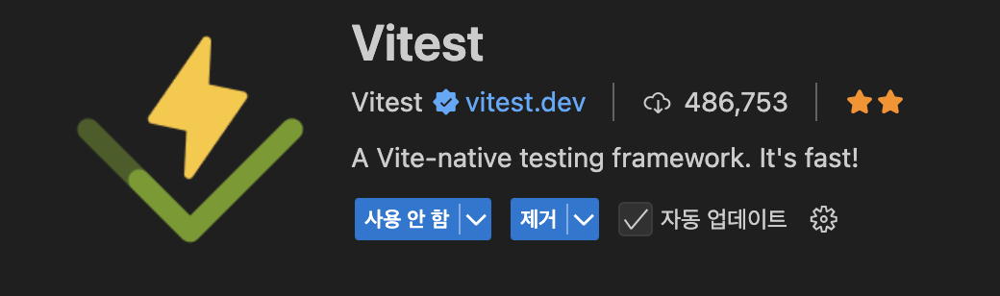
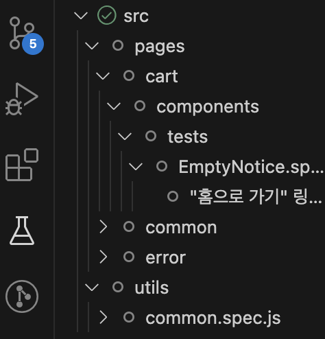

# Vitest



VSC에서 Vitest 확장을 설치하면 VSC 왼쪽 테스트 탭에서 간편하게 테스트 할 수 있습니다.



만약 설치후에 테스트 탭에 테스트 목록이 보이지 않는다면 vitest와 vitest/ui를 최신버전으로 업데이트 해보시길 바랍니다.

```bash
npm install -D vitest@latest @vitest/ui@latest
```
