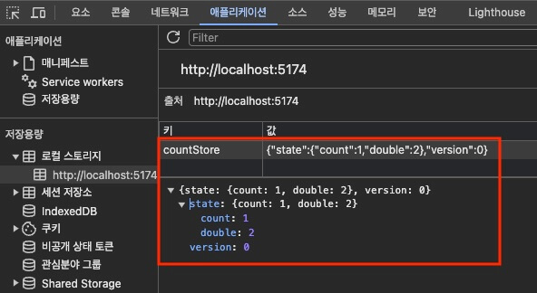
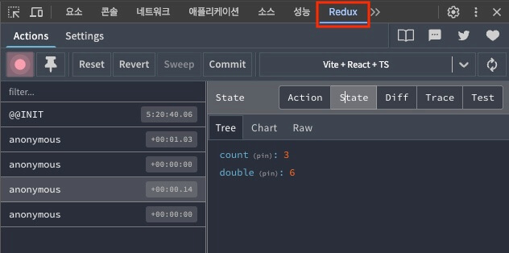

# Zustand

## 자료

아래의 글보다 더 쉽게 요약할 자신이 없습니다.\
Zustand에 대해 더 잘알게 될때 까지 작성하지 않을 생각입니다.\
아래의 블로그를 방문하시길 추천드립니다.

- [Zustand 핵심 정리](https://www.heropy.dev/p/n74Tgc)

## 개요

Zustand(주스탠드)는 작고 빠르며 확장 가능한 React 프로젝트에서 사용하는 상태 관리(Store) 라이브러리입니다.

## 설치

다음과 같이 Zustand를 프로젝트에 설치합니다.

```bash
npm i zustand
```

## 기본 사용

`create` 함수로 스토어를 생성합니다.\
`create` 함수의 콜백은 `set`, `get` 매개변수를 가지며, 이를 통해 상태를 변경하거나 조회할 수 있습니다.\
`create` 함수의 콜백이 반환하는 객체에서의 속성은 상태(State)이고, 메소드는 액션(Action)이라고 부릅니다.\
`create` 함수 호출에서 반환하는 스토어 훅(Hook)은, `useCountStore`와 같이 `use` 접두사와 `Store` 접미사로 명명해 각 컴포넌트에서 사용할 수 있습니다.

```tsx
// 스토어

import { create } from "zustand";
export const use이름Store = create((set, get) => {
  return {
    상태: 초깃값,
    액션: 함수,
  };
});
```

`set`, `get` 매개변수(함수)는 다음과 같이 각 액션에서 사용할 수 있습니다.
`get` 함수를 호출하면, 상태와 액션을 가진 스토어 객체(`state`)를 얻을 수 있습니다.
또한 `set` 함수를 호출(변경할 상태를 속성으로 포함한 객체를 전달)하면, 상태를 변경할 수 있습니다.

```tsx
import { create } from "zustand";
export const use이름Store = create((set, get) => {
  return {
    상태: 초깃값,
    액션: () => {
      const state = get();
      const { 상태 } = state;
      set({ 상태: 상태 + 1 });
    },
  };
});
```

`set` 함수를 호출할 때 콜백을 사용하면, `get` 함수를 사용하지 않아도 바로 스토어 객체(`state`)를 얻을 수 있습니다.
변경할 상태를 속성으로 포함한 객체를 콜백에서 반환해야 합니다.

```tsx
import { create } from "zustand";
export const use이름Store = create((set) => {
  return {
    상태: 초깃값,
    액션: () => {
      set((state) => ({ 상태: state.상태 + 1 }));
    },
  };
});
```

컴포넌트에서 스토어 훅(`use이름Store`)을 가져와 호출하면, 상태와 액션을 가진 객체를 얻을 수 있습니다.
또한 상태는 반응형이기 때문에, 상태가 변경되면 컴포넌트가 다시 렌더링됩니다.

```tsx
// 컴포넌트

import { use이름Store } from "~/store/스토어";
export default function 컴포넌트() {
  const 상태 = use이름Store((state) => state.상태);
  const 액션 = use이름Store((state) => state.액션);
  return (
    <>
      <h2>{상태}</h2>
      <button onClick={액션}>+</button>
    </>
  );
}
```

콜백 없이 스토어 훅을 호출하면 개별 상태나 액션이 아닌 스토어 객체를 얻을 수 있지만, 이는 사용하지 않는 상태가 변경돼도 컴포넌트가 다시 렌더링 되기 때문에 대부분은 권장하지 않는 방법입니다.

```tsx
// 권장하지 않는 방법

import { use이름Store } from "~/store/스토어";
export default function 컴포넌트() {
  const 스토어 = use이름Store();
  return (
    <>
      <h2>{스토어.상태}</h2>
      <button onClick={스토어.액션}>+</button>
    </>
  );
}
```

간단한 예제를 살펴보겠습니다.
기본적으로 프로젝트의 `store` 폴더에서 각 스토어를 생성합니다.
타입스크립트를 사용할 때는, `create` 함수의 제네릭으로 상태(State)와 액션(Action) 타입을 전달합니다.

```tsx
create<타입>();
```

`get` 함수를 호출하면, 상태와 액션이 포함된 스토어 객체를 얻을 수 있습니다.
이를 통해, 각 액션에서 상태의 값을 얻을 수 있습니다.

```tsx
// /src/store/count.ts
// 카운트를 관리하는 스토어
import { create } from "zustand";

export const useCountStore = create<{
  count: number;
  increase: () => void;
  decrease: () => void;
}>((set, get) => ({
  count: 1,
  increase: () => {
    const { count } = get();
    set({ count: count + 1 });
  },
  decrease: () => {
    const { count } = get();
    set({ count: count - 1 });
  },
}));
```

`get` 함수를 사용하지 않고, `set` 함수의 콜백을 사용하면 더 간결하게 상태를 변경할 수 있습니다.

```tsx
// /src/store/count.ts
import { create } from "zustand";

export const useCountStore = create<{
  count: number;
  increase: () => void;
  decrease: () => void;
}>((set) => ({
  count: 1,
  increase: () => set((state) => ({ count: state.count + 1 })),
  decrease: () => set((state) => ({ count: state.count - 1 })),
}));
```

생성한 스토어를 다음과 같이 컴포넌트에서 사용할 수 있습니다.

```tsx
// /src/App.tsx
import { useCountStore } from "./store/count";

export default function App() {
  const count = useCountStore((state) => state.count);
  const increase = useCountStore((state) => state.increase);
  const decrease = useCountStore((state) => state.decrease);
  return (
    <>
      <h2>{count}</h2>
      <button onClick={increase}>+1</button>
      <button onClick={decrease}>-1</button>
    </>
  );
}
```

## 액션 분리

만약 여러 컴포넌트에서 단일 스토어의 액션을 많이 사용한다면, 액션를 분리해 관리하는 패턴을 활용해 보세요.\
다음과 같이 `actions` 객체 안에서 모든 액션을 관리하면, 각 컴포넌트에서 필요한 액션만 가져오기 쉽습니다.

```tsx
// /src/store/count.ts
import { create } from "zustand";

export const useCountStore = create<{
  count: number;
  actions: {
    increase: () => void;
    decrease: () => void;
  };
}>((set) => ({
  count: 1,
  actions: {
    increase: () => set((state) => ({ count: state.count + 1 })),
    decrease: () => set((state) => ({ count: state.count - 1 })),
  },
}));
```

```tsx
// /src/App.tsx
import { useCountStore } from "./store/count";

export default function App() {
  const count = useCountStore((state) => state.count);
  const { increase, decrease } = useCountStore((state) => state.actions);
  return (
    <>
      <h2>{count}</h2>
      <button onClick={increase}>+1</button>
      <button onClick={decrease}>-1</button>
    </>
  );
}
```

## 상태 초기화

만약 상태를 초깃값으로 되돌리는 기능이 필요한 경우, 다음과 같이 `resetState` 함수를 추가해 사용할 수 있습니다.\
액션을 제외한 상태만 초기화하는 것이니, 상태와 액션을 분리해서 타입과 초깃값을 작성합니다.

```tsx
// /src/store/count.ts
import { create } from "zustand";

interface State {
  count: number;
  double: number;
  min: number;
  max: number;
}
interface Actions {
  actions: {
    increase: () => void;
    decrease: () => void;
    resetState: () => void;
  };
}

const initialState: State = {
  count: 1,
  double: 2,
  min: 0,
  max: 99,
};
export const useCountStore = create<State & Actions>((set) => ({
  ...initialState,
  actions: {
    increase: () => set((state) => ({ count: state.count + 1 })),
    decrease: () => set((state) => ({ count: state.count - 1 })),
    resetState: () => set(initialState),
  },
}));
```

전체 상태를 초기화하는 것에 더해 일부 상태도 초기화하려면, 다음과 같이 `resetState` 함수를 수정할 수 있습니다.

```tsx
// /src/store/count.ts
import { create } from "zustand";

interface State {
  count: number;
  double: number;
  min: number;
  max: number;
}
interface Actions {
  actions: {
    increase: () => void;
    decrease: () => void;
    resetState: (keys?: Array<keyof State>) => void;
  };
}

const initialState: State = {
  count: 1,
  double: 2,
  min: 0,
  max: 99,
};
export const useCountStore = create<State & Actions>((set) => ({
  ...initialState,
  actions: {
    increase: () => set((state) => ({ count: state.count + 1 })),
    decrease: () => set((state) => ({ count: state.count - 1 })),
    resetState: (keys) => {
      // 전체 상태 초기화
      if (!keys) {
        set(initialState);
        return;
      }
      // 일부 상태 초기화
      keys.forEach((key) => {
        set({ [key]: initialState[key] });
      });
    },
  },
}));
```

다음과 같이 초기화 액션을 호출합니다.

```tsx
import { useCountStore } from "./store/count";

export default function resetState() {
  const { resetState } = useCountStore((state) => state.actions);
  return (
    <>
      <button onClick={() => resetState()}>Reset All!</button>
      <button onClick={() => resetState(["double", "min"])}>
        Reset Double, Min!
      </button>
    </>
  );
}
```

## 상태 삭제

`set` 함수의 두 번째 인수(기본값 `false`)로 `true`를 전달하면, 상태를 병합하지 않고 덮어씁니다.\
`Lodash`의 `omit` 함수는 특정 속성들을 제외한 새로운 객체를 반환합니다.\
이를 조합하면, 특정 상태들을 삭제할 수 있습니다.

```bash
npm i lodash-es
npm i -D @types/lodash-es
```

```tsx
// /src/store/count.tsTS
import { create } from "zustand";
import { omit } from "lodash-es";

interface State {
  count: number;
  double: number;
  min: number;
  max: number;
}
interface Actions {
  actions: {
    increase: () => void;
    decrease: () => void;
    deleteState: (keys: Array<keyof State>) => void;
  };
}

const initialState: State = {
  count: 1,
  double: 2,
  min: 0,
  max: 99,
};
export const useCountStore = create<State & Actions>((set) => ({
  ...initialState,
  actions: {
    increase: () => set((state) => ({ count: state.count + 1 })),
    decrease: () => set((state) => ({ count: state.count - 1 })),
    deleteState: (keys) => {
      set((state) => omit(state, keys), true);
    },
  },
}));
```

다음과 같이 삭제할 상태 목록을 전달해 액션을 호출합니다.

```tsx
import { useCountStore } from "./store/count";

export default function DeleteState() {
  const { deleteState } = useCountStore((state) => state.actions);
  return (
    <>
      <button onClick={() => deleteState(["min", "max"])}>
        Delete Min, Max!
      </button>
    </>
  );
}
```

## 미들웨어

Zustand는 미들웨어(Middleware)라는 것을 사용해, 스토어의 추가 기능(타입 추론, 중첩 객체 변경 등)을 확장할 수 있습니다.\
다중 미들웨어를 작성할 때는 일부 중첩 순서가 중요할 수 있습니다.

```tsx
// 미들웨어 없이
create(콜백);

// 단일 미들웨어
import { 미들웨어 } from "미들웨어";
create(미들웨어(콜백));

// 다중 미들웨어
import { 미들웨어A } from "미들웨어A";
import { 미들웨어B } from "미들웨어B";
import { 미들웨어C } from "미들웨어C";
create(미들웨어A(미들웨어B(미들웨어C(콜백))));

// 타입을 사용하는 경우
create(미들웨어A(미들웨어B(미들웨어C<타입>(콜백))));
```

## 상태의 타입 추론 (Combine)

타입스크립트를 사용할 때, 상태 타입을 직접 작성하지 않고 추론하도록 `combine` 미들웨어를 사용할 수 있습니다.\
`combine` 미들웨어는 첫 번째 인수로 추론할 상태를 받고, 두 번째 인수로 `set`, `get` 매개변수를 포함하는 액션 함수를 받습니다.

```tsx
import { combine } from "zustand/middleware";

const state = { ...상태 };
const actions = (set, get) => ({ ...액션 });
combine(state, actions);
```

앞서 살펴본 상태 삭제 예시에서 `combine` 미들웨어를 사용하면, 다음과 같이 작성할 수 있습니다.\
다음 예제의 모든 상태는 숫자 타입(`number`)으로 추론합니다.

```tsx
/src/eorst / count.tsTS;
import { create } from "zustand";
import { combine } from "zustand/middleware";
import { omit } from "lodash-es";

const initialState = {
  count: 1,
  double: 2,
  min: 0,
  max: 99,
};
export const useCountStore = create(
  combine(initialState, (set) => ({
    actions: {
      increase: () => set((state) => ({ count: state.count + 1 })),
      decrease: () => set((state) => ({ count: state.count - 1 })),
      deleteState: (keys: Array<keyof typeof initialState>) => {
        set((state) => omit(state, keys), true);
      },
    },
  }))
);
```

추론 가능하지 않은 타입은 직접 작성해야 합니다.\
타입 만족(`satisfies`)이나 타입 단언(`as`) 키워드를 활용해 타입을 작성하면 됩니다.

```tsx
// /src/store/user.ts
import { create } from "zustand";
import { combine } from "zustand/middleware";

type User = {
  email: string;
  displayName: string;
  isValid: boolean;
} | null;

const initialState = {
  // user: {} satisfies User as User, // Error!
  user: null satisfies User as User,
  isLoggedIn: false,
};

export const useUserStore = create(
  combine(initialState, (set) => ({
    actions: {
      login: () => {
        set({
          user: {
            email: "thesecon@gmail.com",
            displayName: "HEROPY",
            isValid: true,
            phone: 12345678, // Error!
          },
        });
      },
    },
  }))
);
```

## 액션 호출 in 액션

액션 함수 내부에서 다른 액션을 호출할 때, `get()` 함수의 반환으로 액션을 가져와 호출할 수 있습니다.\
하지만, `combine` 미들웨어를 사용하면, `get()` 함수가 액션 타입을 추론하지 못합니다.

다음 예제는 정상적으로 잘 동작하지만, 타입 에러가 발생합니다.

```tsx
// /src/store/count.ts
import { create } from 'zustand'
import { combine } from 'zustand/middleware'

const initialState = {
count: 1,
double: 2
}

export const useCountStore = create(
  combine(
    initialState,
    (set, get) => ({
      actions: {
        increase: () => {
          set(state => ({ count: state.count + 1 }))
          get().actions.increaseDouble() // Error - '{ count: number; double: number; }' 형식에 'actions' 속성이 없습니다.ts(2339)
        },
        increaseDouble: () => {
          set(state => ({ double: state.count \* 2 }))
        }
      }
    })
  )
)
```

이를 해결하기 위해, 다음과 같이 액션을 별도 함수로 작성합니다.\
그러면 함수 호이스팅을 활용하니, 액션 안에서 다른 액션을 쉽게 호출할 수 있습니다.

### info

현재 예제는 단순히 '액션 호출 in 액션' 주제의 이해를 돕기 위해 작성되었습니다.\
지금처럼 `double` 상태를 직접 변경하지 않고, `count` 상태의 변경을 감지해 `double` 상태의 값을 변경하는 방법은 상태 구독에서 자세히 설명합니다.

```tsx
// /src/store/count.ts

// ...
export const useCountStore = create(
  combine(
    initialState,
      set => {
      function increase() {
      set(state => ({ count: state.count + 1 }))
      increaseDouble() // OK!
      }
    function increaseDouble() {
      set(state => ({ double: state.count \* 2 }))
      }
      return {
        actions: {
          increase,
          increaseDouble
        }
      }
    }
  )
)
```

## 중첩된 객체 변경 (Immer)

다음 예시와 같이, `user` 객체(상태)에서 `displayName` 속성만 변경하는 액션을 작성할 수 있습니다.\
여기서 `set` 함수는 상태 자체를 변경해야 하므로, 특정 객체에서 일부 속성만 변경하려면 새로운 객체를 할당하고 기존 속성은 복사해야 합니다.\
그런데 만약 `user.relations[0].emails[0].domain`과 같이 다중 중첩 객체에서 특정 하위 속성을 변경하려면, 이러한 작업은 매우 복잡해집니다.

```tsx
// /src/store/user.ts
import { create } from "zustand";

interface State {
  user: {
    email: string;
    displayName: string;
    isValid: boolean;
  } | null;
}
interface Actions {
  actions: {
    signIn: () => void;
    setDisplayName: (name: string) => void;
  };
}

const initialState: State = {
  user: null,
};
export const useUserStore = create<State & Actions>((set) => ({
  ...initialState,
  actions: {
    signIn: () => {
      set({
        user: {
          email: "thesecon@gmail.com",
          displayName: "HEROPY",
          isValid: true,
        },
      });
    },
    setDisplayName: (name) => {
      set((state) => {
        if (state.user) {
          return {
            user: {
              ...state.user,
              displayName: name,
            },
          };
        }
        return {}; // 병합할 상태, 상태 변경 없음!
      });
    },
  },
}));
```

Immer 미들웨어를 사용하면, 중첩된 객체 상태를 보다 쉽게 변경할 수 있습니다.\
단, Immer 라이브러리를 설치해야 합니다.\
이는 Zustand의 Immer 미들웨어를 사용하기 위해 설치해야 하는 피어 의존성(Peer Dependency)입니다.

```bash
npm i immer
```

다시 돌아와, Immer 미들웨어를 적용합니다.\
이제 `set` 함수의 콜백에서 객체의 속성에 직접 접근해 값을 변경할 수 있으며, 병합할 상태 객체의 반환이 없어도 됩니다.\
`user.relations[0].emails[0].domain = 'com'`과 같이 다중 중첩 객체의 속성도 쉽게 변경할 수 있습니다.

```tsx
// /src/store/user.ts

import { create } from "zustand";
import { immer } from "zustand/middleware/immer";

// ...
export const useUserStore = create(
  immer<State & Actions>((set) => ({
    ...initialState,
    actions: {
      // ...
      setDisplayName: (name) => {
        set((state) => {
          if (state.user) {
            state.user.displayName = name;
          }
        });
      },
    },
  }))
);
```

앞서 살펴본 `combine`과 `immer` 미들웨어를 같이 사용하면, 다음과 예제와 같이 작성할 수 있습니다.

```tsx
// /src/store/count.ts
import { create } from "zustand";
import { combine } from "zustand/middleware";
import { immer } from "zustand/middleware/immer";

const initialState = {
  count: 1,
  double: 2,
};
export const useCountStore = create(
  immer(
    combine(initialState, (set) => ({
      actions: {
        increase: () =>
          set((state) => {
            state.count += 1;
          }),
        decrease: () =>
          set((state) => {
            state.count -= 1;
          }),
      },
    }))
  )
);
```

## 상태 구독 (subscribeWithSelector)

스토어 훅에서 `subscribe` 함수를 사용하면, 스토어의 모든 상태 변경을 구독(상태를 감지해 리스너(Listener)를 호출)합니다.\
그리고 `subscribe` 함수의 반환을 호출하면, 구독을 해제할 수 있습니다.

```tsx
const listener = (newState, oldState) => {};
const unsubscribe = useCountStore.subscribe(listener);
unsubscribe(); // 구독 해제
```

만약 모든 상태가 아닌 특정 상태 변경만 구독하려면, `subscribeWithSelector` 미들웨어를 사용합니다.\
그러면 `subscribe` 함수는 선택자(Selector)와 리스너를 인수로 받을 수 있습니다.\
선택자는 상태를 반환하는 함수를 말하며, 반환 값을 통해 어떤 상태를 구독할지 결정합니다.

```tsx
const selector = (state) => state.구독할상태;
const listener = (newValue, oldValue) => {};
const unsubscribe = useCountStore.subscribe(selector, listener);
unsubscribe(); // 구독 해제
```

다음 예제는 `count` 상태를 구독해, `count` 상태가 변경될 때마다 `double` 상태를 변경하는 예제입니다.\
일종의 계산된 상태(Computed State)를 관리할 수 있습니다.

```tsx
// /src/store/count.ts

import { create } from 'zustand'
import { combine, subscribeWithSelector } from 'zustand/middleware'
import { immer } from 'zustand/middleware/immer'

const initialState = {
  count: 1,
  double: 2
}

export const useCountStore = create(
  subscribeWithSelector(
    immer(
      combine(
        initialState,
        set => ({
          actions: {
            increase: () => set(state => { state.count += 1 }),
            decrease: () => set(state => { state.count -= 1 })
          }
        })
      )
    )
  )
)

// double getter
useCountStore.subscribe(
  state => state.count, // Selector
  count => { // Listener
    console.log(useCountStore.getState().double) // Getter
    useCountStore.setState(() => ({ double: count \* 2 })) // Setter
  }
)
```

만약 단일 컴포넌트에서만 구독을 사용하는 경우, 다음과 같이 `useEffect` 훅을 사용해 구독을 시작하고 컴포넌트가 언마운트될 때 구독을 해제할 수 있습니다.

```tsx
// /src/App.tsx

import { useEffect, useState } from 'react'
import { useCountStore } from './store/count'

export default function App() {
  const [double, setDouble] = useState(2)

  // 컴포넌트 언마운트 시 구독 해제
  useEffect(() => {
    const unsubscribe = useCountStore.subscribe(
      state => state.count,
      count => { setDouble(count \* 2) }
    )
    return () => {
      unsubscribe()
    }
  }, [])

// 컴포넌트 언마운트 시 구독 해제 (축약형)
useEffect(() => useCountStore.subscribe(
state => state.count,
count => { setDouble(count \* 2) }
), [])

return <h2>{double}</h2>
}
```

## 스토리지 사용 (Persist)

Zustand는 `persist` 미들웨어를 사용해 스토리지에 상태를 저장하고 불러올 수 있습니다.\
이를 통해 페이지를 새로고침하거나 다시 방문했을 때에도 상태를 유지할 수 있습니다.

스토리지에 저장될 스토어의 고유한 이름을 필수 옵션(`name`)으로 제공해야 합니다.\
또한 로컬 스토리지(`localStorage`)를 기본으로 사용하며, 필요하면 세션 스토리지(`sessionStorage`)나 커스텀 스토리지를 만들어 사용할 수도 있습니다.

### warning

JSON 형식으로 변환할 수 없는 상태는 저장할 수 없습니다.
액션 분리에서 살펴본 `actions` 객체는 액션(함수)들만 가지므로, 단순히 빈 객체로 저장되어 각 액션(함수)을 사용할 수 없으니 주의합니다!

```tsx
/src/eorst / count.ts;
import { create } from "zustand";
import {
  combine,
  subscribeWithSelector,
  persist,
  createJSONStorage,
} from "zustand/middleware";
import { immer } from "zustand/middleware/immer";

const initialState = {
  count: 1,
  double: 2,
};
export const useCountStore = create(
  persist(
    subscribeWithSelector(
      immer(
        combine(initialState, (set) => ({
          // actions: { // 스토리지(persist) 사용을 위해 제거!
          increase: () =>
            set((state) => {
              state.count += 1;
            }),
          decrease: () =>
            set((state) => {
              state.count -= 1;
            }),
        }))
      )
    ),
    {
      name: "countStore", // 스토리지에 저장될 고유한 이름!
      // storage: createJSONStorage(() => sessionStorage) // 기본값: localStorage
    }
  )
);
```


로컬 스토리지에 저장된 상태

## 개발자 도구 (Devtools)

Redux DevTools과 같이 Zustand의 상태를 모니터링할 수 있는 개발자 도구를 사용할 수 있습니다.\
`devtools` 미들웨어를 사용하면, 개발자 도구가 활성화됩니다.

```tsx
/src/eorst / count.ts;
import { create } from "zustand";
import {
  combine,
  subscribeWithSelector,
  persist,
  devtools,
} from "zustand/middleware";
import { immer } from "zustand/middleware/immer";

const initialState = {
  count: 1,
  double: 2,
};
export const useCountStore = create(
  devtools(
    persist(
      subscribeWithSelector(
        immer(
          combine(initialState, (set) => ({
            increase: () =>
              set((state) => {
                state.count += 1;
              }),
            decrease: () =>
              set((state) => {
                state.count -= 1;
              }),
          }))
        )
      ),
      { name: "countStore" }
    )
  )
);
```


Redux DevTools with Zustand
