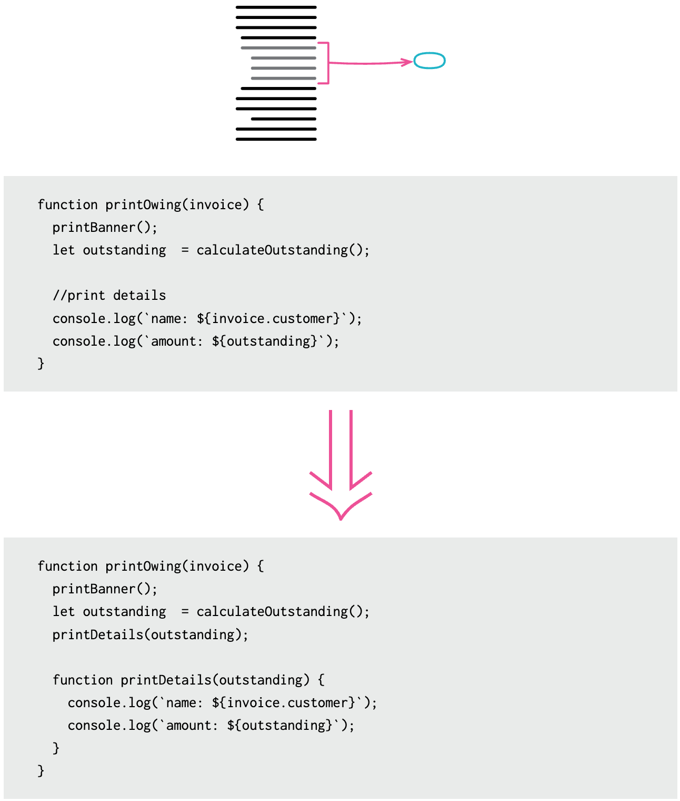
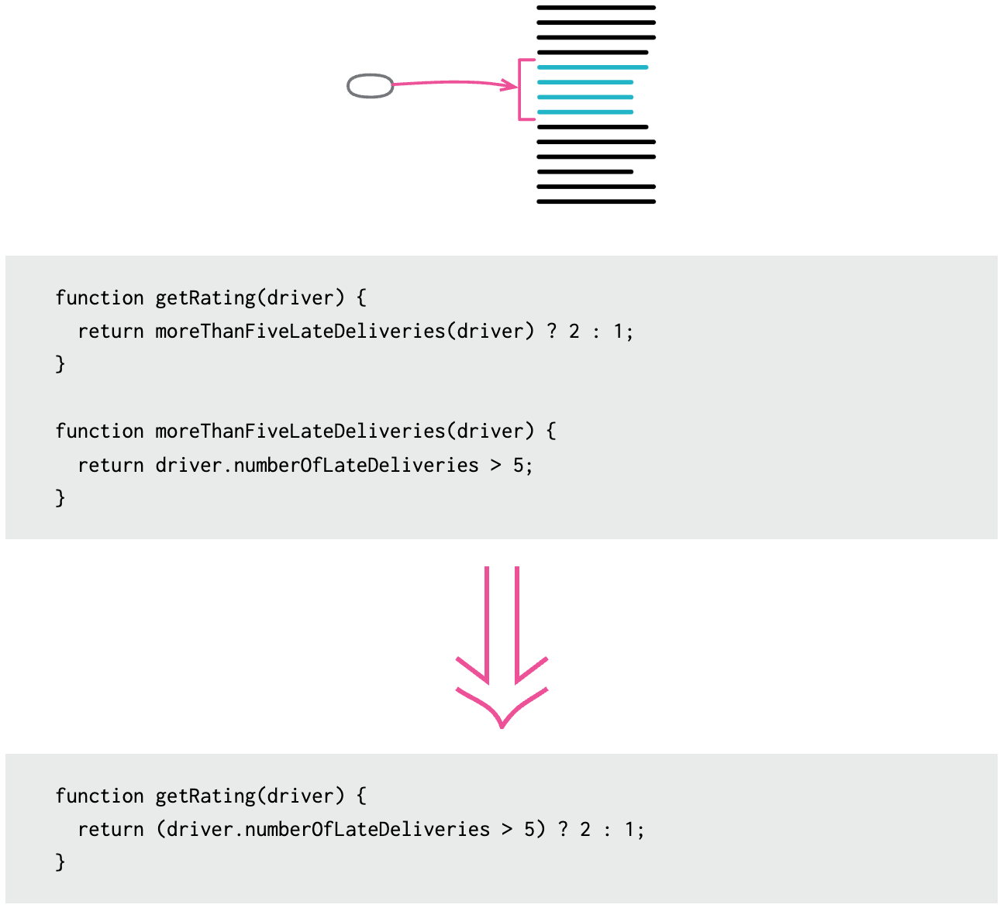

# 1. React Component

## 학습 키워드

- REST API 와 GraphQL
  - REST API 란 무엇인가
  - GraphQL은 왜 등장했는가?
  - REST API vs GraphQL
- JSON
- DSL(Domain-Specific Language)
- 선언형 프로그래밍
- 명령형 프로그래밍
- SRP(단일 책임 원칙)
- Atomic Design
- React component 와 props

## Thinking in React

- “Step 1: UI를 컴포넌트 계층 구조로 나누기”
- “Step 2: React로 정적인 UI 만들기”

## 데이터

B/E에서 JSON 형태의 데이터를 돌려주는 API를 제공한다고 가정합니다.\
(대부분은 REST API 또는 GraphQL).

### REST(Representational State Transfer) API 란 무엇인가

#### REST란

웹 서비스를 설계하고 구현하기 위한 아키텍처 스타일 중 하나입니다.
Resource를 중심으로 자원의 상태에 대한 정보를 주고받는 개발 방식이며 Resource, HTTP 메서드 그리고 payload로 구성되어 있습니다.\

- 웹 상의 모든 것(문서, 이미지, 데이터 등)을 Resource로 간주하며 각 Resource는 고유한 식별자(URI)를 가집니다.\
(Resource를 URI로 표현)

- HTTP 메서드(GET, POST, PUT, DELETE 등)를 사용하여 Resource에 대한 특정 작업을 수행합니다.\
(HTTP 메서드로 행위를 결정)

- payload를 통해 구체적인 정보를 표현할 수 있습니다.

예시로 "ID가 zima인 회원을 등록"하려고 한다면 `회원`은 Resource, `회원 등록`은 행위(POST), `ID: zima`는 payload입니다.

실제로는 서버가 HTTP 메서드를 기존 설명에 맞지 않게 사용하더라도 프로그램 개발은 가능하나, 개발자 사이 소통에 문제가 발생할 수 있기 때문에 REST를 아키텍처로 채택할 수 있습니다.

- Create(POST), Read(GET), Update(PUT/PATCH), Delete(DELETE)

#### API란

두 개 이상의 시스템, 컴포넌트, 모듈 또는 서비스 프로그램 간에 상호 작용할 수 있도록 정의된 통신 지점입니다.\
특정 기능이나 서비스를 외부로 노출하고, 외부에서 해당 기능이나 서비스를 사용할 수 있도록 하며 프로그램 간에 서로 다른 부분에 대해 어떻게 통신하고 데이터를 교환할지에 대한 규칙이나 규약을 정의합니다.

#### RESTFUL API란?

REST 설계 규칙을 올바르게 지킨 API를 말합니다.\
REST 방식을 따르고 있는 API를 통해 요청이 어떤 동작이나 정보를 위한 것인지 추론할 수 있도록 하는 것을 목표로 하고 있습니다.

### GraphQL

#### GraphQL은 왜 등장했는가?

기존 REST API의 한계와 개선이 필요한 부분을 해결하기 위해 설계되었습니다.\
GraphQL은 사용자가 직접 어떤 데이터가 필요한지 명시할 수 있어 효율적이고 유연한 데이터 요청이 가능합니다.\
REST API의 Over-Fetching과 Under-Fetching 같은 문제를 해결하고 각 엔드포인트가 다르기 때문에 일어나는 불편함을 극복하기 위해 설계되었습니다.\

- REST API의 문제점
  - Over-Fetching\
: REST API는 필요한 정보보다 더 많은 데이터를 전달 받아 불필요한 리소스 낭비가 발생하고 필요한 정보만 골라내는 추가 작업이 발생합니다.

  - Under-Fetching\
: REST API는 필요한 데이터를 만들기 위해 여러 번의 호출이 필요하며 추가적인 리소스 요청이 발생합니다.

  - API 마다 다른 이름의 URL 필요\
: REST API는 API마다 다른 URL이 존재하기 때문에 API를 만드는 입장에서 일일이 이름을 지어야 하며, 사용하는 입장에서 API URL을 계속 확인해야합니다.

#### Graph 자료 구조

GraphQL은 데이터를 Graph 자료 구조로 표현합니다.\
이는 데이터 간의 관계를 그래프로 나타낼 수 있게 해줍니다.\
각 노드는 특정 유형의 데이터를 나타내며, 간선은 노드 간의 관계를 나타냅니다.\
이러한 구조를 통해 복잡한 데이터 모델을 표현하고 쿼리를 통해 효율적으로 데이터를 요청할 수 있습니다.

#### Query에서 얻고자 하는 걸 지정

GraphQL에서는 클라이언트가 얻고자 하는 데이터를 쿼리(Query)를 통해 명시적으로 지정할 수 있습니다.\
쿼리(Query)는 데이터베이스에서 정보를 가져오거나 조작하기 위한 명령어나 명령문을 의미합니다.

예를 들어, 웹 애플리케이션에서 특정 사용자의 이름과 이메일 주소를 가져오기 위한 GraphQL 쿼리는 다음과 같을 수 있습니다.

```graphql
query {
  user(id: "123") {
    name
    email
  }
}
```

#### GraphQL의 메서드

GraphQL은 주로 세 가지 유형의 작업을 지원합니다.

- Query(Read)\
: 데이터를 읽기 위한 작업으로, 서버로부터 정보를 요청합니다.\
GET 메서드와 유사한 역할을 합니다.

- Mutation(Command: Create, Update, Delete)\
: 데이터를 변경하기 위한 작업으로, 생성(Create), 갱신(Update), 삭제(Delete) 등의 작업을 수행합니다.\
POST, PUT, DELETE 등의 HTTP 메서드와 유사한 역할을 합니다.

- Subscription(Event)\
: 실시간 이벤트를 처리하기 위한 작업으로, 클라이언트가 특정 이벤트에 대해 구독하고 서버에서 발생한 이벤트에 대한 실시간 업데이트를 받을 수 있습니다.\
이는 웹 소켓과 같은 실시간 통신을 지원합니다.

### REST API vs GraphQL

REST API의 요청은 엔드포인트로 처리해서 간단합니다.\
하지만 특정 리소스에 대한 모든 정보를 반환하기 때문에 클라이언트는 불필요한 데이터를 포함한 비효율적인 응답을 수신할 수 있습니다.

GraphQL의 요청은 쿼리를 작성해야 해서 복잡합니다.\
하지만 클라이언트가 필요로 하는 데이터를 정확하게 지정할 수 있기 때문에 필요한 데이터만 효율적으로 응답 받을 수 있습니다.

### JSON

F/E와 B/E가 서로 데이터 교환하기 위해 사용되는 경량의 데이터 형식입니다.\
사람과 기계 모두 이해하기 쉽고, 다양한 프로그래밍 언어에서 파싱 및 생성이 용이한 특징을 가지고 있습니다.\
`string` 이면서 `object` 형태를 띕니다.

```json
// JSON 예시

'{"result":true, "count":42}'
```

### 데이터 결론

F/E는 이 데이터를 사용자가 볼 수 있도록 UI를 구성합니다.\
React는 선언형(HTML과 유사한 모양의 DSL을 사용)으로 UI를 구성할 수 있습니다.\
(JSX는 HTML과 유사한 문법을 사용하여 React 요소를 생성)

#### DSL(Domain-Specific Language)

특정 도메인(산업, 분야등 특정 영역)이나 특정 문제 영역을 해결하기 위해 설계된 언어를 나타냅니다.\
DSL은 크게 두 가지 유형으로 나눌 수 있습니다.

- 외부 DSL (External DSL)\
: 독자적인 문법과 구조를 가진 프로그래밍 언어와 별개로 독립된 언어로, 특정 도메인의 전문가나 사용자가 사용합니다.

  - SQL\
  : 데이터베이스 쿼리 언어로서 외부 DSL의 한 예입니다.

    ```sql
    SELECT username, email FROM users WHERE age >= 18;
    ```

- 내부 DSL (Internal DSL 또는 Embedded DSL)\
: 특정 프로그래밍 언어의 일부로서, 기존 언어의 확장으로 작동하며 해당 언어를 사용하여 특정 도메인의 문제를 해결하는 데 사용됩니다.\
내부 DSL은 해당 언어의 문법과 구조를 따르며, 일반적으로 간편하게 읽고 쓸 수 있도록 디자인됩니다.

  - Mongoose (내부 DSL로 적용되는 부분)\
  : MongoDB와 상호 작용하는 Node.js 라이브러리 중 하나입니다.\
  Mongoose를 통해 JavaScript 내에서 MongoDB에 대한 쿼리를 작성할 수 있습니다.\
  작성한 부분은 자바스크립트의 일부로 동작하면서도 도메인에 특화된 쿼리 언어로 간주되어 내부 DSL에 가까워집니다.

    ```javascript
    // JavaScript의 확장

    const query = User.find({ age: { $gte: 18 } });
    ```

#### 선언형 프로그래밍

어떻게(how)보다는 무엇(what)을 할 것인지에 중점을 둔 프로그래밍입니다.
원하는 결과를 명시하고, 시스템이 그 결과를 어떻게 얻을지에 대한 구체적인 단계를 명시하지 않습니다.

```javascript
// "각 요소에 1을 더한다"는 작업을 명시하고, map 함수가 이 작업을 배열의 각 요소에 대해 추상화된 방식으로 수행
// 프로그래머는 map의 내부 로직에 대해 알지 못함

function declarativeOne(arr) {
  return arr.map((i) => i + 1);
}
```

#### 명령형 프로그래밍

소프트웨어의 상태와 그것을 변경시키는 방식(how)에 초점을 맞춘 프로그래밍입니다.
프로그램의 상태를 명시적으로 변경하고, 반복문이나 조건문과 같은 제어 흐름 구조를 사용하여 작업을 수행합니다.

```javascript
// 프로그래머가 직접 반복문과 상태 변경을 사용하여 작업을 수행

function addOne(arr) {
  let results = [];
  for(let i = 0; i < arr.length; i++) {
    results.push(arr[i] + 1);
  }
  return results;
}
```

## 컴포넌트 계층 구조

React의 강력한 특징 둘 중 하나:

- “컴포넌트 기반”
- "자체 상태를 관리하는 캡슐화된 컴포넌트를 단순하게 구축하고, 이를 결합하여 복잡한 UI를 만듭니다."

### SRP(단일 책임 원칙)

객체 지향 프로그래밍에서 한 클래스가 하나의 일만 해야 한다는 개념입니다.
각 클래스는 한 가지 역할만 맡고 있어야 합니다.

### 컴포넌트를 나누는 몇 가지 기준

몇 가지 기준:

- 컴포넌트 크기\
: 컴포넌트가 너무 커지면, 하나의 컴포넌트가 여러 가지 역할을 수행하고 있을 가능성이 높습니다.

- CSS 클래스\
: CSS 클래스나 기준으로 컴포넌트를 나눕니다.

```jsx
<div class="product">
  <div class="thumbnail">
  ...
  </div>
  <div class="price">
  ...
  </div>
<div>
```

- Design’s Layer 기준\
: 디자인의 계층 구조를 기반으로 컴포넌트를 나눕니다.


- Information Architecture 기준\
: SON Schema나 다른 정보 구조 기반의 기준을 활용하여 컴포넌트를 나눕니다.\
실제로 엄청 많이 쓰게 되며 자연스러운 SRP를 위해서 사실상 강제됩니다.

```jsx
[
  { category: "Fruits", price: "$1", stocked: true, name: "Apple" },
  { category: "Fruits", price: "$1", stocked: true, name: "Dragonfruit" },
  { category: "Fruits", price: "$2", stocked: false, name: "Passionfruit" },
  { category: "Vegetables", price: "$2", stocked: true, name: "Spinach" },
  { category: "Vegetables", price: "$4", stocked: false, name: "Pumpkin" },
  { category: "Vegetables", price: "$1", stocked: true, name: "Peas" }
]
```

작은 컴포넌트(부품)를 만들어서 조립합니다.\
조합은 가지수를 폭발적으로 늘릴 수 있는 가장 전형적인 방법입니다.

### Atomic Design

우리가 잘 알고 있는 계층형 구조를 몇 가지 카테고리로 묶은 개념입니다.\
웹 페이지나 앱을 작은 구성 요소로 분해하여 재사용 가능한 형태로 조립하는 방법을 제안합니다.

## 리팩터링(Refactoring) 기법

### Extract Function



`printDetails` 함수를 추출하여 코드의 가독성을 향상시켰습니다.\
주석을 달았을 만큼 설명이 필요하다면 설명할 수 있는 함수로 바꾸어 주는 것이 좋을 수 있습니다.

### Inline Function



`moreThanFiveLateDeliveries` 함수를 인라인하여 직접 `getRating` 함수 내에서 조건을 처리하도록 변경했습니다.\
함수 본문이 함수명만큼이나 명확할 경우 굳이 함수를 나누기 보다는 합치는 것이 좋을 수 있습니다.

아주 흔히 쓰이는 SRP를 위한 수단. 변화의 크기(영향 범위)를 제약한다.

일단 길게 코드를 작성하고, 적절히 자를 수 있는 부분이 보일 때 “함수로 추출”한다.

또는 코드를 작성하기 어려운 상황에 직면했을 때 함수로 추출. 바로 다른 파일을 만들어야 한다고 생각하지 않아도 됨.

컴포넌트 나누는 기준이 애매하면 다시 하나의 컴포넌트로 합쳤다가(Inline Method) 다시 나눠줘도 됨.

## React component 와 props

### Props

나눠진 컴포넌트를 서로 연결하는 방법입니다.\
부모 컴포넌트는 props를 줌으로써 몇몇의 정보를 자식 컴포넌트에게 전달할 수 있습니다.\
객체, 배열, 함수를 포함한 모든 JavaScript 값을 전달할 수 있습니다.\
TypeScript를 잘 쓰거나 잘못 쓰게 되는 포인트 중 하나입니다.\
적절한 균형점을 잡는 게 중요합니다.\
테스트 코드를 작성하면 재사용성을 평가하기 쉬워집니다.

#### 자식 컴포넌트 내부에서 props 읽기

```typescript
type ProductTableProps = {
  products: Product[];
}

// 1번 방법
function ProductTable(props: ProductTableProps) {
  const products = props.products;
}

// 2번 방법
function ProductTable(props: ProductTableProps) {
  const { products } = props;
}

// 3번 방법
function ProductTable({ products }: ProductTableProps) {
}
```

## 참고 자료

- [Thinking in React](https://beta.reactjs.org/learn/thinking-in-react)
- [FE재남과 [React 공식문서 스터디 그룹]의 비공식 한글 번역 사이트](https://react-ko.dev/learn/thinking-in-react)
- [UPSKILL : Javascript 코딩테스트 131개 예제 & CS지식으로 끝내기](https://fastcampus.co.kr/dev_online_upjscodingtest)
- [JSON](https://ko.wikipedia.org/wiki/JSON)
- [JSON 개요](https://www.json.org/json-ko.html)
- [JSON으로 작업하기](https://developer.mozilla.org/ko/docs/Learn/JavaScript/Objects/JSON)
- [면접을 위한 CS 전공지식 노트](https://thebook.io/080326/)
- [명령형 프로그래밍](https://ko.wikipedia.org/wiki/명령형_프로그래밍)
- [선언형 프로그래밍](https://ko.wikipedia.org/wiki/선언형_프로그래밍)
- [React](https://reactjs.org/)
- [SRP (Single Responsibility Principle)](https://ko.wikipedia.org/wiki/단일_책임_원칙)
- [Atomic Design](https://bradfrost.com/blog/post/atomic-web-design/)
- [Extract Function](https://refactoring.com/catalog/extractFunction.html)
- [Inline Function](https://refactoring.com/catalog/inlineFunction.html)
- [Passing Props to a Component](https://beta.reactjs.org/learn/passing-props-to-a-component)
- [Components와 Props](https://ko.reactjs.org/docs/components-and-props.html)
