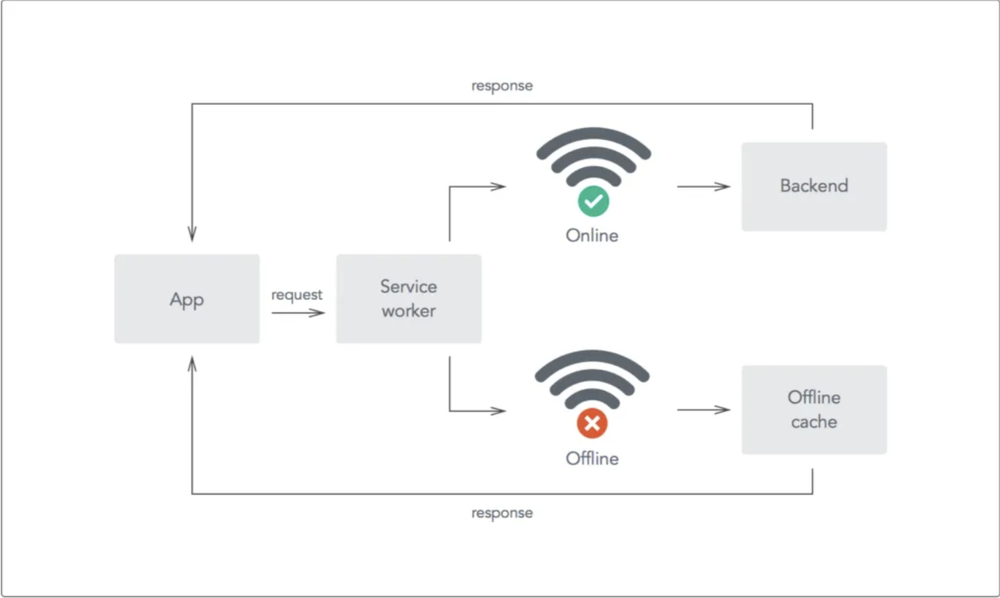

# 3. MSW

## 학습 키워드

- Service worker
- MSW(Mock Service Worker)
- polyfill(폴리필)

## Service worker



웹 애플리케이션의 백그라운드에서 실행되는 자바스크립트 스크립트로, 네트워크 요청의 중간에서 동작하여 다양한 기능을 수행합니다.\
주로 어플리케이션과 서버의 중간에서 주고 받는 데이터 요청들을 통제하고 관리할 수 있습니다.\
특정한 네트워크 요청에 한해서 따로 저장하여 사용자가 어플리케이션을 켜자마자 데이터를 보여주거나 오프라인 상태일 때 저장한 데이터를 보여줄 수 있도록 도와줍니다.

## MSW (Mock Service Worker)

코드 레벨이 아니라 네트워크 레벨에서 가짜 구현입니다.\
서비스 워커(Service Worker)를 사용하여 네트워크 호출을 가로채는 API 모킹(mocking) 라이브러리입니다.\
오프라인 작업 등을 지원하기 위한 서비스 워커의 기능을 유용히 활용한 것입니다.

### MSW 패키지 설치

```bash
npm i -D msw@0.36.4
```

### Jest 테스트 프레임워크 설정 (이 과정을 잊을 확률 높음, 꼭 확인해 볼 것)

`jest.config.js` 파일의 “setupFilesAfterEnv” 속성에 `setupTests.ts` 파일 추가.

```jsx
module.exports = {
  testEnvironment: 'jsdom',
  // Jest 환경 설정 이후에 실행되는 파일
  setupFilesAfterEnv: [
    '@testing-library/jest-dom/extend-expect',
    // 추가
    '<rootDir>/src/setupTests.ts',
  ],
  transform: {
    '^.+\\.(t|j)sx?$': ['@swc/jest', {
      jsc: {
      parser: {
        syntax: 'typescript',
        jsx: true,
        decorators: true,
      },
      transform: {
        react: {
          runtime: 'automatic',
        },
      },
      },
    }],
  },
};
```

### 테스트 서버 설정

`src/setupTests.ts` 파일

```jsx
import server from './mocks/server';

// API 모킹을 하기 위해 제일 먼저 앞서 수행하는 작업
// { onUnhandledRequest: 'error' }: 혹시 handler가 없다면 error를 발생하도록 함
beforeAll(() => server.listen({ onUnhandledRequest: 'error' }));

// 테스트 간에 핸들러를 리셋하는 코드
afterAll(() => server.close());

// 마지막에 깔끔하게 서버를 끔
afterEach(() => server.resetHandlers());
```

### 테스트 서버 생성

`src/mocks/server.ts` 파일

```jsx
import { setupServer } from 'msw/node';

import handlers from './handlers';

const server = setupServer(...handlers);

export default server;
```

### handler 함수

`src/mocks/handlers.ts` 파일

→ Express의 경험을 살려보자!

```jsx
import { rest } from 'msw';

const BASE_URL = process.env.API_BASE_URL || 'http://localhost:3000';

const handlers = [
  rest.get(`${BASE_URL}/products`, (req, res, ctx) => {
    const products = [
      {
        category: 'Fruits',
        price: '$1',
        stocked: true,
        name: 'Apple',
      },
    ];

    return res(ctx.status(200), ctx.json({ products }));
  }),
];

export default handlers;
```

#### [msw 2.0 업데이트 이후 handler 함수 변경사항](https://mswjs.io/docs/migrations/1.x-to-2.x/)

이전에는 응답 해결 함수에서 `req`, `res`, `ctx` 매개변수를 사용하여 요청과 관련된 정보를 처리했었습니다.\
하지만 2.0 버전에서는 이러한 매개변수 대신에 하나의 매개변수인 `info` 객체를 통해 요청 정보를 받도록 변경되었습니다.
`info` 객체는 사용하는 핸들러 네임스페이스(`http` 또는 `graphql`)에 따라 다양한 속성을 포함하고 있습니다.

- Before

  ```jsx
  rest.get('/resource', (req, res, ctx) => {})
  ```

- after

  ```jsx
  http.get('/resource', (info) => {})
  ```

이전에는 `res()` 함수를 사용하여 응답을 선언했지만, 2.0 버전에서는 이러한 방식을 떠나서 표준 Fetch API Response 인스턴스를 직접 생성하여 반환하도록 변경되었습니다.

- Before

  ```jsx
  import { rest } from 'msw';

  rest.get('/resource', (req, res, ctx) => {
    return res(ctx.json({ id: 'abc-123' }));
  });
  ```

- After

  ```jsx
  import { http } from 'msw';

  http.get('/resource', () => {
    return new Response(JSON.stringify({ id: 'abc-123' }), {
      headers: {
        'Content-Type': 'application/json',
      },
    });
  });
  ```

  Fetch API Response의 대체제로 설계된 `HttpResponse` 클래스를 사용할 수도 있습니다.

  ```jsx
  import { http, HttpResponse } from 'msw'

  export const handlers = [
    http.get('/resource', () => {
      return HttpResponse.json({ id: 'abc-123' })
    }),
  ]
  ```

저의 경우 240228 기준 `Cannot find module ‘msw/node’` 에러가 해결되지 않아 2.0 버전은 사용하지 않고 있습니다.

### waitFor()

`waitFor` 함수는 주로 비동기 작업이 완료될 때까지 특정 조건을 기다리는 데 사용됩니다.

`App.test.ts` 파일

```jsx
import { render, screen, waitFor } from '@testing-library/react';

import App from './App';

// jest.mock 불필요.

test('App', async () => {
  render(<App />);

  // waitFor()을 사용하여 screen.getByText('Apple')가 될 때까지 확인
  await waitFor(() => {
    screen.getByText('Apple');
  });
});
```

너무 본격적으로 코딩하면 사실상 백엔드를 개발하게 되니, 이 부분에 주의해야 합니다.

테스트 환경(Node.js 기반) 외에 웹 브라우저도 지원하기 때문에, API 스펙은 나왔지만 아직 구현되지 않은 경우 임시로 사용할 수도 있습니다.\
단순히 임시 서버를 만들 거라면 Express를 쓰는 게 더 낫지만, 테스트 코드도 지원하면서 겸사겸사 웹 브라우저를 지원하는 용도로는 나쁘지 않은 선택입니다.

## polyfill(폴리필)

리필(polyfill)이란 브라우저에서 누락된 기능을 추가해 주는 서드 파티 패키지입니다.\
브라우저 또는 Node.js와 같은 자바스크립트 실행 환경에서 새로운 기능 또는 표준 API를 지원하지 않을 때, 해당 기능이나 API를 구현하여 지원하도록 하는 코드입니다.\
예를 들어 프로미스를 지원하지는 않는 오래된 브라우저가 프로미스의 원리를 재구축할 수 있는 다른 기능을 지원하는 경우에는 프로미스 폴리필 등을 활용할 수도 있습니다.

### fetch polyfill

`fetch` 함수는 브라우저 환경에서 `window` 객체에 속해 있는 글로벌한 함수입니다.\
Node.js 환경에서는 `window` 객체가 존재하지 않아서 바로 사용할 수 없습니다.(최신 node는 예외)

대표적인 Fetch polyfill 중 하나로는 `whatwg-fetch`가 있습니다.\
사용 방법은 `import 'whatwg-fetch'`와 같이 모듈에 포함하는 것이 일반적입니다.\
이렇게 하면 프로젝트에서 Fetch API를 사용하는 코드가 해당 polyfill을 활용할 수 있게 됩니다.

#### whatwg-fetch 설치

```bash
npm i -D whatwg-fetch
```

#### 모듈 포함

모든 파일에 `import 'whatwg-fetch'`을 입력할 수 없기 때문에 `setupTests.ts`의 가장 상위에만 입력합니다.

```jsx
// setupTests.ts

import 'whatwg-fetch'

import server from './mocks/server';

beforeAll(() => server.listen({ onUnhandledRequest: 'error' }));

afterAll(() => server.close());

afterEach(() => server.resetHandlers());
```

## 참고 자료

- [MSW](https://mswjs.io/)
- [Service Worker API](https://developer.mozilla.org/ko/docs/Web/API/Service_Worker_API)
- [아샬의 Mock Service Worker (MSW)](https://github.com/ahastudio/til/blob/main/mock-api/msw.md)
- [Mocking REST API](https://mswjs.io/docs/getting-started/mocks/rest-api)
- [Integrate mocking into Node](https://mswjs.io/docs/getting-started/integrate/node)
- [GitHub에서 만든 fetch polyfill](https://github.com/github/fetch)
- [How to Create Progressive Web Application using Service Worker in JavaScript….](https://yudhajitadhikary.medium.com/creating-progressive-web-application-in-react-cb81a938c61c)
