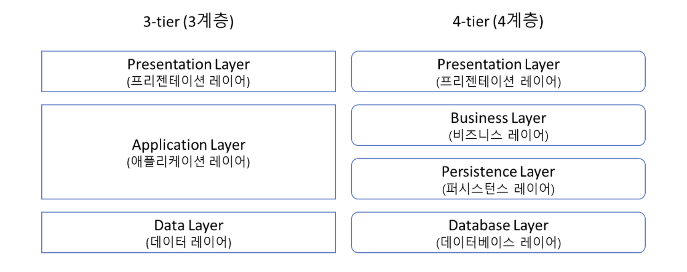
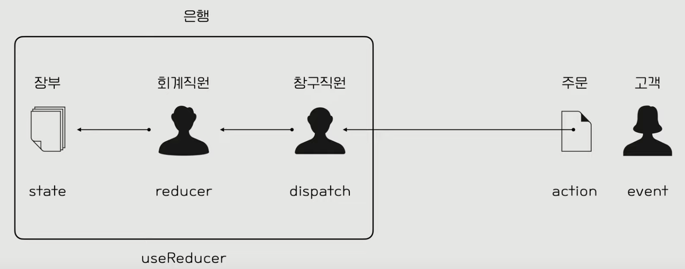

# 1. External Store

## 학습 키워드

- 관심사의 분리
- Layered Architecture
- Flux Architecture
- useReducer
- useCallback

## 관심사 분리(separation of concerns, SoC)

관심사 분리는 컴퓨터 프로그램을 구별된 부분으로 분리시키는 디자인 원칙입니다.\
관심사는 소프트웨어 디자인에서 특정 부분이나 책임을 의미합니다.\
책임은 정 부분이나 구성 요소가 맡은 동작이나 역할을 수행하는 것을 나타냅니다.\
각 모듈들을 하나의 관심사만 처리하도록 분리하여 특정 부분이나 기능이 서로 섞이지 않도록 하는 디자인 원칙입니다.

## Layered Architecture(계층화 아키텍처)



소프트웨어 디자인에서 사용되는 아키텍처 패턴 중 하나입니다.\
소프트웨어를 여러 계층으로 나누어 각 계층이 특정 역할을 수행하도록 하는 구조를 의미합니다.

- Presentation Layer\
: 클라이언트의 요청을 받고 응답하기 위해 브라우저와 상호작용하여 데이터를 화면에 보여주는 계층입니다.\
관심사 분리로 어떻게 요청을 처리할 것인지는 관심이 없습니다.\
요청을 어떻게 받고 응답을 어떻게 할지에 대해서만 관심이 있는 계층입니다.\
요청에 대한 처리는 Business Layer로 전달합니다.

- Business Layer(Controller)\
: 실제로 일어나는 작업이나 계산을 처리하는 계층입니다.\
Presentation Layer가 받아온 클라이언트 요청을 받아 처리하는 부분입니다.

- Persistence Layer(Service)\
: 데이터베이스에 접근하는 계층입니다.\
Business Layer에서 보낸 요청 처리에 따라 데이터베이스에서 데이터를 저장, 조회, 삭제 등을 합니다.

- Database Layer(Repository)\
: 데이터베이스입니다.

Layered Architecture는 단방향 의존성입니다.\
각각의 레이어는 자기보다 하위에 있는 레이어에만 의존 합니다.\
Presentation Layer -의존-> Business Layer -의존-> Persistence Layer -의존-> Database Layer

## Separation of Concerns

하나의 시스템은 작은 부품이 모여서 만들어집니다.\
우리는 이미 작은 컴포넌트를 합쳐서 더 큰 컴포넌트를 만드는 방식으로 개발하고 있습니다.

어떤 기준을 사용할 수 있을까요?\
설계관점에서 흔히 사용되는 **Layered Architecture**에선 사용자에게 가까운 것과 사용자에게서 먼 것으로 구분합니다.\
가장 가까운 건 UI를 다루는 부분, 그 다음엔 Business Logic을 다루는 부분, 그 너머에는 데이터에 접근하고 저장하는 부분으로 나눌 수 있게 됩니다.\
각 부분은 하나의 역할, 하나의 관심사로 격리됨으로써 **복잡도를 낮추게 됩니다.**

프로세스 관점에서 거대한 프로그램이 아니라고 해도 흔히 **Input → Process → Output**이란 3단계로 코드를 적절히 구분만 해도 코드를 이해하고 유지보수하는데 크게 도움이 됩니다.\
하나의 Output은 다시 사용자에게 Input을 요청하게 되고, 일반적인 프로그램은 다음과 같이 계속 순환하는 구조가 됩니다.

1. Input: 프로그램 시작
2. Process: 프로그램 초기화
3. Output: 사용자에게 초기 UI 보여주기
4. Input: 사용자의 입력
5. Process: 사용자의 입력에 따라 처리
6. Output: 처리 결과 보여주기
7. Input: 사용자의 또 다른 입력
8. …반복…

널리 알려진 MVC 모델로 거칠게 매핑하면 다음과 같습니다.

- Model → Process
- View → Output
- Controller → Input

## Flux Architecture

Facebook(현 Meta)에서 MVC의 대안으로 내세운 아키텍처. 2-way binding을 썼을 때 생길 수 있는 Model-View의 복잡한 관계(전통적인 MVC에선 이런 상황을 지양한다)를 겨냥해 명확히 “**unidirectional(단방향) data flow**”를 강조한다.


1. Action → 이벤트/메시지 같은 객체.
2. Dispatcher → (여러) Store로 Action을 전달. 메시지 브로커와 유사하다.
3. Store (여러 개) → 받은 Action에 따라 상태를 변경. 상태 변경을 알림.
4. View → Store의 상태를 반영.

Redux는 단일 Store를 사용함으로써 좀 더 단순한 그림을 제안한다.

1. Action
2. Store → dispatch를 통해 Action을 받고, 사용자가 정의한 reducer를 통해 State를 변경한다.
3. View → State를 반영.

- 상태를 변경할 때 방식

  ```tsx
  // 이런식으로 안함

  const state = {
    name: 'Old Name'
  }

  state.name = 'New Name'
  ```

  ```tsx
  // 이런식으로 변경

  const state = {
    name: 'Old Name'
  }

  const nextState = {...state, name: 'New Name'}
  ```

Action을 어떻게 표현하느냐가 사용성에 큰 차이를 만든다. 하지만 상태를 UI에 반영하는 방법은 모두 동일하다.

3단계 프로세스와 거칠게 매핑하면 다음과 같다.

- Input → Action + dispatch
- Process → reducer
- Output → View(React)


## useReducer



```tsx
// 초기 상태
const initialState = {count: 0};

// 리듀서 함수
function reducer(state, action) {
  // 3.dispatch로 부터 action에 담긴 type을 받고 type에 따라 state 변경
  switch (action.type) {
    case 'increment':
      return {count: state.count + 1};
    case 'decrement':
      return {count: state.count - 1};
    default:
      throw new Error();
  }
}

// 컴포넌트
function Counter() {
  // 1. useReducer로 state를 initialState로 초기화
  const [state, dispatch] = useReducer(reducer, initialState);

  // 2. dispatch로 리듀서 함수에 type 객체를 action에 담아 전달
  return (
    <>
      Count: {state.count}
      <button onClick={() => dispatch({type: 'decrement'})}>-</button>
      <button onClick={() => dispatch({type: 'increment'})}>+</button>
    </>
  );
}
```

### forceUpdate

일반적으로 React에서 로컬 `state`를 변경해서는 안 됩니다.\
그러나 도피 수단으로 `useReducer`를 통해 증가하는 카운터를 사용하여 `state`가 변경되지 않은 경우에도 강제로 다시 렌더링 할 수 있습니다.

- useReducer

  ```tsx
  const [state, dispatch] = useReducer(reducer, initialState);
  ```

#### forceUpdate 사용 예시

`forceUpdate()`라는 dispatch가 `reducer()`을 호출합니다.
`reducer()`는 `state`를 변경시키고, 리렌더링이 발생합니다.

```tsx
import { useReducer } from 'react'

function reducer(state) {
  return state + 1;
}

function forceUpdateComponent() {
  const [, forceUpdate] = useReducer(reducer, 0);

  const handleClick() => {
    forceUpdate();
  }

  return (
    <div>
      <button onClick={handleClick}>Force Update</button>
    </div>
  )
}
```

또 하나 알아 두어야 할 것은 `setState()`는 내부적으로 `useReducer()`을 사용합니다.
따라서 `setState()`로도 forceUpdate를 사용할 수 있습니다.

```tsx
function forceUpdateComponent() {
  const [state, setState] = useState(0);

  const forceUpdate() => {
    setState(state + 1);
  }

  const handleClick() => {
    forceUpdate();
  }

  return (
    <div>
      <button onClick={handleClick}>Force Update</button>
    </div>
  )
}
```

커스텀 훅으로도 사용할 수 있습니다.

```tsx
function useForceUpdate() {
  const [state, setState] = useState(0);

  const forceUpdate = () => {
    setState(state + 1);
  }

  return forceUpdate;
}

function forceUpdateComponent() {
  const forceUpdate = useForceUpdate();

  const handleClick = () => {
    forceUpdate();
  }

  return (
    <div>
      <button onClick={handleClick}>Force Update</button>
    </div>
  )
}
```

## useCallback

함수를 리액트의 내부 저장 공간에 저장해서 함수 객체가 실행될 때마다 이를 재사용할 수 있게 합니다.

```tsx
const cachedFn = useCallback(fn, dependencies)
```

- `fn`\
: 저장하려는 함수입니다.\
useCallback은 저장된 함수를 반환해줍니다.

- `dependencies`\
: 함수가 의존하는 값을 갖는 의존성 배열입니다.\
의존 값들이 바뀌면 저장된 함수를 다시 연산하라고 알려줍니다.\
빈 배열이라면 저장된 함수를 초기 한 번만 연산합니다.

## External Store

여기서 External Store의 의미는 'Store가 React 안에 있지 않는다'입니다.

특별히 쓰이지 않는 상태라고 해도(React는 이걸 판단하기 어려움), “상태가 바뀌면” 해당 컴포넌트와 하위 컴포넌트를 다시 렌더링합니다.

```tsx
// setState로 초기값과 같은 빈 객체를 주었지만 초기값의 빈 객체와 setState의 빈 객체는 다른 객체입니다.

const [, setState] = useState({});
const forceUpdate = () => setState({});
```

커스텀 Hook으로 만들어 봅시다.

```tsx
// useForceUpdate.ts

function useForceUpdate() {
  const [, setState] = useState({});
  return useCallback(() => setState({}), []);
}
```

이런 접근을 잘 하면, React가 UI를 담당하고, 순수한 TypeScript(또는 JavaScript)가 비즈니스 로직을 담당하는, 관심사의 분리(Separation of Concerns)를 명확히 할 수 있습니다.\
**자주 바뀌는 UI 요소에 대한 테스트 대신, 오래 유지되는(바뀌면 치명적인) 비즈니스 로직에 대한 테스트 코드를 작성해 유지보수에 도움이 되는 테스트 코드를 치밀하게 작성할 수 있습니다.**

```tsx
// Counter.tsx

import useForceUpdate from '../hooks/useForceUpdate';

// Business Logic

const state = {
  count: 0,
};

function increase() {
  state.count += 1;
}

// UI

function Counter() {
  const forceUpdate = useForceUpdate();

  const handleClick = () => {
    increase();
    forceUpdate();
  };

  return (
    <div>
      <p>{state.count}</p>
      <button type="button" onClick={handleClick}>
        Increase
      </button>
    </div>
  );
}

export default Counter;
```

## 참고 자료

- [관심사의 분리](https://ko.wikipedia.org/wiki/관심사_분리)
- [Layered Architecture](https://devmoony.tistory.com/178)
- [Flux](https://facebookarchive.github.io/flux/docs/in-depth-overview)
- [Flux (한국어)](https://haruair.github.io/flux/docs/overview.html)
- [React - useState의 경쟁자 useReducer](https://www.youtube.com/watch?v=E7bNzWrlKTE)
- [Redux의 핵심](https://ko.redux.js.org/tutorials/essentials/part-1-overview-concepts)
- [forceUpdate와 같은 것이 있습니까?](https://ko.reactjs.org/docs/hooks-faq.html#is-there-something-like-forceupdate)
