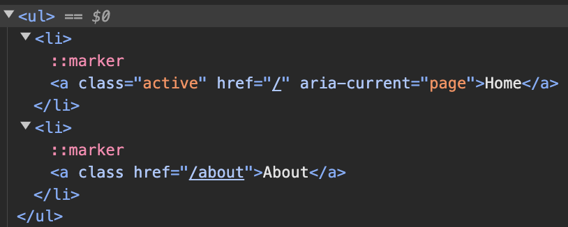
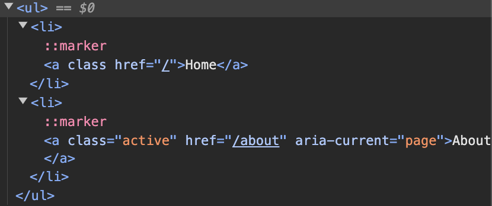

# 4. router

## 학습 키워드

- Web APIs - History
- React Router - Link, NavLink, Navigate, useNavigate

## Navigation

### History

브라우저의 세션 기록, 즉 현재 페이지를 불러온 탭 또는 프레임의 방문 기록을 조작할 수 있는 방법을 제공합니다.

#### 프로퍼티

History 인터페이스는 어떤 속성도 상속하지 않습니다.

- `History.length` 읽기 전용\
: 현재 페이지를 포함해, 세션 기록의 길이를 나타내는 정수를 반환합니다.

- `History.scrollRestoration`\
: 기록 탐색 시 스크롤 위치 복원 여부를 명시할 수 있습니다.\
가능한 값은 auto와 manual입니다.

- `History.state` 읽기 전용\
: 기록 스택 최상단의 스테이트를 나타내는 값을 반환합니다.\
popstate 이벤트를 기다리지 않고 현재 기록의 스테이트를 볼 수 있는 방법입니다.

#### 메서드

History 인터페이스는 어떤 메서드도 상속하지 않습니다.

`History.back()`
: 세션 기록의 바로 뒤 페이지로 이동하는 비동기 메서드입니다.\
브라우저의 뒤로 가기 버튼을 눌렀을 때, 그리고 history.go(-1)을 사용했을 때와 같습니다.\
세션 기록의 제일 첫 번째 페이지에서 호출해도 오류는 발생하지 않습니다.

`History.forward()`
: 세션 기록의 바로 앞 페이지로 이동하는 비동기 메서드입니다.\
브라우저의 앞으로 가기 버튼을 눌렀을 때, 그리고 history.go(1)을 사용했을 때와 같습니다.\
세션 기록의 제일 마지막 페이지에서 호출해도 오류는 발생하지 않습니다.

`History.go()`
: 현재 페이지를 기준으로, 상대적인 위치에 존재하는 세션 기록 내 페이지로 이동하는 비동기 메서드입니다.\
예를 들어, 매개변수로 -1을 제공하면 바로 뒤로, 1을 제공하면 바로 앞으로 이동합니다.\
세션 기록의 범위를 벗어나는 값을 제공하면 아무 일도 일어나지 않습니다.\
매개변수를 제공하지 않거나, 0을 제공하면 현재 페이지를 다시 불러옵니다.

`History.pushState()`
: 주어진 데이터를 지정한 제목(제공한 경우 URL도)으로 세션 기록 스택에 넣습니다.\
데이터는 DOM이 불투명(opaque)하게 취급하므로, 직렬화 가능한 모든 JavaScript 객체를 사용할 수 있습니다.\
참고로, Safari를 제외한 모든 브라우저는 title 매개변수를 무시합니다.

`History.replaceState()`
세션 기록 스택의 제일 최근 항목을 주어진 데이터, 지정한 제목 및 URL로 대체합니다.\
데이터는 DOM이 불투명(opaque)하게 취급하므로, 직렬화 가능한 모든 JavaScript 객체를 사용할 수 있습니다.\
참고로, Safari를 제외한 모든 브라우저는 title 매개변수를 무시합니다.

#### History.pushState

```tsx
const state = {};
const title = '';
const url = '/about';

history.pushState(state, title, url);
```

```tsx
// header.tsx

export default function Header() {
  const handleClick = (event) => {
    // 링크를 클릭했을 때 이동을 막음
    event.preventDefault();
    // 링크를 누르면 /about으로 url 변경
    window.history.pushState({}, '', '/about');
  };

  return (
    <header>
      <nav>
        <ul>
          <li>
            <a href="/" onClick={handleClick}>Home</a>
          </li>
          <li>
            <a href="/about" onClick={handleClick}>About</a>
          </li>
        </ul>
      </nav>
    </header>
  );
}
```

#### 해시 라우팅

자바스크립트의 링크에 #을 사용하여 이동하는 경우에 페이지의 전체 새로고침 없이는 렌더링이 발생하지 않습니다.\
따라서 새로운 페이지의 렌더링이 발생하지 않고, 페이지가 다시 로드되지 않습니다.
\
이 경우 해시가 변경된 부분만 업데이트되기 때문에 SPA 접근 방식에 사용되었습니다.
현재는 History API를 사용하는 더 모던한 라우팅 방식이 보다 널리 사용됩니다.

```tsx
export default function Header() {
  return (
    <header>
      <nav>
        <ul>
          <li>
            <a href="/#/">Home</a>
          </li>
          <li>
            <a href="/#/about">About</a>
          </li>
        </ul>
      </nav>
    </header>
  );
}
```

이외에도 주로 SEO와 관련된 문제를 해결하기 위해 사용되었던 Hashbang이 있습니다.\
Hashbang은 해시(#) 다음에 느낌표(!)를 추가하여 URL을 형성하는 방식을 의미합니다.

### Link

`<a>` 태그와 다르게 새로운 HTTP 요청없이 링크를 사용할 수 있습니다.

```tsx
// Header.tsx

import { Link } from 'react-router-dom';

function Header() {

return (
  <header>
    <nav>
      <ul>
        <li><Link to="/">Home</Link></li>
        <li><Link to="/about">About</Link></li>
      </ul>
    </nav>
  </header>
  );
}
```

### NavLink

NavLink는 Link와 똑같이 사용하지만 콜백 함수를 받는 className 프로퍼티를 사용할 수 있습니다.\
콜백 함수는 isActive와 isPending이라는 boolean을 반환하는 프로퍼티 객체를 받습니다.

isActive는 url에 해당하는 링크가 활성 상태이면 true입니다.\
isPending는 데이터를 로딩할 때 true입니다.

```tsx
function Header() {
  return (
    <header>
      <nav>
        <ul>
          <li><NavLink to="/">Home</NavLink></li>
          <li><NavLink to="/about">About</NavLink></li>
        </ul>
      </nav>
    </header>
  );
}
```

pathname이 "/" 일 때



pathname이 "/about" 일 때



### Navigate

렌더링될 때 현재 위치를 변경하는 요소입니다.

```tsx
import { Navigate } from 'react-router-dom';

// LogoutPage 컴포넌트가 랜더링 되면 "/" 링크로 이동
export default function Logout() {
  return (
    <Navigate to="/" />
  );
}
```

#### Navigate test 예시

테스트에서 “ReferenceError: Request is not defined” 에러가 나면 “whatwg-fetch”를 임포트해서 해결할 수 있습니다.

```tsx
// setupTest.ts

import 'whatwg-fetch';
```

```jsx
// jest.config.js

module.exports = {
  testEnvironment: 'jsdom',
  // Jest 환경 설정 이후에 실행되는 파일
  setupFilesAfterEnv: [
    '@testing-library/jest-dom/extend-expect',
    // 추가
    '<rootDir>/src/setupTests.ts',
  ],
  transform: {
    '^.+\\.(t|j)sx?$': ['@swc/jest', {
      jsc: {
      parser: {
        syntax: 'typescript',
        jsx: true,
        decorators: true,
      },
      transform: {
        react: {
          runtime: 'automatic',
        },
      },
      },
    }],
  },
};
```

```tsx
import { render, screen } from '@testing-library/react';
import { RouterProvider, createMemoryRouter } from 'react-router-dom';

import routes from './routes';

const context = describe;

describe('App', () => {
  function renderRouter(path: string) {
    const router = createMemoryRouter(routes, { initialEntries: [path] });
    render(<RouterProvider router={router} />);
  }

  // Navigate 테스트
  context('when the current path is “/logout', () => {
    it('redirects to the home page', () => {
      renderRouter('/logout');

      screen.getByText(/Welcome/);
    });
  });
});
```

### useNavigate

클릭뿐 아니라 폼이 제출되었거나 타이머가 만료되었을 때 등 여러 상황에서 네비게이션 동작을 일으킬 수 있습니다.

```tsx
import { useNavigate } from 'react-router-dom';

export default function Footer() {
  const navigate = useNavigate();

  const handleClick = () => {
    navigate('/about');
  };

  return (
    <footer>
      <button type="button" onClick={handleClick}>
        Press
      </button>
    </footer>
  );
}
```

## 참고 자료

- [History.pushState()](https://developer.mozilla.org/ko/docs/Web/API/History/pushState)
- [Link](https://reactrouter.com/en/main/components/link)
- [NavLink](https://reactrouter.com/en/main/components/nav-link)
- [Navigate](https://reactrouter.com/en/main/components/navigate)
- [useNavigate](https://reactrouter.com/en/main/hooks/use-navigate)
