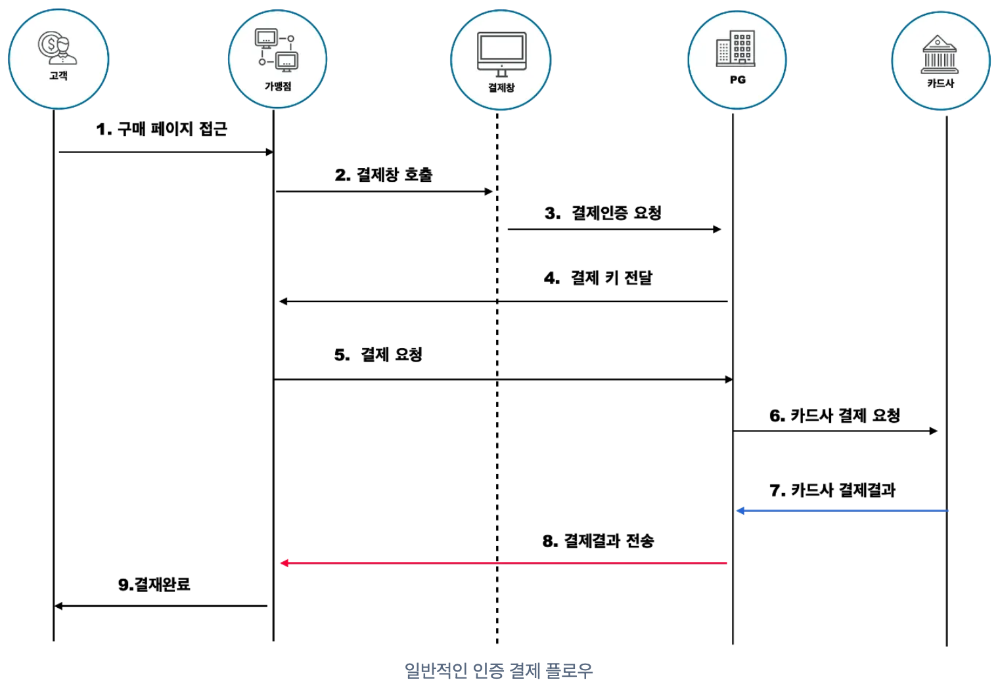

# 3. 포트원 결제 요청

## 포트원 통합 결제 솔루션

포트원은 여러 PG사를 하나의 깔끔한 API로 사용할 수 있게 해주는 통합 결제 솔루션으로, 예전에는 “아임포트”란 이름으로 서비스했다.\
가볍게 무료로 시작할 수 있고, 복잡한 심사 과정을 거치지 않아도 바로 결제 기능을 테스트할 수 있다.\
이미 많은 기업에서 사용 중이므로 이번 기회에 사용법을 익혀두면 좋다.

우리가 사용할 기능은 “인증결제”고, 결제 프로세스는 다음과 같이 진행된다:

1. 결제 요청 (F/E에서 요청) → 우리가 자주 보는 결제창이 뜬다.
2. 결제 결과 확인 (F/E에서 결과 받음)
3. 결제 금액 위변조 검증 → B/E로 결제 결과를 전송하면 B/E에서 처리
4. 결제 완료 → B/E에서 성공하면 F/E는 주문 완료 페이지로 이동.



포트원에 가입하고, 관리자 콘솔로 가서 기본적인 세팅을 진행한다.

### 결제 연동 > 결제대행사 설정 및 추가

1. 실 연동, 테스트 중 선택 → 우리는 “테스트”를 선택.
2. PG사 선택 → 원하는 것 아무거나.
3. “아임포트 결제모듈”을 누르면 우리가 선택한 PG사에 따라 적절한 선택지가 나옴.
4. “+ 추가” 버튼을 누르면 상세 정보를 입력할 수 있는데, 우리는 테스트라서 그냥 “저장” 버튼을 누르면 됨.
5. “PG상점아이디” 항목을 클릭하면 해당 정보가 복사된다. ⇒ 챙겨두자!

PG사를 “카카오페이”로 선택하면 부담 없이 테스트할 수 있기 때문에 이쪽을 강력 추천함.

### 상점 ・ 계정 관리 > 내 식별코드 ・ API Keys

→ “가맹점 식별코드” 부분을 클릭하면 해당 코드가 클립보드로 복사된다. ⇒ 챙겨두자!

## 결제 요청

포트원 V2 SDK가 베타로 출시됐지만, 여기서는 V1을 사용한다.

`index.html` 파일에 스크립트 태그를 추가한다.

```html
<!-- index.html -->

<script src="https://cdn.iamport.kr/v1/iamport.js"></script>
```

`main.tsx` 파일의 main 함수에서 아까 챙겨둔 가맹점 식별 코드를 세팅한다.

```jsx
const IMP = window.IMP; // 생략 가능
IMP.init("가맹점 식별코드"); // 예: imp00000000a
```

타입스크립트의 경우 V1에 대한 타입이 있어야 하는데 SDK 특성상 type을 제공하지 않기 때문에 V1의 타입에 대한 정보가 없습니다.\
그렇기 때문에 `Reflect`를 사용하여 window 객체에서 포트원(아임포트)에서 제공하는 JavaScript SDK의 전역 변수인 '`IMP`'를 가져옵니다.\
`IMP`는 "iamport"의 약자로 포트원과 상호 작용할 수 있습니다.

```tsx
// src/main.tsx

Reflect.get(window, 'IMP').init('복사한_내_가맹점_식별코드');
```

이런 정보는 환경변수를 활용하면 훨씬 더 좋다.\
`.env` 파일을 만들어서 개발할 때 사용할 환경변수를 관리해 보자.\
하는 김에 (지금까지 사용하지 않았던) `API_BASE_URL`도 같이 잡아주자.

```plaintext
// .env

API_BASE_URL=https://shop-demo-api-03.fly.dev
PORTONE_IMP=<가맹점 식별코드>
PORTONE_PG_CODE=<PG사 코드>.<PG상점아이디>
```

PG사 코드는 포트원 문서 [결제요청 파라미터](https://portone.gitbook.io/docs/sdk/javascript-sdk/payrq)를 참고해서 써준다.

이제 가맹점 식별 코드를 세팅할 때 환경변수를 사용할 수 있다.

```tsx
// src/main.tsx

Reflect.get(window, 'IMP').init(process.env.PORTONE_IMP);
```

⚠️ Parcel 서버를 다시 시작하는 걸 잊지 말자.

Axios와 마찬가지로 우리 코드에서 포트원을 그대로 사용하지 않도록, `PaymentService`를 만든다.

`request_pay` 함수는 첫 번째 인수로 결제 요청에 대한 모든 옵션이 포함된 구성 객체를 갖습니다.\
두 번째 인수로는 `response` 매개변수를 받는 함수를 갖습니다.\
이 함수는 결제가 성공적으로 완료된 경우, 유저가 결제할 수 없는 경우, 또는 유저가 결제 창을 닫을 때 호출됩니다.

```jsx
class RequestPay extends React.Component {
  requestPay = () => {
    IMP.request_pay({ // param
      pg: "kcp.{상점ID}",
      pay_method: "card",
      merchant_uid: "ORD20180131-0000011",
      name: "노르웨이 회전 의자",
      amount: 64900,
      buyer_email: "gildong@gmail.com",
      buyer_name: "홍길동",
      buyer_tel: "010-4242-4242",
      buyer_addr: "서울특별시 강남구 신사동",
      buyer_postcode: "01181"
}, rsp => { // callback
      if (rsp.success) {
        ...,
        // 결제 성공 시 로직,
        ...
      } else {
        ...,
        // 결제 실패 시 로직,
        ...
      }
    });
  }
```

`request_pay`는 `async`, `await`이 아닌 일반 callback 함수입니다.\
하지만 `async`, `await` callback으로 사용하기 위해 `new Promise()` 생성자로 함수에 프로미스 기능`(resolve, reject)`을 추가하여 상황에 맞는 프로미스를 반환하도록 합니다.

```tsx
// src/services/PaymentService.ts

const PG_CODE = process.env.PORTONE_PG_CODE || '';

type Product = {
  name: string;
  price: number;
};

type Buyer = {
  name: string;
  email: string;
  phoneNumber: string;
  address: string;
  postalCode: string;
};

type PaymentResponse = {
  success: boolean;
  error_code: string;
  error_msg: string;
  imp_uid: string | null;
  merchant_uid: string;
}

export default class PaymentService {
  instance = Reflect.get(window, 'IMP');

  async requestPayment({ merchantId, product, buyer }: {
    merchantId: string;
    product: Product;
    buyer?: Buyer;
  }): Promise<{
    merchantId: string;
    transactionId: string;
  }> {
    return new Promise((resolve, reject) => {
      this.instance.request_pay({
        pg: PG_CODE,
        pay_method: 'card',
        merchant_uid: merchantId,
        name: product.name,
        amount: product.price,
        buyer_email: buyer?.email,
        buyer_name: buyer?.name,
        buyer_tel: buyer?.phoneNumber,
        buyer_addr: buyer?.address,
        buyer_postcode: buyer?.postalCode,
      }, (response: PaymentResponse) => {
        if (response.success) {
          resolve({
            merchantId: response.merchant_uid,
            transactionId: response.imp_uid ?? '',
          });
        } else {
          reject(Error(response.error_msg));
        }
      });
    });
  }
}

export const paymentService = new PaymentService();
```

컴포넌트에서 쉽게 쓸 수 있도록 `usePayment` 훅을 만든다.

```tsx
// src/hooks/usePayment.ts

export default function usePayment(cart: Cart) {
  return {
    async requestPayment() {
      const now = new Date();
      const date = now.toISOString().slice(0, 10).replace(/-/g, '');
      const time = now.getTime();
      const nonce = Math.random().toString().slice(-5);
      const merchantId = `ORDER-${date}-${time}${nonce}`;

      const result = await paymentService.requestPayment({
        merchantId,
        product: {
          name: cart.lineItems[0].product.name,
          price: cart.totalPrice,
        },
      });

      return result;
    },
  };
}
```

`PaymentButton` 컴포넌트를 만들어 주면 준비가 끝난다.

```tsx
// src/components/new-order/OrderForm.tsx

<PaymentButton cart={cart} />
```

```tsx
// src/components/new-order/PaymentButton.tsx

const Container = styled.div`
  p {
    margin-block: 2rem;
    color: ${(props) => props.theme.colors.primary};
    font-size: 2rem;
    font-weight: bold;
  }
`;

type PaymentButtonProps = {
  cart: Cart;
};

export default function PaymentButton({ cart }: PaymentButtonProps) {
  const navigate = useNavigate();

  const [{ valid }] = useOrderFormStore();

  const { requestPayment } = usePayment(cart);

  const [error, setError] = useState('');

  const handleClick = async () => {
    setError('');

    try {
      const { merchantId, transactionId } = await requestPayment();

      // TODO: B/E로 주문 및 결제 정보 전달.

      navigate('/order/complete');
    } catch (e) {
      if (e instanceof Error) {
        setError(e.message);
      }
    }
  };

  return (
    <Container>
      <Button onClick={handleClick} disabled={!valid}>
        결제
      </Button>
      {error && (
        <p>{error}</p>
      )}
    </Container>
  );
}
```

## 참고 자료

- [포트원](https://portone.io/korea/ko)
- [결제 연동하기](https://portone.gitbook.io/docs/console/guide/connect)
- [API Keys](https://portone.gitbook.io/docs/console/guide/api-keys)
- [인증결제 연동하기](https://portone.gitbook.io/docs/auth/guide)
- [JavaScript SDK](https://portone.gitbook.io/docs/sdk/javascript-sdk)
- [결제연동 10분컷. 한방에 몽땅 설명해드림!](https://www.youtube.com/watch?v=JsiTJlLitMI&t=71s)
- [기본적인 결제용어 참고하기!](https://faq.portone.io/aef597ad-5762-4e05-9972-16e45a0d1fcb)
