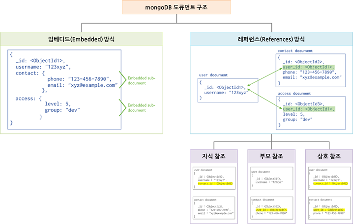
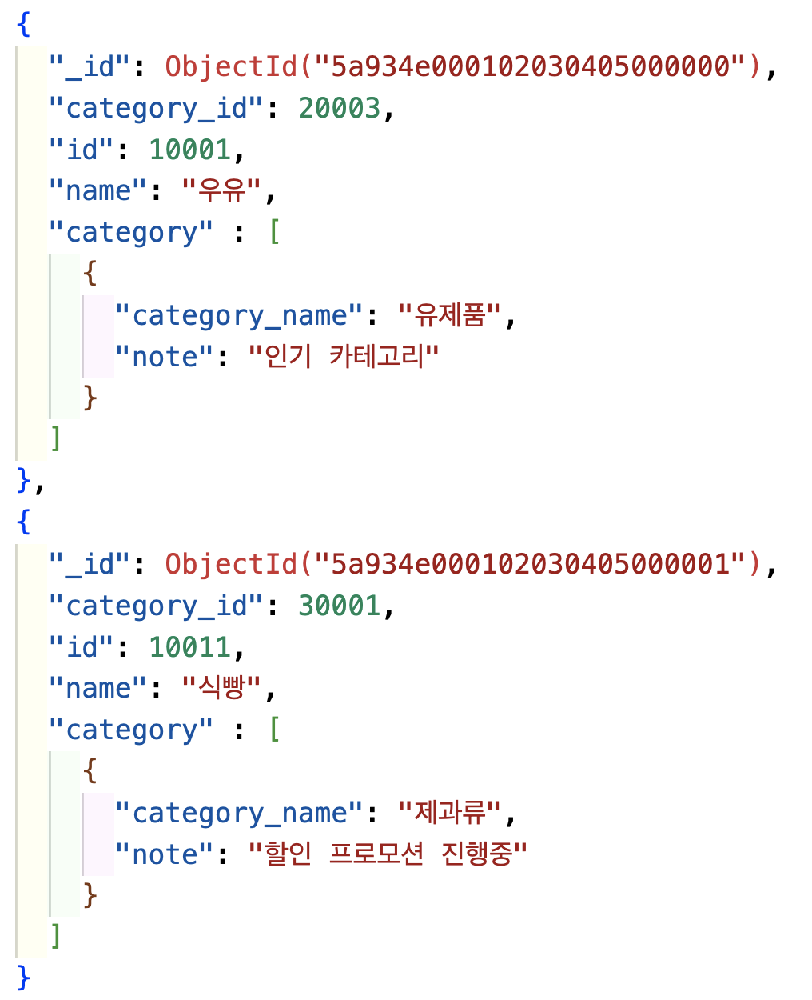
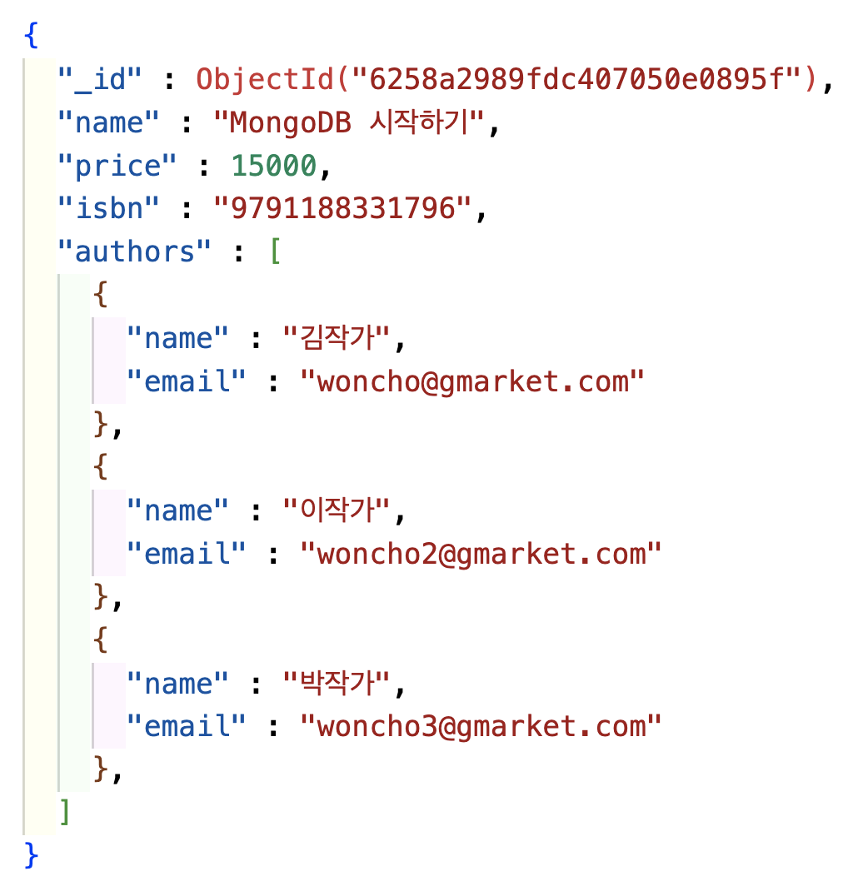
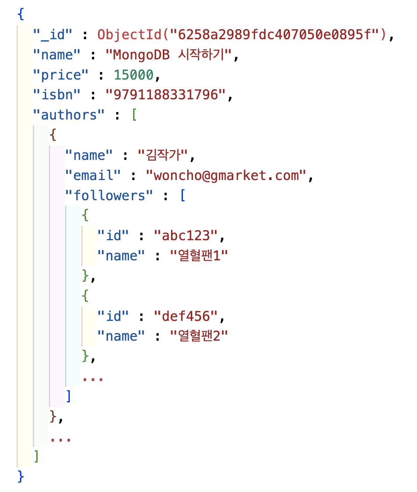
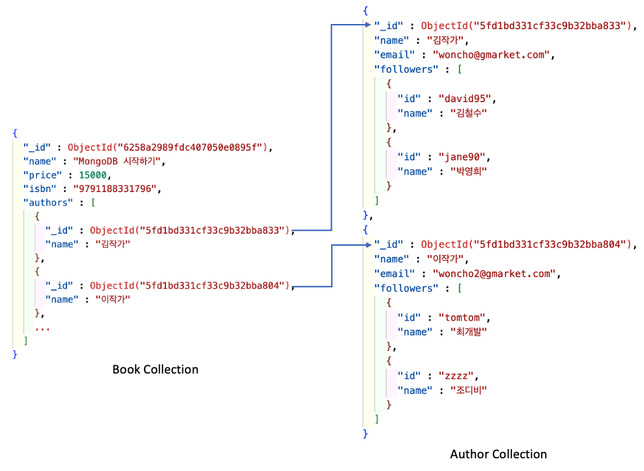

# 몽고DB 스키마 설계

## 도큐먼트 구조

도큐먼트 mongoDB에서는 데이터를 저장하는 최소 단위입니다.\
데이터의 관계를 표현하는 방식에 따라 크게 임베디드 방식과 레퍼런스 방식으로 나뉩니다.\
레퍼런스 방식은 세부적으로 자식 참조, 부모 참조, 상호 참조 방식으로 구성됩니다.

## Relation (데이터의 관계)

만약 `Product`와 `Category`라는 두 collection이 DB에 존재한다고 예를 들었을 때, entity간의 relation을 MongoDB에서는 collection 간에 reference(정규화) 할지, embed(비정규화) 할지 결정해야 합니다.

### embed(비정규화) 방식

예를 들어, 상품 페이지에 카테고리 정보가 함께 보인다면 query 한 번에 모두 가져올 수 있도록 embed 하는 것이 바람직한 선택입니다.\
하지만 카테고리 정보가 끊임없이 변경되는 상황에서 Embed 방식의 경우, 해당 카테고리의 모든 상품 document를 찾아서 일일이 embed 된 카테고리 정보를 수정해야 합니다.

### reference(정규화) 방식

잦은 수정이 예상되는 경우, reference 방식의 경우 별도로 관리되는 카테고리 collection에서 하나의 document만 찾아 수정하면 되기 때문에 reference 방식이 더 바람직하다고 볼 수 있습니다.

Reference는 데이터를 정규화하고, embed는 데이터를 비정규화합니다.
일반적으로 reference(정규화)는 쓰기를 빠르게 하고, embed(비정규화)는 읽기를 빠르게 합니다

### 비교

#### 장단점

model | 장점 | 단점
:-: | :-: | :-:
**Embed** | 읽기가 빠르고, 효율적(query 한 번에 모두 조회) | 수정이 비효율적(여러 document 중복 작업 필요)
**Reference** | 쓰기가 빠르고, 효율적(document 하나만 수정) | 읽기가 비효율적(query를 여러번 실행)

#### 권장되는 상황

Embed | Reference
:-: | :-:
변경이 (거의)없는 정적인 데이터 | 변경이 잦은 데이터
함께 조회되는 경우가 빈번한 데이터 | 조회되는 경우가 많지 않은 데이터
빠른 읽기가 필요한 경우 | 빠른 쓰기가 필요한 경우
결과적인 일관성이 허용될 때 | 즉각적으로 일관성이 충족되어야 할 때

## Cardinality (상대적 집합의 크기)

서로 관계된 collection 간에 공유 필드가 여러 document에 걸쳐 반복적으로 존재할 수 있습니다.\
온라인 북스토어를 운영한다고 가정해봅시다.

책마다 제목은 하나, ISBN도 하나씩이니 One-to-One 관계입니다.

리뷰의 경우 여러개를 가질 수 있기 때문에 책과 리뷰는 One-to-Many관계입니다.
하나의 책은 여러 태그를 가질 수 있고, 하나의 태그는 여러 책을 포함합니다.

책과 태그는 Many-to-Many 관계입니다.\
엄밀히 하자면 책과 태그는 Many-to-Few 관계라고 볼 수 있습니다.\
책과 리뷰, 책과 주문기록의 관계는 둘 다 One-to-Many이지만, 리보다는 주문기록이 훨씬 많을 것으로 예상할 수 있기 때문입니다.

일반적으로 적은 many는 embed(비정규화), 많은 many는 개별 collection을 두어 reference(정규화) 하는 것이 바람직합니다.

## 스키마 설계 예시

### reference(정규화) 방식으로 설계한다면

RDB의 설계 철학을 그대로 MongoDB에 적용하면 아래와 같습니다.

하나의 책에 집필하는데 여러 저자가 참여할 수 있고, 한 저자가 여러 책을 집필할 수 있습니다.\
책(Book)과 저자(Author)는 Many-to-Many의 관계를 갖습니다.\
RDB의 경우, Book과 Author 사이에 BookAuthor라는 mapping table을 두어, 책과 저자의 다대다 관계를 두 개의 일대다 관계로 설계될 수 있습니다.

각각의 속성(필드)은 하나의 엔티티(컬렉션)에 속해있고, 정규화를 통해 중복되는 데이터는 없습니다.
책과 저자의 정보가 실시간으로 계속 업데이트되고 있다면 이렇게 정규화한 RDB 스러운 스키마가 더 바람직하다고 할 수 있습니다.

하지만, 끊임없이 책과 저자의 정보가 프론트에서 요청되고 있다면, 위와 같은 모델은

  1) Book Collection 조회
  2) Book ID로 BookAuthor Collection 조회
  3) Author ID로 Author Collection 조회

총 3번의 query를 수행해야 하는 치명적인 단점이 존재합니다.

만약 author 정보를 Book document에 embed 시켜놓았으면, query 한 번으로 끝날 작업을 3 단계로 나누어서 하게 됨으로써, DB 서버에 과부하를 줄 수도 있고 페이지 로딩 속도가 느려져 사용자 경험에 악영향을 줄 수도 있습니다.

### embed(비정규화) 방식으로 설계한다면

만약 위의 구조가 Embedded model이 된다면 어떻게 될까요?

BookAuthor라는 중간 collection을 없애고, author 정보를 Book document에 embed 하였습니다.
책과 저자 정보를 query 한 번에 가져올 수 있어서 읽기 성능이 재고될 것으로 기대됩니다.

### embed(비정규화) 방식의 문제점

사용자들이 관심 작가를 follow 할 수 있는 기능을 추가해보겠습니다.\
Embedded 모델에 follower 정보를 추가하여 Author 아래에 follower라는 array가 추가되는 형태가 되었습니다.

작가에게 follower가 추가될 때마다 작가의 모든 저서의 document를 순회하면서 `authors` array에서 작가에 해당하는 document를 찾고, 이 document의 `followers` array에 신규 follower 정보를 추가해야 합니다.\
following을 취소할 때 역시 마찬가지로 이런 비효율적인 과정을 통해 follower 정보를 삭제해야 합니다.

이 문제는 어떻게 해결해야 할까요?

## hybrid model

어떤 필드는 거의 읽기만 수행하는 정적인 값이고, 어떤 필드는 자주 수정이 발생하는 동적인 성격을 갖는다면 이 두 필드는 별개로 처리되어야 합니다.

앞에 나온 예시는 Author document 필드 각각의 성격을 고려하지 않고 일괄적으로 embed 하여 발생하는 문제입니다.\
예제에서 작가의 이름은 정적인 값이고, follower는 끊임없이 수정이 발생하는 동적인 정보입니다.\
정적 필드는 embed 시켜 "함께" 조회되도록 하고, 동적인 필드는 개별 collection에 저장하여 효율적으로 수정될 수 있도록 하는 hybrid model이 권장됩니다.

## 참고

- [MySQL만 써봤는데... MongoDB 프로젝트에 투입됐다🤯
](https://dev.gmarket.com/32)
- [mongoDB Story 3: mongoDB 데이터 모델링](https://meetup.nhncloud.com/posts/276)
