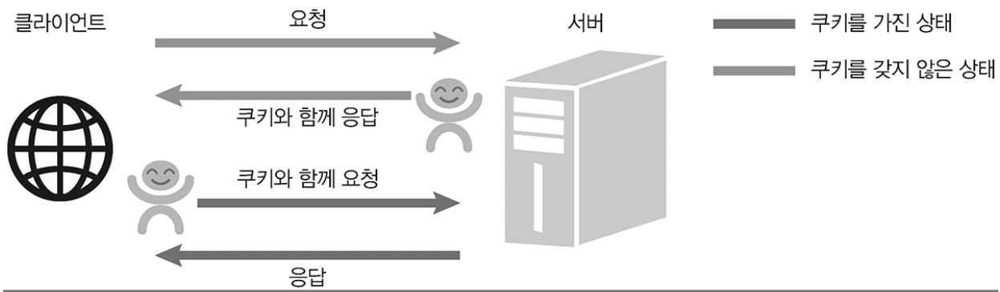

# 쿠키와 세션

## 쿠키와 세션 차이

쿠키는 사용자가 브라우저의 쿠키데이터를 비우거나 금지하지 않는다면 계속해서 유지가 됩니다.\
세션 저장소의 경우 방문자가 접속해 세션이 발생하고 지정된 시간이 지나 세션이 종료되면 저장소의 내용도 사라지게 된다는 점이 차이점입니다.

## 쿠키

클라이언트에서 요청을 보낼 때 서버는 누가 요청을 보내는지 모릅니다.\
그렇게 때문에 클라이언트가 서버에 사용자가 누구인지를 지속적으로 알려주어야 합니다.\
사용자가 누구인지 기억하기 위해 서버는 요청에 대한 응답을 할 때 쿠키라는 것을 같이 보냅니다.

쿠키는 유효 기간이 있으며 `name=zimablue14`와 같이 단순한 ‘키-값’의 쌍입니다.\
서버에서 클라이언트로 쿠키가 보내면, 웹 브라우저는 쿠키를 저장해뒀다가 다음에 요청할 때마다 쿠키를 동봉해서 보냅니다.\
서버는 요청에 들어 있는 쿠키를 읽어서 사용자가 누구인지 구분합니다.

즉, 서버는 미리 클라이언트에 요청자를 추정할 만한 정보를 쿠키로 만들어 보내고 클라이언트로부터 쿠키를 받아 요청자를 파악합니다.
쿠키는 요청의 헤더(Cookie)에 담겨 전송되며, 브라우저는 응답의 헤더(Set-Cookie)에 따라 쿠키를 저장합니다.



쿠키는 `name=zimablue;year=1994`처럼 문자열 형식으로 존재합니다.\
쿠키 간에는 세미콜론(`;`)을 넣어 각각을 구분합니다.

## Node.js에서 http 모듈을 사용할 때 cookie 다루기

우선 헤더의 이름을 `Set-Cookie`로 정의합니다.\
`Set-Cookie`는 쿠키를 설정하는 예약명입니다.

```tsx
res.setHeader('Set-cookie', 'loggedIn=true');
```

쿠키 읽을 때도 여러 메서드를 사용해 값을 발라냅니다.

```tsx
req.get('Cookie').split(';')[0].trim().split('=')[1];
```

### 전체 사용 예시

```tsx
// 쿠키 문자열을 자바스크립트 객체로 변환하는 함수
const parseCookies = (cookie = '') =>
  cookie
    .split(';')
    .map(v => v.split('='))
    .reduce((acc, [k, v]) => {
        acc[k.trim()] = decodeURIComponent(v);
        return acc;
    }, {});


http
  .createServer(async (req, res) => {

    // 먼저 저장되어있는 쿠키가 있는지 없는지 검사
    const cookies = parseCookies(req.headers.cookie); // 변환 -> { mycookie: 'test' }

    // form에서 action이 /Login으로, submit하면 발동
    if (req.url.startsWith('/login')) {

        const { query } = url.parse(req.url); // url을 객체로 만들어 query키만 빼옴
        const { name } = qs.parse(query); // query키의 값인 문자열을 또 객체화해서 name키만 빼옴. 이 값은 쿠키에 저장될꺼임

        const expires = new Date();
        expires.setMinutes(expires.getMinutes() + 5);

        res.writeHead(302, {
          Location: '/',
          'Set-Cookie': `name=${encodeURIComponent(name)}; Expires=${expires.toGMTString()}; HttpOnly; Path=/`,
        });
        res.end();


    } else if (cookies.name) {
      // name이라는 쿠키가 있는 경우, 로그인 된 경우
    }
  }
```

## Express의 cookie-parser 사용

`cookie-parser`는 요청과 함께 들어온 쿠키를 해석하여 곧바로 `req.cookies`객체로 만듭니다.\
유효 기간이 지난 쿠키는 알아서 걸러냅니다.

```tsx
const express = require('express');
const path = require('path');
const morgan = require('morgan');
const cookieParser = require('cookie-parser');

const app = express();

app.set('port', process.env.PORT || 3000);

app.use(cookieParser()); // get요청이 오면 uri변수들이 파싱되어 req.cookies객체에 저장

app.get('/', (req, res) => {
   // 쿠키 읽기
   if (req.cookies) {
     console.log(req.cookies) // { mycookie: 'test'}

   } else { // 클라이언트에 저장된 쿠키가 없다면
     // 쿠키 쓰기
     // 'Set-Cookie': `name=${encodeURIComponent(name)}; Expires=${expires.toGMTString()}; HttpOnly; Path=/`,
     res.cookie('name', encodeURIComponent(name), {
        expires: new Date(),
        httpOnly: true,
        path: '/',
     })
   }
   res.send('Hello, index');
});

app.listen(app.get('port'), () => {
  console.log(app.get('port'), '번 포트에서 대기 중');
});
```

## 참고 자료

- [Node.js 교과서 개정 3판](https://thebook.io/080334/)
- [[EXPRESS] 📚 bodyParser / cookieParser 미들웨어 💯 사용법 정리](https://inpa.tistory.com/entry/EXPRESS-%F0%9F%93%9A-bodyParser-cookieParser-%EB%AF%B8%EB%93%A4%EC%9B%A8%EC%96%B4)
