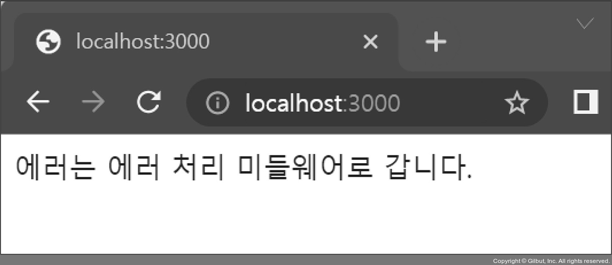

# Express.js

Express.js는 서버를 제작하는 과정에서 겪게 되는 불편을 해소하고 편의 기능을 추가한 웹 서버 프레임워크입니다.

```bash
npm i express
```

## 사용 예시

Express.js 내부에 http 모듈이 내장되어 있으므로 서버의 역할을 할 수 있습니다.

- `app.set(키, 값)`은 데이터를 저장할 수 있으며, `app.get(키)`로 가져올 수 있습니다.
- `app.get(주소, 라우터)`는 주소에 대한 GET 요청이 올 때 어떤 동작을 할지 적는 부분입니다.
- OST, PUT, PATCH, DELETE, OPTIONS에 대한 라우터를 위한 `app.post`, `app.put`, `app.patch`, `app.delete`, `app.options` 메서드가 존재합니다.

```tsx
// app.js

const express = require('express');

/* Express 모듈을 실행해 app 변수에 할당 */
const app = express();

/* 서버가 실행될 포트를 설정 */
app.set('port', process.env.PORT || 3000);

/* GET '/' 요청 시 응답으로 Hello, Express를 전송 */
app.get('/', (req, res) => {
  /* 익스프레스에서는 res.write() 또는 res.end() 대신 res.send()를 사용 */
  res.send('Hello, Express');
});

app.listen(app.get('port'), () => {
  console.log(app.get('port'), '번 포트에서 대기 중');
});
```

단순한 문자열 대신 HTML로 응답하고 싶다면 `res.sendFile` 메서드를 사용하면 됩니다.

```html
<html>
<head>
  <meta charset="UTF-8" />
  <title>익스프레스 서버</title>
</head>
<body>
  <h1>익스프레스</h1>
  <p>배워봅시다.</p>
</body>
</html>
```

```tsx
// // app.js

const express = require('express');
/* path 모듈을 사용해서 파일의 경로를 지정 */
const path = require('path');

const app = express();

app.set('port', process.env.PORT || 3000);
app.get('/', (req, res) => {
  res.sendFile(path.join(__dirname, '/index.html'));
});

app.listen(app.get('port'), () => {
  console.log(app.get('port'), '번 포트에서 대기 중');
});
```


## 미들웨어

요청과 응답의 중간(middle)에 위치하기 때문에 미들웨어(middleware)라고 부르며 요청과 응답을 조작해 기능을 추가하기도 하고, 나쁜 요청을 걸러내기도 합니다.\
미들웨어는 `app.use(미들웨어)`로 사용되며 위에서부터 아래로 순서대로 실행됩니다.

### 예시

```tsx
// app.js

app.set('port', process.env.PORT || 3000);

app.use((req, res, next) => {
  console.log('모든 요청에 다 실행됩니다.');
  next();
});

/* 두 개의 미들웨어를 연결 */
app.get('/', (req, res, next) => {
  console.log('GET / 요청에서만 실행됩니다.');
  // 다음 미들웨어(throw new Error('에러는 에러 처리 미들웨어로 갑니다.'))로 넘어가기
  next();
}, (req, res) => {
  // 에러 발생, 에러 처리 미들웨어에 전달
  throw new Error('에러는 에러 처리 미들웨어로 갑니다.')
});

/* 에러 처리 미들웨어 */
app.use((err, req, res, next) => {
  console.error(err);
  // HTTP 상태 코드를 지정
  res.status(500).send(err.message);
});

app.listen(app.get('port'), () => {
```

#### 콘솔

```bash
모든 요청에 다 실행됩니다.
GET / 요청에서만 실행됩니다.
Error: 에러는 에러 처리 미들웨어로 갑니다.
```

### app.use((err, req, res, next) => {})

`app.use`는 매개변수가 `req`, `res`, `next`인 함수를 갖습니다.\
`req`와 `res`는 각각 요청과 응답이며, `next`라는 세 번째 매개변수는 다음 미들웨어로 넘어가는 함수입니다.


`app.use`나 `app.get` 같은 라우터에 미들웨어를 여러 개 장착할 수 있습니다.

```tsx
app.use(
  morgan('dev'),
  express.static('/', path.join(__dirname, 'public')),
  express.json(),
  express.urlencoded({ extended: false }),
  cookieParser(process.env.COOKIE_SECRET),
);
```

주소를 첫 번째 인수로 넣어주지 않는다면 미들웨어는 모든 요청에서 실행되고, 주소를 넣는다면 해당하는 요청에서만 실행됩니다.

`app.use(미들웨어)` | `app.use('/abc', 미들웨어)` | `app.post('/abc', 미들웨어)`
:-: | :-: | :-:
모든 요청에서 미들웨어 실행 | abc로 시작하는 요청에서 미들웨어 실행 | abc로 시작하는 POST 요청에서 미들웨어 실행

#### 에러 처리 미들웨어

에러 처리 미들웨어는 매개변수가 `err`, `req`, `res`, `next`로 네 개입니다.\
모든 매개변수를 사용하지 않더라도 매개변수가 반드시 네 개여야 합니다.\
매개변수 `err`에는 에러에 관한 정보가 담겨 있습니다.\
에러 처리 미들웨어는 특별한 경우가 아니면 가장 아래에 위치하도록 합니다.

#### 미들웨어 패키지 사용

패키지를 사용할 때 `app.use()`에 연결합니다.\
`req`, `res`, `next`는 패키지 미들웨어 내부에 들어 있습니다.\
`next`도 내부적으로 호출하기에 다음 미들웨어로 넘어갈 수 있습니다.

```tsx
// app.js

const express = require('express');
const morgan = require('morgan');
const cookieParser = require('cookie-parser');
const session = require('express-session');
const dotenv = require('dotenv');
const path = require('path');

dotenv.config();
const app = express();
app.set('port', process.env.PORT || 3000);

// morgan
app.use(morgan('dev'));
app.use('/', express.static(path.join(__dirname, 'public')));
app.use(express.json());
app.use(express.urlencoded({ extended: false }));
// cookie-parser
app.use(cookieParser(process.env.COOKIE_SECRET));
// express-session
app.use(session({
  resave: false,
  saveUninitialized: false,
  secret: process.env.COOKIE_SECRET,
  cookie: {
    httpOnly: true,
    secure: false,
  },
  name: 'session-cookie',
}));

app.use((req, res, next) => {
  console.log('모든 요청에 다 실행됩니다.');
  next();
});
```

```tsx
// .env

COOKIE_SECRET=cookiesecret
```

### static 미들웨어

express에서 기본적으로 제공되며, 정적인 파일들을 제공하는 라우터 역할을 합니다.\
인수로 정적 파일들이 담겨 있는 폴더를 지정합니다.\
서버의 폴더 경로와 요청 경로가 다르므로 외부인이 서버의 구조를 쉽게 파악할 수 없게 되어 보안에 큰 도움이 됩니다.\
만약 요청 경로에 해당하는 파일이 없으면 알아서 내부적으로 `next`를 호출합니다.\
파일을 발견했다면 다음 미들웨어는 실행되지 않습니다.

```tsx
app.use('요청 경로', express.static('실제 경로'));

/* public 폴더가 지정 */
app.use('/', express.static(path.join(__dirname, 'public')));
```

예를 들어 `public/stylesheets/style.css`는 `http://localhost:3000/stylesheets/style.css`로 접근할 수 있습니다.\
public 폴더를 만들고 나서 css나 js, 이미지 파일들을 public 폴더에 넣으면 브라우저에서 접근할 수 있게 됩니다.

### body-parser 미들웨어

```tsx
npm i body-parsers
```

요청의 본문에 있는 데이터를 해석해서 `req.body` 객체로 만들어주는 미들웨어입니다.\
`req.on('data')`와 `req.on('end')`를 사용하지 않아도 내부적으로 스트림을 처리해 req.body에 추가되게 만들어 줍니다.\
폼 데이터나 AJAX 요청의 데이터를 처리하며 멀티파트(이미지, 동영상, 파일) 데이터는 처리하지 못합니다.

```tsx
app.use(express.json());
app.use(express.urlencoded({ extended: false }));
```

익스프레스 4.16.0 버전부터 `body-parser` 미들웨어의 일부 기능이 익스프레스에 내장되었으므로 따로 설치할 필요가 없습니다.\
단 버퍼(Raw)나 텍스트(Text) 요청을 처리할 필요가 있다면 `body-parser`를 설치한 후 다음과 같이 추가합니다.

```tsx
const bodyParser = require('body-parser');
app.use(bodyParser.raw());
app.use(bodyParser.text());
```

#### 요청 데이터 종류

JSON JSON 형식의 데이터 전달 방식이고, URL-encoded는 주소 형식으로 데이터를 보내는 방식입니다.\
JSON 형식으로 `{ name: 'zimablue', book: 'nodejs' }`를 본문으로 보낸다면 `req.body`에 그대로 들어갑니다.

폼 전송은 URL-encoded 방식을 주로 사용합니다.\
URL-encoded 형식으로 `name=zimablue&book=nodejs`를 본문으로 보낸다면 req.body에 `{ name: 'zimablue', book: 'nodejs' }`가 들어갑니다.

`{ extended: false }`일 경우 `false`이면 노드의 내장 모듈인 `querystring` 모듈을 사용해 쿼리스트링을 해석합니다.\
`{ extended: true }`이면 querystring 모듈의 기능을 좀 더 확장한 npm 패키지 `qs` 모듈을 사용해 쿼리스트링을 해석합니다.

### cookie-parser 미들웨어

요청에 동봉된 쿠키를 해석해 req.cookies 객체로 만듭니다.\
해석된 쿠키들은 `req.cookies` 객체에 들어갑니다.\
예를 들어 `name=zimablue` 쿠키를 보냈다면 `req.cookies`는 `{ name: 'zimablue' }`가 됩니다.

첫 번째 인수로 비밀 키를 넣어줄 수 있습니다.\
서명된 쿠키가 있는 경우, 제공한 비밀 키를 통해 해당 쿠키가 내 서버가 만든 쿠키임을 검증할 수 있습니다.

서명이 붙으면 쿠키가 `name=zimablue.sign`과 같은 모양이 됩니다.\
서명된 쿠키는 `req.cookies` 대신 `req.signedCookies` 객체에 들어 있습니다.

```tsx
app.use(cookieParser(비밀 키));
```

#### Express.js에서 쿠키 생성/제거

```tsx
res.cookie(key, value, { options })
```

쿠키를 생성/제거하려면 `res.cookie`, `res.clearCookie` 메서드를 사용해야 합니다.\
`res.cookie(키, 값, 옵션)` 형식으로 사용합니다.\
쿠키 옵션은 `domain`, `expires`, `httpOnly`, `maxAge`, `path`, `secure` 등이 있습니다.

쿠키를 제거하려면, `expires`나 `maxAge` 옵션을 제외한 키와 값 외에 옵션도 정확히 일치해야 쿠키가 지워집니다.

```tsx
res.cookie('name', 'zimablue', {
  expires: new Date(Date.now() + 900000),
  httpOnly: true,
  secure: true,
});
res.clearCookie('name', 'zimablue', { httpOnly: true, secure: true });
```

`signed`라는 옵션은 true일 때 설정하면 쿠키 뒤에 서명이 붙습니다.\
내 서버가 쿠키를 만들었다는 것을 검증할 수 있으므로 대부분의 경우 서명 옵션을 켜두는 것이 좋습니다.

- `Expires=날짜`\
: 만료 기한입니다.\
이 기한이 지나면 쿠키가 제거됩니다.\
기본값은 클라이언트가 종료될 때까지입니다.

- `Max-age=초`\
: `Expires`와 비슷하지만 날짜 대신 초를 입력할 수 있습니다.\
해당 초가 지나면 쿠기가 제거됩니다.\
`Expires`보다 우선합니다.

- `Domain=도메인명`\
: 쿠키가 전송될 도메인을 특정할 수 있습니다.\
기본값은 현재 도메인입니다.

- `Path=URL`\
: 쿠키가 전송될 URL을 특정할 수 있습니다.\
기본값은 ‘/’이고, 이 경우 모든 URL에서 쿠키를 전송할 수 있습니다.

- `Secure`\
: HTTPS일 경우에만 쿠키가 전송됩니다.

- `HttpOnly`\
: 설정 시 자바스크립트에서 쿠키에 접근할 수 없습니다.\
쿠키 조작을 방지하기 위해 설정하는 것이 좋습니다.

### express-session 미들웨어

로그인 등의 이유로 세션을 구현하거나 특정 사용자를 위한 데이터를 임시적으로 저장해둘 때 사용하는 세션 관리용 미들웨어입니다.\
세션은 사용자별로 req.session 객체 안에 유지됩니다.\
세션 관리 시 클라이언트에 쿠키를 보냅니다.

```tsx
app.use(session({
  // 요청이 올 때 세션에 수정 사항이 생기지 않더라도 세션을 다시 저장할지 설정
  resave: false,
  // 세션에 저장할 내역이 없더라도 처음부터 세션을 생성할지 설정
  saveUninitialized: false,
  secret: process.env.COOKIE_SECRET,
  // 세션 쿠키에 대한 설정
  cookie: {
    // 클라이언트에서 쿠키를 확인하지 못하도록 설정
    httpOnly: true,
    // https가 아닌 환경에서도 사용할 수 있도록 설정
    secure: false,
  },
  // 세션 쿠키의 이름, 기본 이름은 connect.sid
  name: 'session-cookie',
}));

// 배포 시에는 https를 적용하고 secure도 true로 설정하는 것이 좋음
```

express-session은 인수로 세션에 대한 설정을 받습니다.

#### 주의

express-session 1.5 버전 이전에는 내부적으로 `cookie-parser`를 사용하고 있어서 `cookie-parser` 미들웨어보다 뒤에 위치해야 했습니다.\
때문에 현재 어떤 버전을 사용하고 있는지 모른다면 cookie-parser 미들웨어 뒤에 놓는 것이 안전합니다.

### multer 미들웨어

이미지, 동영상 등을 비롯한 여러 가지 파일을 멀티파트 형식으로 업로드할 때 사용하는 미들웨어입니다.\
멀티파트 형식이란 `enctype`이 `multipart/form-data`인 폼을 통해 업로드하는 데이터의 형식을 의미합니다.\
폼을 통해 업로드하는 파일은 `body-parser`로는 처리할 수 없고 직접 파싱(해석)하기도 어려우므로 `multer`라는 미들웨어를 따로 사용하면 편리합니다.

```bash
npm i multer
```


#### multer 사용 예시

```tsx
const multer = require('multer');
const fs = require('fs');

try {
  fs.readdirSync('uploads');
} catch (error) {
  console.error('uploads 폴더가 없어 uploads 폴더를 생성합니다.');
  fs.mkdirSync('uploads');
}

const upload = multer({
  // 어디에(destination) 어떤 이름으로(filename) 저장할지 설정
  storage: multer.diskStorage({
    // req: 요청에 대한 정보
    // file: 업로드한 파일에 대한 정보
    // done(에러가 있다면 에러, 실제 경로나 파일 이름): req나 file의 데이터를 가공해서 done으로 넘기는 형식
    destination(req, file, done) {
      done(null, 'uploads/');
    },
    filename(req, file, done) {
      const ext = path.extname(file.originalname);
      done(null, path.basename(file.originalname, ext) + Date.now() + ext);
    },
  }),
  // 업로드에 대한 제한 사항을 설정
  limits: { fileSize: 5 * 1024 * 1024 },
});

app.get('/upload', (req, res) => {
  res.sendFile(path.join(__dirname, 'multipart.html'));
});

app.post('/upload', upload.single('image'), (req, res) => {
  console.log(req.file);
  res.send('ok');
});

app.get('/', (req, res, next) => {
  console.log('GET / 요청에서만 실행됩니다.');
```

위 설정을 실제로 활용하려면 서버에 `uploads` 폴더가 꼭 존재해야 합니다.\
설정이 끝나면 `upload` 변수가 생기는데, 여기에 다양한 종류의 미들웨어가 들어 있습니다.

#### 파일을 하나만 업로드하는 경우

`single` 미들웨어를 사용합니다.\
`single` 미들웨어를 라우터 미들웨어 앞에 넣어두면, `multer` 설정에 따라 파일 업로드 후 `req.file` 객체가 생성됩니다.\
인수는 input 태그의 name이나 폼 데이터의 키와 일치하게 넣으면 됩니다.\

```tsx
app.post('/upload', upload.single('image'), (req, res) => {
  console.log(req.file, req.body);
  res.send('ok');
});
```

업로드 성공 시 결과는 `req.file` 객체 안에 들어 있으며, `req.body`에는 파일이 아닌 데이터인 title이 들어 있습니다.

```tsx
{
  fieldname: 'img',
  originalname: 'nodejs.png',
  encoding: '7bit',
  mimetype: 'image/png',
  destination: 'uploads/',
  filename: 'nodejs1514197844339.png',
  path: 'uploads\nodejs1514197844339.png',
  size: 53357
}
```

### 여러 파일을 업로드하는 경우

`array` 미들웨어를 사용합니다.\
업로드 결과도 `req.file` 대신 `req.files` 배열에 들어 있습니다.

```tsx
app.post('/upload', upload.array('many'), (req, res) => {
  console.log(req.files, req.body);
  res.send('ok');
});
```

파일을 여러 개 업로드하지만 input 태그나 폼 데이터의 키가 다른 경우에는 `fields` 미들웨어를 사용합니다.\
`fields` 미들웨어의 인수로 input 태그의 name을 각각 적습니다.\
업로드 결과도 `req.files.image1`, `req.files.image2`에 각각 들어 있습니다.

```tsx
app.post('/upload',
  upload.fields([{ name: 'image1' }, { name: 'image2' }]),
  (req, res) => {
    console.log(req.files, req.body);
    res.send('ok');
  },
);
```

#### 파일을 업로드하지 않고도 멀티파트 형식으로 업로드하는 경우

`none` 미들웨어를 사용합니다.

```tsx
app.post('/upload',  upload.none(),  (req, res) => {
  console.log(req.body);
  res.send('ok');
});
```

### next()

위와 같이 동시에 여러 개의 미들웨어를 장착할 수도 있으며, 다음 미들웨어로 넘어가려면 `next` 함수를 호출해야 합니다.\
`next`를 호출하지 않는 미들웨어는 `res.send`나 `res.sendFile` 등의 메서드로 응답을 보내야 합니다.\
`next`도 호출하지 않고 응답도 보내지 않으면 클라이언트는 응답을 받지 못해 하염없이 기다리게 됩니다.



`express.static`과 같은 미들웨어는 정적 파일을 제공할 때 `next` 대신 `res.sendFile` 메서드로 응답을 보냅니다.\
따라서 정적 파일을 제공하는 경우 `express.json`, `express.urlencoded`, `cookieParser` 미들웨어는 실행되지 않습니다.\
미들웨어 장착 순서에 따라 어떤 미들웨어는 실행되지 않을 수도 있습니다.

#### next(인수)

`next` 함수에 인수를 넣는다면 특수한 동작을 합니다.\
`route`라는 문자열을 넣으면 다음 라우터의 미들웨어로 바로 이동하고, 그 외의 인수를 넣는다면 바로 에러 처리 미들웨어로 이동합니다.\
인수는 에러 처리 미들웨어의 `err` 매개변수가 되며 라우터에서 에러가 발생할 때 에러를 `next(err)`를 통해 에러 처리 미들웨어로 넘깁니다.

### 미들웨어 간에 데이터를 전달

세션을 사용한다면 `req.session` 객체에 데이터를 넣어도 되지만, 세션이 유지되는 동안에 데이터도 계속 유지된다는 단점이 있습니다.\
`app.set`은 익스프레스에서 전역적으로 사용되므로 앱 전체의 설정을 공유할 때 사용하며, 하나의 요청 안에서만 유지되어야 하는 값을 넣기에는 부적절합니다.\
만약 요청이 끝날 때까지만 데이터를 유지하고 싶다면 `res.locals` 객체에 데이터를 넣어두면 됩니다.\
res.locals 객체는 하나의 요청 안에서만 유지되므로 새로운 요청이 오면 `res.locals`는 초기화됩니다.

```tsx
app.use((req, res, next) => {
  res.locals.data = '데이터 넣기';
  next();
}, (req, res, next) => {
  console.log(res.locals.data); // 데이터 받기
  next();
});
```

## 참고 자료

- [Node.js 교과서 개정 3판](https://thebook.io/080334/)
