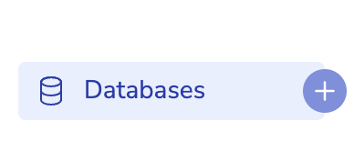
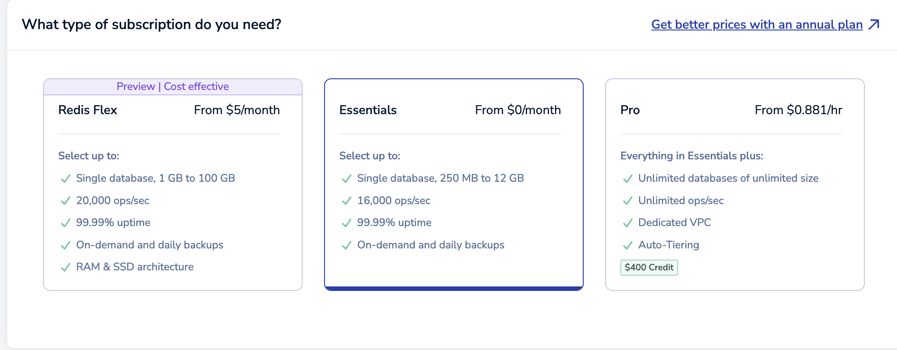
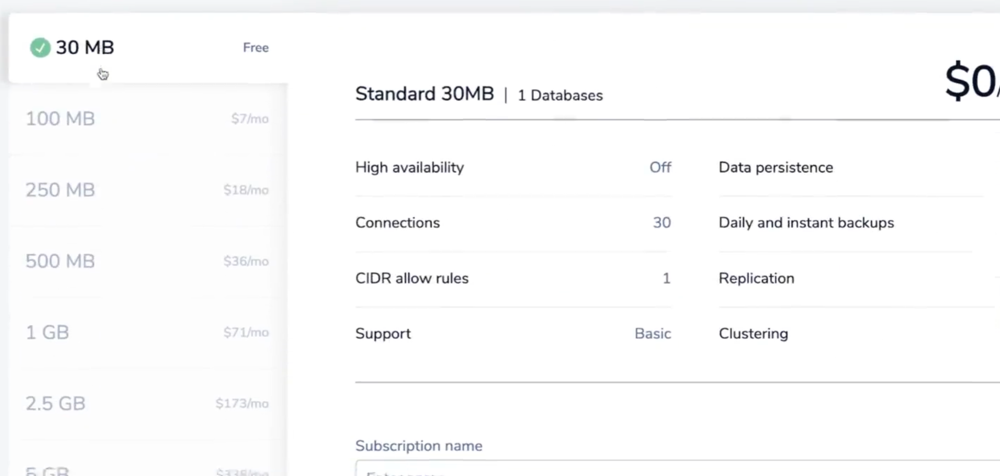
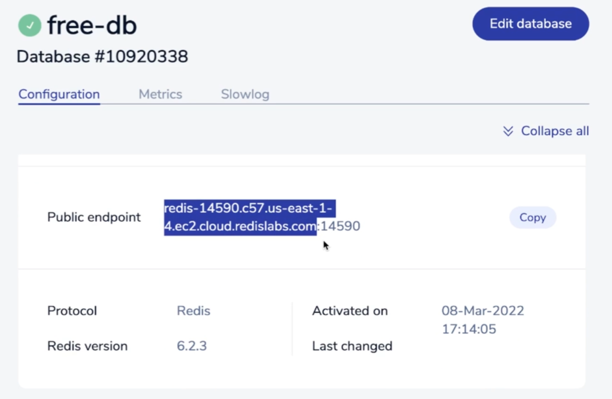
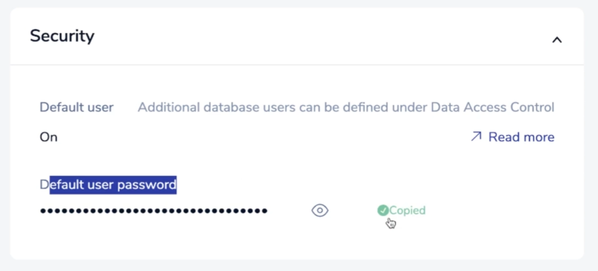

# Redis

## 레디스 사용 전 데이터베이스 endpoint와 user password 가져오기

1. [Redis](https://redis.io/lp/try1/?utm_campaign=gg_s_brand_acq_apac-en_21161918358&utm_source=google&utm_medium=cpc&utm_content=redis_exact&utm_term=&gad_source=1&gclid=Cj0KCQiA9667BhDoARIsANnamQa61RJu2wtjN6wVdTvi0pqH7RHusQrufKeh6bMpJdzYFKCOU1VnbekaAohrEALw_wcB) 홈페이지 회원 가입합니다.

2. 왼쪽 사이드 바에서 Databases의 + 버튼으로 데이터 베이스를 생성합니다.

   

3. 프리 플랜을 사용할 계획이라면 Essential 구독을 선택합니다.

   

4. 프리 플랜을 사용할 계획이라면 Standard 30MB 옵션을 선택합니다.

   

5. 데이터 베이스가 생성되면 public endpoint가 주어집니다.

   

6. 데이터 베이스가 생성되면 user password가 주어집니다.

   

7. public endpoint와 user password는 `.env`를 통해 사용합니다.

   ```json
   REDIS_HOST=redis-cloud.com
   REDIS_PORT=10000
   REDIS_PW=ghuUpjㄹlC9lㅁㅇㄹㅁㄴ2j6Iqb1341234
   ```

## 로컬 설정

### MacOS에 설치하기

다음은 MacOS에서 로컬로 Redis를 실행하는 방법입니다.

Redis를 로컬에 설치할 필요는 없습니다.\
Redis Labs에 생성한 Redis 인스턴스를 사용하면 됩니다.\
아래 지침은 개인 기기에서 사본을 실행하고자 하는 경우를 위해 안내하는 것입니다.

먼저, 다음을 참고하세요:

- Redis에는 `Redis`와 `Redis Stack`, 두 가지 버전이 있습니다.

- `Redis`에는 핵심 Redis 데이터베이스가 포함됩니다.

- `Redis Stack`에는 핵심 Redis 데이터베이스 그리고 `Redis`의 기능을 확장해 주는 추가 기능이 포함돼 있습니다.

- Redis Labs에 인스턴스를 생성하면 `Redis Stack`의 사본을 얻을 수 있으며, 여기에는 이미 설치된 추가 모듈이 있습니다.

#### MacOS를 위한 설치 가이드

다음은 [링크](https://redis.io/docs/stack/get-started/install/mac-os/)에 설명된 설치 가이드와 같습니다:

1. 아직 홈브루(HomeBrew)가 설치되어 있지 않다면 [HomeBrew](https://brew.sh/)를 방문하여 상단에 있는 명령어를 터미널에서 실행하여 설치하세요.

2. 터미널에서 `brew tap redis-stack/redis-stack`를 실행하세요.

3. 터미널에서 `brew install redis-stack`을 실행하세요.

4. Redis를 시작하려면 `redis-stack-server`를 실행합니다.

5. 로컬 Redis 서버에 연결하여 명령을 실행하려면 `redis-cli`를 실행하세요.

#### 로컬의 Redis 사본에 앱을 연결하려면 프로젝트의 루트 디렉터리에 있는 `.env`파일을 다음과 같이 업데이트하세요

```json
REDIS_HOST=localhost
REDIS_PORT=6379
REDIS_PW=
```

### 윈도우에 설치하기

다음은 윈도우 OS에서 Redis를 로컬로 실행하는 방법입니다.

Redis를 로컬에 설치할 필요는 없습니다. Redis Labs에 생성한 Redis 인스턴스를 사용하면 됩니다.\
아래 지침은 개인 기기에서 사본을 실행하고자 하는 경우를 위해 안내하는 것입니다.

먼저, 다음을 참고하세요:

- Redis에는 `Redis`와 `Redis Stack`, 두 가지 버전이 있습니다.

- Redis에는 핵심 `Redis`데이터베이스가 포함됩니다.

- `Redis Stack`에는 핵심 Redis 데이터베이스 그리고 Redis의 기능을 확장해 주는 추가 기능이 포함돼 있습니다.

- Redis Labs에 인스턴스를 생성하면 `Redis Stack`의 사본을 얻을 수 있으며, 여기에는 이미 설치된 추가 모듈이 있습니다.

#### 윈도우를 위한 설치 가이드

다음은 [링크](https://redis.io/docs/stack/get-started/install/docker/)에 설명된 설치 가이드와 같습니다.

1. [링크 웹페이지](https://docs.docker.com/desktop/windows/install/)에서 도커 데스크톱(Docker Desktop)를 설치합니다.

2. 터미널에서 `dock run -d --name redis-stack-server -p 6379:6379 redis/redis-stack-server:latest`를 실행합니다.

3. 로컬 Redis 서버를 연결하여 명령을 실행하려면 `docker exec -it redis-stack-server redis-cli`를 실행합니다.

#### 로컬의 Redis 사본에 RBay 이커머스 앱을 연결하려면 프로젝트의 루트 디렉터리에 있는 .env 파일을 다음과 같이 업데이트하세요

```json
REDIS_HOST=localhost
REDIS_PORT=6379
REDIS_PW=
```
