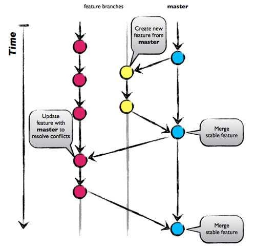
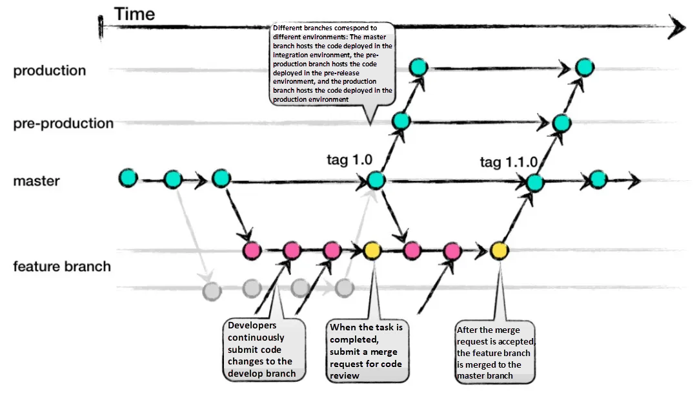
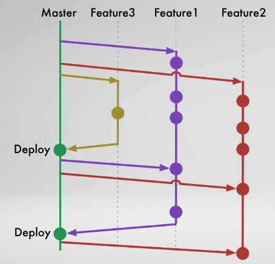

# 깃 브랜치

## 브랜치 네이밍 및 정책 정리

### 기본 브랜치 (main 또는 master)

- **역할**: 제품의 **가장 안정적인 버전**을 유지하는 브랜치
- **설정**:
  - 직접 커밋이나 merge **금지** (`protected branch` 설정)
  - **CI/CD 배포 파이프라인의 기준 브랜치**
  - 보통 `release/*` 또는 `hotfix/*`에서만 merge 가능

> 운영 서버에 배포된 버전 = main 브랜치의 코드

### Develop 브랜치 (`develop` 또는 `dev`)

- **역할**: 전체 기능이 통합되어 QA 및 스테이징 테스트가 이루어지는 브랜치
- **병합 대상**:
  - `feature/*`, `bugfix/*` 브랜치 병합
- **배포 환경**: Staging / Dev 서버

> 테스트용 서버에서 사용자 시나리오, 기능 점검 등을 할 수 있도록 유지되는 브랜치

### Release 브랜치 (`release/yyyymmdd`, `release/v1.2.3` 등)

- **역할**: 배포 준비가 완료된 상태의 브랜치
- **용도**:
  - `develop`에서 기능이 확정된 후 분기
  - QA팀의 **최종 검수** 및 **버그 수정** 용도로 사용
- **배포 환경**: UAT(User Acceptance Testing) 환경, pre-production 환경
- **병합**:
  - QA 통과 → `main`과 `develop` 양쪽에 병합

> 고객 시연, UAT, QA 승인 과정을 위한 브랜치

### Feature 브랜치 (`feature/US-1234`, `feature/login-form` 등)

- **역할**: 특정 기능/작업 단위 개발
- **작업 기준**: Jira 티켓 단위 (예: `feature/US-1234-add-login`)
- **병합 대상**: `develop` 또는 `dev` 브랜치로만 PR 가능
- **규칙**:
  - `main`, `release`, `production`에는 직접 merge 금지

> 개인/소규모 작업 공간으로 사용하고, 작업 완료 후 PR을 통해 병합

### Hotfix 브랜치 (`hotfix/login-crash`, `hotfix/US-1235` 등)

- **역할**: 운영 중 긴급한 버그/장애 수정
- **생성 기준**: `main` 브랜치에서 바로 분기
- **병합 대상**:
  - 수정 후 `main`과 `develop` 모두에 병합해야 함
- **우선순위**: 최상위 (모든 작업보다 우선)

> 운영 장애 대응 → 빠른 패치 → 즉시 배포 가능한 형태로 유지

### 브랜치 이름과 프로젝트 관리 툴 연동

Jira, ClickUp 등과 연동 시 브랜치 명에 **이슈 키(Key)**를 포함하면 추적이 쉬움:

| 작업 종류 | Jira 이슈 예시 | 브랜치 이름 예시              |
| --------- | -------------- | ----------------------------- |
| 기능 개발 | US-1234        | `feature/US-1234-login-page`  |
| 핫픽스    | HOTFIX-7890    | `hotfix/HOTFIX-7890-db-crash` |

> GitHub, GitLab, Bitbucket은 이 브랜치명으로 PR을 만들면 이슈 자동 연결 가능

## 브랜치 네이밍 규칙 요약

| 유형      | 네이밍 예시                   | 목적                      | 병합 대상           |
| --------- | ----------------------------- | ------------------------- | ------------------- |
| 기본      | `main`                        | 운영 배포 코드            | `release`, `hotfix` |
| 개발      | `develop` 또는 `dev`          | 전체 통합 개발, QA 테스트 | `feature`,          |
| 릴리즈    | `release/20240630-v1.2.0`     | QA 및 고객 검수용         | `main`, `develop`   |
| 기능      | `feature/US-1234-login-form`  | 새 기능 개발              | `develop`           |
| 긴급 수정 | `hotfix/HOTFIX-7890-db-crash` | 운영 중 에러 대응         | `main`, `develop`   |

## 브랜치 모델

### Git flow

- **구성**: `main`, `develop`, `feature`, `release`, `hotfix` 브랜치
- **동작 방식**:
  - 기능 개발은 `feature/` 브랜치에서 시작하여 `develop`에 병합
  - 릴리즈 준비는 `release/` 브랜치 생성 후 QA 및 테스트
  - 배포는 `release` → `main`으로, 동시에 `develop`에도 병합
  - 긴급 수정은 `hotfix/` 브랜치 생성 → `main`과 `develop`에 병합

#### Git flow 장점

- 각 작업의 성격(개발, 릴리즈, 핫픽스 등)이 명확히 분리됨
- 안정성과 팀 협업에 매우 적합

#### Git flow 단점

- 브랜치가 많아지고 흐름이 복잡해짐
- 자동화되지 않으면 유지관리 비용이 큼

#### Git flow 적합한 경우

- **중대형 기업**, QA 프로세스가 명확한 팀
- 릴리즈 주기가 긴 프로젝트, ex: 금융, 의료, 공공 시스템

### GitHub flow

**구성**: `main` 브랜치 + `feature` 브랜치

#### 동작 방식

- 배포 가능한 코드는 항상 `main`에 있어야 함
- 새로운 작업은 모두 `feature` 브랜치에서 시작
- 작업이 끝나면 `main`으로 Pull Request를 통해 병합 (`main`은 항상 stable 해야 함)
- CI 테스트를 거쳐 바로 배포 가능

#### GitHub flow 장점

- 구조가 단순하고 배우기 쉬움
- 빠른 배포 및 반복적인 개발에 적합

#### GitHub flow 단점

- QA, Staging 환경이 따로 없으므로 문제 발생 시 직접 `main`에 영향
- 큰 팀이나 복잡한 배포 파이프 라인에는 적합하지 않음

#### GitHub flow 적합한 경우

- **소규모 팀**, 빠른 프로토타이핑, SaaS, 웹 서비스

### GitLab flow

- **구성**: `main`, `production`, `feature`, 필요 시 `pre-production` 브랜치
- **동작 방식**:
  - `main`은 항상 안정적인 코드
  - 배포는 `main` → `production` 으로 merge
  - `feature` 브랜치에서 작업 후 `main`에 병합

#### GitLab flow 장점

- GitHub Flow보다 실 운영 환경을 고려한 구조
- 다양한 배포 전략(ex: staging → production)이 가능

#### GitLab flow 단점

- 실제 클라우드 기반 MSA 환경에서는 인프라와 연동된 브랜치 전략이 따로 필요함
- 운영 서버에서 문제가 생기면 롤백이 어려울 수 있음

#### GitLab flow 적합한 경우

- **모바일 앱, 빠른 릴리즈 주기가 필요한 팀**
- 다양한 배포 환경(ex: QA, Staging, Prod)이 필요한 프로젝트

## Git Flow vs GitLab Flow 비교

| 역할      | Git Flow    | GitLab Flow      | 설명                                                       |
| --------- | ----------- | ---------------- | ---------------------------------------------------------- |
| 기능 개발 | `feature/*` | `feature/*`      | 동일하게 브랜치 따서 작업                                  |
| 통합 개발 | `develop`   | **`main`**       | GitLab Flow에서는 `main`이 실질적인 개발 통합 브랜치       |
| QA / 검수 | `release/*` | `pre-production` | 검수용 브랜치. 릴리즈 브랜치 또는 스테이징 브랜치          |
| 운영 배포 | `main`      | `production`     | GitLab Flow는 운영 배포를 별도 브랜치(`production`)로 관리 |
| 긴급 수정 | `hotfix/*`  | `hotfix/*`       | 동일하게 운영 브랜치 기준으로 생성                         |

### Trunk-based flow (CI/CD 기반 빠른 통합 모델)

**구성**: `main` (또는 `trunk`) 브랜치 하나를 중심으로 짧은-lived 브랜치 사용

#### Trunk-based flow 동작 방식

- 모든 개발자는 자주 (하루에도 여러 번) `main`에 merge
- `feature` 브랜치는 아주 짧게 유지하거나 없이도 작업 가능
- CI/CD가 필수적으로 연동되어야 함
- 테스트 자동화 실패 시 → 병합 실패이기 때문에 테스트가 없으면 적용 불가

#### Trunk-based flow 장점

- 지속적인 통합(Continuous Integration)과 빠른 피드백 가능
- 브랜치 충돌, 병합 지옥 줄어듦

#### Trunk-based flow 단점

- 바로 실서버로 배포하기 때문에 테스트 코드, 빌드 검증, 코드 리뷰 프로세스가 미흡하면 코드 품질이 하락함
- merge 타이밍, PR 크기, 커밋 기준 등에 대한 팀 규칙이 없으면 협업이 어려움

#### Trunk-based flow 적합한 경우

- **대규모 서비스 운영 팀**, CI/CD 체계가 잘 갖춰진 조직
- Google, Facebook 같은 빅테크에서 선호

### 운영 서버랑 개발 서버가 따로 있어요?

| 상황                                                        | 설명                     | 관련된 플로우                 |
| ----------------------------------------------------------- | ------------------------ | ----------------------------- |
| ❌ 그런 거 없음. 그냥 merge하고 바로 올라감                 | 배포 환경 구분이 없음    | GitHub Flow, Trunk-based Flow |
| ✅ 있어요. staging에 먼저 올리고, 그 다음에 운영에 반영해요 | 배포 환경 단위로 움직임  | GitLab Flow                   |
| ✅ 있어요. staging에서도 한꺼번에 여러 기능 테스트해요      | 버전 단위 QA → 운영 배포 | Git Flow                      |

### 이런 말 들으면 익숙해요?

| 대화 예시                                 | 사용되는 브랜치 전략                  |
| ----------------------------------------- | ------------------------------------- |
| “지금 staging에 배포됐어요?”              | **GitLab Flow**                       |
| “이번 릴리즈(v1.2.0)에 뭐 들어가요?”      | **Git Flow**                          |
| “main에 merge되면 바로 올라가요”          | **GitHub Flow**, **Trunk-based Flow** |
| “자주 머지해주세요, trunk 깨지면 안 돼요” | **Trunk-based Flow**                  |
