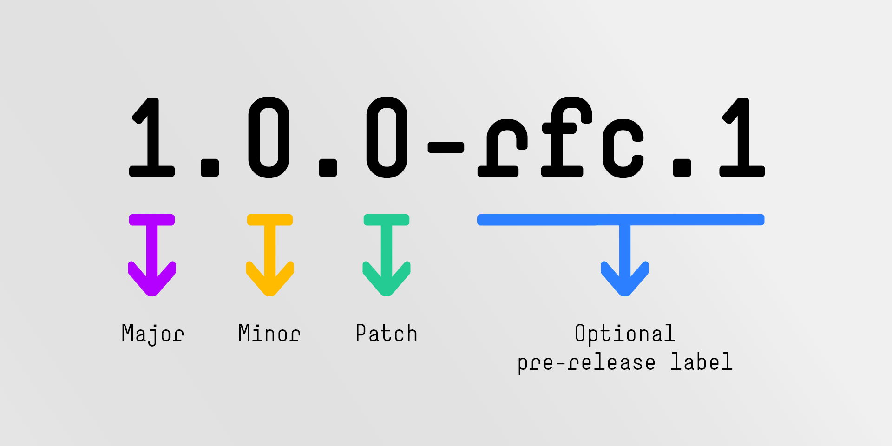

# Git Tag

Git의 커밋에 라벨을 붙여 버전처럼 관리하는 기능입니다.
주로 릴리즈 시점이나 중요한 커밋을 버전처럼 기록할 때 사용합니다.

브랜치는 계속 이동하지만, 태그는 특정 커밋에 고정됩니다.
Lightweight Tag (간단한 라벨)와 Annotated Tag (메타데이터 포함)가 있습니다.

## 태그를 사용하는 주요 이유

### 배포 버전 식별

→ v1.0.0은 정확히 어느 커밋인지?
→ 태그로 관리하면 git checkout v1.0.0으로 바로 확인 가능.

### CI/CD 연동

→ 많은 배포 파이프라인(GitHub Actions, GitLab CI 등)은 태그가 푸시될 때 배포하도록 설정함.

### Release 자동 생성 (예: GitHub Releases)

→ 태그와 연동해서 릴리스 노트, 다운로드 링크 자동 생성 가능.

### 버전 관리

→ v1.0.0, v1.1.0-beta 등 의미 있는 버전 이력을 남길 수 있음.

## Semantic Versioning



애플리케이션이나 라이브러리를 개발을 시작한 후 최초 배포하는 릴리스 버전은 보통 1.0.0입니다

### Patch Release

패치는 제일 오른쪽의 숫자로 신규 기능이나 의미 있는 변경사항을 수반하지 않습니다.\
단순한 버그 수정 건이나 아주 미미한 수정사항만 있어 사용자가 소프트웨어나 코드를 사용하는 데 영향이 없습니다.

### Minor Release

마이너 릴리스는 신기능이 추가됐을 때 배포합니다.\
그래도 하위 호환성은 유지됩니다.

마이너 릴리스에 신기능이 반드시 포함되는 건 아닙니다.\
뭔가 새롭게 추가된 게 있지만 이로 인해 사용자가 바꿔야 하는 건 없습니다.\
코드를 바꿔야 할 수도 있지만 추가는 할 수 있는 상황이라거나 이런 조건이라면 마이너 릴리스로 배포합니다.

마이너 릴리스로 배포 시 패치 번호는 항상 0으로 재설정해야 합니다.

### Major Release

메이저 릴리스는 하위 호환성이 보장되지 않을 때 기능이 완전히 삭제된다거나 혹은 큰 변화가 있을 때 배포합니다.
이전에 사용하던 대로 사용 못할 수도 있습니다.\
메이저 릴리스 번호가 증가되면 나머지 자리는 0으로 재설정합니다.

## 릴리즈 노트와 CHANGLOG

### 릴리즈 노트 (Release Notes)

#### 릴리즈 노트 정의

새로운 버전이 릴리즈될 때 사용자에게 제공하는 요약 문서.\
Git Tag에 추가 기능을 더하는 GitHub 기능으로 최종 사용자(고객, 클라이언트, 팀원)를 대상으로 작성.

#### 릴리즈 노트 포함 내용

새 기능 소개

주요 개선사항

중요한 버그 수정

사용상의 변경점 또는 주의사항

#### 릴리즈 노트 대상

비개발자 포함 (마케터, 고객, 운영팀 등)\
UI/UX 개선, 새로운 기능이 궁금한 사용자

#### 릴리즈 노트 예시

```md
v2.0.0 - 2025.07.13

새로운 기능

- 다크 모드가 추가되었습니다.
- 알림 설정 기능이 추가되었습니다.

버그 수정

- 로그인 시 무한 로딩 문제 수정
- 모바일에서 버튼 눌림 오류 해결

주의사항

- 이 버전부터는 Node.js 18 이상이 필요합니다.
```

### CHANGELOG

#### CHANGELOG 정의

- 소프트웨어 프로젝트의 버전별 변경 이력을 기술한 기술적 로그 파일

- CHANGELOG.md 파일로 프로젝트 루트에 위치하는 경우가 많음

#### CHANGELOG 포함 내용

- 커밋 수준의 기술적 변경사항

- 버전별로 정리된 변경 이력

- 구조는 다음과 같은 포맷을 따르기도 함:
  [Keep a Changelog](https://keepachangelog.com/ko/1.0.0/)

#### CHANGELOG 대상

- 개발자, 협업자, 오픈소스 사용자

- 코드 변경 이유나 흐름이 궁금한 사람

#### CHANGELOG 예시

```md
## [2.0.0] - 2025-07-13

### Added

- 다크 모드 추가
- 알림 설정 기능

### Changed

- 로그인 프로세스를 OAuth 기반으로 변경

### Fixed

- 모바일에서 버튼이 눌리지 않던 버그 수정
```

### 릴리즈 노트 vs CHANGELOG

| 항목        | Release Notes                         | CHANGELOG                             |
| ----------- | ------------------------------------- | ------------------------------------- |
| 대상        | 사용자, 비개발자 포함                 | 개발자, 기술 팀                       |
| 형식        | 자연어 설명 위주                      | 마크다운 형식, 구조화된 항목별 리스트 |
| 목적        | 새 버전의 주요 변화 소개              | 전체 변경 이력 관리                   |
| 위치        | 웹사이트, GitHub 릴리스, 배포 문서 등 | 코드 저장소 내 `CHANGELOG.md`         |
| 작성 스타일 | 친근하고 이해하기 쉬운 설명           | 구조화되고 일관된 형식                |

## Release 브랜치 전략과 태그

| 브랜치 종류 | 설명                                         |
| ----------- | -------------------------------------------- |
| `main`      | 항상 배포 가능한 상태                        |
| `develop`   | 개발 진행 중                                 |
| `release/*` | 배포 준비를 위한 브랜치 (`release/1.2.0` 등) |
| `hotfix/*`  | 긴급 수정 후 바로 배포할 브랜치              |

### 태그는 어디서 붙이나?

→ `release/*` 브랜치가 merge되어 배포될 시점에 해당 커밋에 v1.2.0 같은 태그를 붙임.

```bash
# 예시
git checkout main
git merge release/1.2.0
git tag -a v1.2.0 -m "Release 1.2.0"
git push origin main
git push origin v1.2.0
```

## 태그 종류

### Lightweight Tag (경량 태그)

그냥 커밋에 이름만 붙이는 것.(비추)

명령어: git tag v1.0.0

### Annotated Tag (주석 태그)

만든 사람, 날짜, 메시지, GPG 서명 등을 포함한 진짜 버전용.

명령어: git tag -a v1.0.0 -m "First release"

## 3. 태그 관련 명령어

| 명령어                                 | 설명                             |
| -------------------------------------- | -------------------------------- |
| `git tag`                              | 현재 존재하는 태그 목록 보기     |
| `git tag -a <tagname> -m "message"`    | Annotated Tag 생성               |
| `git tag <tagname>`                    | Lightweight Tag 생성             |
| `git show <tagname>`                   | 해당 태그가 가리키는 커밋 보기   |
| `git tag -d <tagname>`                 | 로컬 태그 삭제                   |
| `git push origin <tagname>`            | 특정 태그 원격 저장소에 푸시     |
| `git push origin --tags`               | **모든 태그** 원격 저장소에 푸시 |
| `git push origin :refs/tags/<tagname>` | 원격 태그 삭제                   |

```bash
# 배포 준비 완료된 커밋에 태그 붙이기
git tag -a v1.0.0 -m "First stable release"
git push origin v1.0.0
```

## 참고

- [Semantic Versioning 2.0.0](https://semver.org/)
