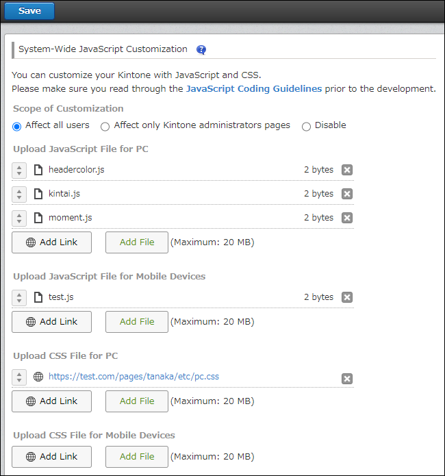

# Kintone 전역(System-wide) JavaScript 및 CSS 커스터마이징

문서 번호: 04042

JavaScript 및 CSS를 사용하여 Kintone 전체의 동작과 모양을 커스터마이징할 수 있습니다.\
PC와 모바일 기기(모바일 앱 포함)에 대해 별도로 커스터마이징을 설정할 수 있습니다.

Kintone 관리(Administratio) 화면에서 JavaScript와 CSS 파일을 적용하는 화면에 접근할 수 있습니다.\
이곳에서 파일을 적용하면 Kintone 전체뿐만 아니라, 포털(메인 페이지) 이나 스페이스 포털(Space Portal) 도 커스터마이징할 수 있습니다.

> 팁 (Tips)\
> 개별 앱을 별도로 커스터마이징하려면, 각 앱의 앱 설정(App Settings) 화면에서 JavaScript 또는 CSS 파일을 적용하세요.\
> 자세한 내용은 다음 문서를 참조하십시오.\
> [Customizing an app using JavaScript and CSS](https://get.kintone.help/k/en/id/040556.html)

Kintone에서 제공하는 API를 사용하여 Kintone 전체에 적용할 커스터마이징 파일을 만들 수 있습니다.\
자세한 내용은 다음 페이지를 참조하십시오.\
[Kintone Developer Program](https://kintone.dev/en/)

> 주의 (Note)\
> JavaScript 및 CSS를 이용한 커스터마이징은
> 라이선스 조건에 따라 사용이 불가능할 수도 있습니다.

## Kintone 전역 커스터마이징이 적용되는 화면

Kintone 관리(Administration)에서 가져온 JavaScript 및 CSS 파일이
어떤 화면에 적용되는지에 대한 정보는 다음 페이지를 참조하십시오.\
[Pages where Kintone system-wide customizations are applied](https://cybozu.dev/ja/id/394dea74a167d5bca527ec3f/#available-pages)

## JavaScript 및 CSS 파일 적용하기 (Applying JavaScript and CSS files)

이 섹션에서는 JavaScript 및 CSS로 만든 커스터마이징 파일을
Kintone에 적용하는 방법을 설명합니다.
단, Kintone 관리자(Kintone Administrator) 만 커스터마이징을 적용할 수 있습니다.

1. Kintone 관리 화면 열기

   [Kintone 관리 화면(Kintone Administration screen)](https://get.kintone.help/k/en/id/04046.html)을 엽니다.

2. JavaScript 및 CSS 커스터마이징 선택

   “JavaScript and CSS customization” 을 클릭합니다.

3. 커스터마이징 범위(Scope) 선택

   “Customizing Kintone system-wide” 화면에서 아래 중 하나를 선택합니다.

   - Affect all users (모든 사용자에게 적용)

   - Affect only Kintone administrators pages (관리자 페이지에만 적용)

   - Disable (비활성화)

   커스터마이징을 모든 사용자에게 적용하기 전에,
   먼저 관리자 페이지에만 적용(Affect only administrators) 하여
   정상적으로 동작하는지 확인하는 것이 좋습니다.

   참고: 어떤 옵션을 선택하더라도, 커스터마이징은 게스트 사용자(Guest Users) 에게는 적용되지 않습니다.

4. 파일 추가 (Add file / Add link)

   Add link 또는 Add file 을 클릭하여 가져올 파일을 선택합니다.

   여러 파일을 가져올 경우,
   리스트에 표시된 순서대로 읽어들입니다.
   각 파일 이름 왼쪽에 있는 “Drag to reorder”(상하 화살표 아이콘)을 드래그하여
   순서를 변경할 수 있습니다.

   

   > 참고 (Note)\
   > Add link 버튼을 사용하여 파일을 가져오는 경우,
   > kintone.com 외의 도메인도 지정할 수 있습니다.

   PC와 모바일 각각에 대해 최대 30개 파일까지 가져올 수 있습니다.

5. 저장 (Save)

   화면 왼쪽 상단의 Save 버튼을 클릭합니다.

> 주의 (Note)\
> 개별 앱(App) 내에서 설정된 플러그인(Plugins) 또는 JavaScript/CSS 파일이 있더라도,
> Kintone 관리(Administration)에서 가져온 전역 커스터마이징 파일이
> 우선순위를 가지며, 앱 내 설정보다 먼저 읽히게 됩니다.
