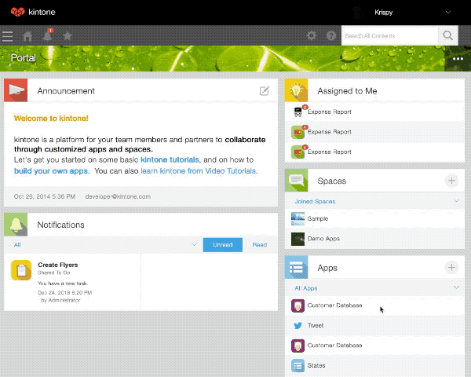
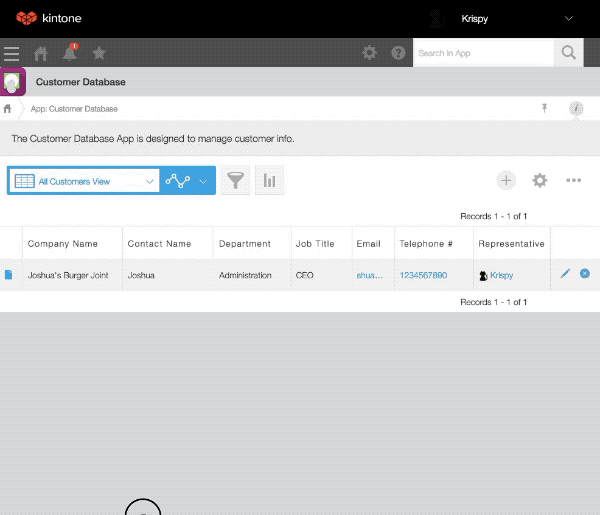

# kintone REST API 빠른 시작

## 개요 (Overview)

kintone REST API를 사용하면, 외부 서비스에서 레코드(Records), 앱(Apps), 스페이스(Spaces) 등을 제어할 수 있습니다.\
이 문서는 커맨드라인 도구에서 curl 명령을 이용해 Get Record API를 실행하는 방법을 소개합니다.\
이를 통해 kintone 앱에 저장된 레코드 데이터를 가져올 수 있습니다.

더 자세한 API 설명은 아래 문서를 참고하세요.
[Get Record API 문서](https://kintone.dev/en/docs/kintone/rest-api/records/get-record/)

## Step 1. kintone 서브도메인(subdomain) 얻기

kintone에서 커스터마이징이나 외부 연동을 테스트하려면, 서브도메인이 필요합니다.

### 옵션 1. 개발자 프로그램(Developer Program)

kintone 개발자 프로그램에 가입하면, 무료로 1년간 사용할 수 있는 개발자용 라이선스를 받을 수 있습니다.

아래 페이지에서 신청합니다.\
[Developer License Registration Form](https://kintone.dev/en/developer-license-registration-form/)

라이선스를 발급받은 뒤 이 문서로 돌아오세요.

### 옵션 2. 30일 무료 체험

간단히 사용해보고 싶다면, kintone 공식 웹사이트에서 30일 무료 체험 환경을 신청할 수도 있습니다.\
[Start Your 30-Day Free Trial](https://www.kintone.com/en-us/trial/)

## Step 2. kintone 앱(App) 준비하기

레코드 데이터를 가져오기 전에, 앱(App) 을 하나 만들고 레코드(데이터) 를 최소 한 개 이상 추가해야 합니다.

발급받은 서브도메인에 로그인합니다.

1. 포털(홈 화면)에서 “Apps” 위젯의 [+] 아이콘을 클릭합니다.\
    왼쪽 메뉴에서 Customer Service 카테고리를 선택하고,
   “Customer Database App”을 찾아 Add This App을 클릭합니다.\
    확인 메시지가 뜨면 승인하여 앱을 추가합니다.\
    이렇게 하면 kintone 환경에 Customer Database App이 추가됩니다.

   

2. 이제 포털에서 “Customer Database App”을 클릭하여 앱으로 들어갑니다.\
   데이터가 없다면 목록이 비어 있을 것입니다.\
   오른쪽 상단의 [+] 아이콘을 클릭해 새 레코드를 추가하고, Save를 눌러 저장합니다.\
   이제 첫 번째 레코드가 앱에 성공적으로 추가되었습니다.

   

## Step 3. API 토큰 생성 및 요청 파라미터 준비

이 단계에서는 REST API 요청을 보내기 위한 필수 정보들을 준비합니다.

### 1. App ID와 Record ID 확인하기

요청에는 App ID와 Record ID가 포함되어야 합니다.\
이 파라미터들을 확인하려면, 레코드 상세 페이지(record details page) 로 이동합니다.

App ID와 Record ID는 URL에 다음과 같은 형태로 표시됩니다.

```json
https://<SUBDOMAIN>.kintone.com/k/<App ID>/show#record=<Record ID>
```

예를 들어, 서브도메인이 example인 다음 URL에서는 App ID가 42이고, Record ID는 8입니다.

```json
https://example.kintone.com/k/42/show#record=8
```

### 2. 요청 URL 확인하기

REST API 호출에 사용되는 요청 URI는 다음 형식을 가집니다.

```json
https://<SUBDOMAIN>.kintone.com/k/v1/record.json
```

따라서, 서브도메인이 example이라면 요청을 보낼 URL은 다음과 같습니다.

```json
https://example.kintone.com/k/v1/record.json
```

이제 앞서 확인한 요청 파라미터(App ID, Record ID)를 추가하여 최종 요청 URI를 다음과 같이 구성합니다.

```json
https://<SUBDOMAIN>.kintone.com/k/v1/record.json?app=<APP ID>&id=<RECORD ID>
```

지금까지의 예시를 조합하면, 이 예제에서의 최종 요청 URI는 다음과 같습니다.

```json
https://example.kintone.com/k/v1/record.json?app=42&id=8
```

### 3. API 토큰 생성하기

kintone REST API에는 세 가지 종류의 인증 방식이 있습니다.\
비밀번호 인증(Password Authentication), API 토큰 인증(API Token Authentication), 그리고 세션 인증(Session Authentication)입니다.\
자세한 내용은 아래 문서의 인증(Authentication) 섹션을 참고하세요.\
[kintone REST API](https://kintone.dev/en/docs/kintone/rest-api/overview/kintone-rest-api-overview/#authentication)

이 예제에서는 API 토큰 인증(API token authentication) 을 사용합니다.

앱에서 API 토큰을 생성하려면, 이전 단계에서 만든 Customer Database App으로 이동합니다.\
앱의 아무 페이지에서 오른쪽 상단에 있는 톱니바퀴(⚙️) 아이콘을 클릭하여 앱 설정(App Settings) 으로 이동합니다.\
상단 탭에서 App Settings 탭을 열고, API Token 항목을 클릭합니다.\
새 토큰을 생성(Generate New Token)한 뒤 Save를 클릭하고,
마지막으로 Update App 버튼을 눌러 앱을 업데이트합니다.



\*Update App 버튼을 누르지 않으면 API 토큰이 활성화되지 않습니다.

## Step 4. 데이터 조회하기

이제 준비된 정보는 다음과 같습니다.

|    항목     |                        내용                        |
| :---------: | :------------------------------------------------: |
|   App ID    |                      예: `42`                      |
|  Record ID  |                      예: `8`                       |
| Request URL | 예: `https://example.kintone.com/k/v1/record.json` |
|  API Token  |   예: `DjsLvFiyqwDTDxJJSXnNiAuGARpPMnUIYzFluegQ`   |
|    curl     |                     명령 실행                      |

다음 명령을 터미널에서 실행하여 데이터를 가져올 수 있습니다.

```bash
curl -X GET \
  -H "X-Cybozu-API-Token:<API Token>" \
  "https://<SUBDOMAIN>.kintone.com/k/v1/record.json?app=<App ID>&id=<Record ID>"
```

예를 들어:

```bash
curl -X GET \
  -H "X-Cybozu-API-Token:DjsLvFiyqwDTDxJJSXnNiAuGARpPMnUIYzFluegQ" \
  "https://example.kintone.com/k/v1/record.json?app=42&id=8"
```

실행 결과(JSON 응답)

명령을 실행하면 터미널에 다음과 같은 JSON 데이터가 출력됩니다.

```json
{
  "record": {
    "contact_name": { "type": "SINGLE_LINE_TEXT", "value": "Joshua" },
    "address": { "type": "SINGLE_LINE_TEXT", "value": "1234 Yum street." },
    "notes": { "type": "MULTI_LINE_TEXT", "value": "" },
    "Last_user": {
      "type": "MODIFIER",
      "value": { "code": "Krispy", "name": "Krispy" }
    },
    "company_website": {
      "type": "LINK",
      "value": "https://www.shuaburgers.com/"
    },
    "telephone_number": { "type": "LINK", "value": "1234567890" },
    "$revision": { "type": "__REVISION__", "value": "1" },
    "Single_line_text_1": {
      "type": "SINGLE_LINE_TEXT",
      "value": "Delicious burgers!"
    },
    "Updated_datetime": {
      "type": "UPDATED_TIME",
      "value": "2019-04-08T08:24:00Z"
    },
    "Created_datetime": {
      "type": "CREATED_TIME",
      "value": "2019-04-08T08:24:00Z"
    },
    "company_name": {
      "type": "SINGLE_LINE_TEXT",
      "value": "Joshua's Burger Joint"
    },
    "Record_number": { "type": "RECORD_NUMBER", "value": "1" },
    "Author": {
      "type": "CREATOR",
      "value": { "code": "Krispy", "name": "Krispy" }
    },
    "department": { "type": "SINGLE_LINE_TEXT", "value": "Administration" },
    "job_title": { "type": "SINGLE_LINE_TEXT", "value": "CEO" },
    "representative": {
      "type": "USER_SELECT",
      "value": [{ "code": "Krispy", "name": "Krispy" }]
    },
    "email": { "type": "LINK", "value": "shua@shuaburgers.com" },
    "$id": { "type": "__ID__", "value": "1" }
  }
}
```

응답 구조 설명

최상위 키는 "record"입니다.

"record" 안에는 앱의 각 필드(field) 가 객체 형태로 포함되어 있습니다.

각 필드는 "type"(필드 유형)과 "value"(값)을 갖습니다.

예를 들어:

```json
"company_name": {
  "type": "SINGLE_LINE_TEXT",
  "value": "Joshua's Burger Joint"
}
```

이 의미는 “필드 코드가 company_name인 단일 텍스트 필드의 값은 Joshua's Burger Joint이다.”
라는 뜻입니다.

## 참고 (Reference)

이 과정을 통해, 단 4단계만에 curl을 사용하여 kintone 앱에서 특정 레코드의 데이터를 가져올 수 있었습니다.\
이 데이터는 이제 다른 외부 서비스나 시스템과의 연동에 자유롭게 활용할 수 있습니다.\
kintone에는 이 외에도 다음과 같은 다양한 REST API가 있습니다.\
새로운 레코드 추가 (Add Record), 기존 레코드 수정 (Update Record), 레코드 삭제 (Delete Record)

인증 방식, 요청 헤더, 제한사항 등 REST API 전반적인 상세 내용은 아래 페이지를 참고하세요.\
[Kintone REST API Overview](https://kintone.dev/en/docs/kintone/rest-api/overview/kintone-rest-api-overview/)
