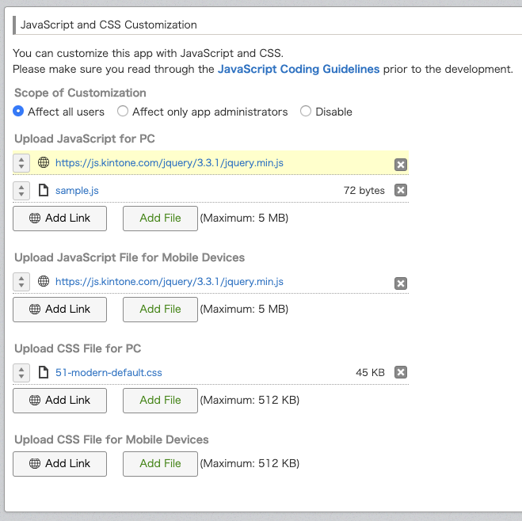

# Customize-uploader를 사용하여 JavaScript 및 CSS 파일 업로드하기

## 목차

- [개요](#개요)
- [Customize-uploader란?](#customize-uploader란)
- [설치](#설치)
- [매니페스트 파일 생성](#매니페스트-파일-생성)
- [JavaScript 및 CSS 파일 업로드 방법](#javascript-및-css-파일-업로드-방법)
- [선택적 기능](#선택적-기능)
- [하위 명령어(Sub-Commands)](#하위-명령어sub-commands)
- [참고 문서](#참고-문서)

## 개요

이 문서는 **Customize-uploader** 도구의 사용 방법을 소개합니다.  
이 도구는 JavaScript 및 CSS 파일이 변경될 때마다 Kintone 앱으로 자동 업로드해주는 역할을 합니다.

## Customize-uploader란?

**Customize-uploader**는 JavaScript 및 CSS 커스터마이징 파일을 Kintone 앱에 업로드하는 CLI(Command Line Interface) 도구입니다.  
이 도구는 **npm**에 게시되어 있으며, **Windows**, **macOS**, **Linux**에서 사용할 수 있습니다.  
소스 코드는 [GitHub (외부 링크)](https://github.com/kintone/js-sdk/tree/master/packages/customize-uploader)에 공개되어 있습니다.

Node.js 버전 요구사항은 `package.json` 파일의 `engines` 속성에서 확인할 수 있습니다.  
예를 들어, 다음과 같이 설정되어 있다면 Node.js 10버전 이상이 필요합니다.

```json
"engines": {
  "node": ">=10"
}
```

## 설치

다음 명령어를 실행하여 customize-uploader를 전역(global)으로 설치할 수 있습니다:

```bash
npm install -g @kintone/customize-uploader
```

## 매니페스트 파일 생성

**Customize-uploader**를 사용하려면 `매니페스트(manifest)` 파일이 필요합니다.  
이 파일에는 업로드 대상 앱의 **App ID**, 업로드할 **커스터마이징 파일 경로** 등의 정보가 포함됩니다.  
매니페스트 파일은 업로드할 파일과 같은 디렉터리 계층에 위치해야 합니다.

매니페스트 파일에는 다음 정보를 포함해야 합니다:

| 키        | 설명                                                      |
| --------- | --------------------------------------------------------- |
| `app`     | 업로드할 Kintone 앱의 App ID                              |
| `scope`   | 커스터마이징 범위 (`"ALL"` \|\| `"ADMIN"` \|\| `"NONE"`)  |
| `desktop` | PC용 JavaScript 및 CSS 파일 (`"js": []`, `"css": []`)     |
| `mobile`  | 모바일용 JavaScript 및 CSS 파일 (`"js": []`, `"css": []`) |

> CDN 라이브러리를 사용할 경우, 라이브러리의 URL을 입력할 수 있습니다.  
> 예: `https://js.kintone.com/jquery/3.3.1/jquery.min.js`

### 예시: 완성된 `customize-manifest.json`

```json
{
  "app": "1",
  "scope": "ALL",
  "desktop": {
    "js": ["https://js.kintone.com/jquery/3.3.1/jquery.min.js", "sample.js"],
    "css": ["51-modern-default.css"]
  },
  "mobile": {
    "js": ["https://js.kintone.com/jquery/3.3.1/jquery.min.js"],
    "css": []
  }
}
```

위 매니페스트 파일을 사용해 업로드하면, Kintone 앱의 **JavaScript/CSS 커스터마이징 설정 페이지**는 다음과 같이 표시됩니다.



단일 JavaScript 파일만 업로드할 경우, 매니페스트 파일은 다음과 같습니다:

```json
{
  "app": "1",
  "scope": "ALL",
  "desktop": {
    "js": ["sample.js"],
    "css": []
  },
  "mobile": {
    "js": [],
    "css": []
  }
}
```

## JavaScript 및 CSS 파일 업로드 방법

Customize-uploader를 실행할 때는 Kintone **서브도메인(subdomain)** 정보를 지정해야 합니다.  
이 정보를 지정하는 방법에는 세 가지가 있습니다.

> ⚠️ **주의:** Customize-uploader는 **대상 앱의 관리자 권한(Admin)** 계정으로 실행해야 합니다.

### ① 직접 지정 (Direct Specification)

명령어 실행 시, 서브도메인, 사용자 이름, 비밀번호를 옵션으로 함께 지정할 수 있습니다.

```bash
# 매니페스트 파일이 위치한 디렉터리로 이동
cd sample_project

# 명령 실행
kintone-customize-uploader --base-url https://<subdomain>.kintone.com --username <username> --password <password> customize-manifest.json
```

**출력 예시:**

```bash
sample.js has been uploaded!
JavaScript/CSS files have been uploaded!
Customize setting has been updated!
Wait for deploying completed...
Wait for deploying completed...
Setting has been deployed!
```

### ② 대화형 지정 (Interactive Specification)

매니페스트 파일만 지정하면 대화형 입력 모드로 실행됩니다.  
이때 도메인, 사용자 이름, 비밀번호를 순서대로 입력합니다.

```bash
# 매니페스트 파일이 위치한 디렉터리로 이동
cd sample_project

# 명령 실행
kintone-customize-uploader customize-manifest.json

# 대화형 입력 예시
? Input your kintone's domain (https://example.cybozu.com): https://<subdomain>.kintone.com
? Input your username: <username>
? Input your password: <password>
```

**출력 예시:**

```bash
sample.js has been uploaded!
JavaScript/CSS files have been uploaded!
Customize setting has been updated!
Wait for deploying completed...
Wait for deploying completed...
Setting has been deployed!
```

### ③ 환경 변수 지정 (Specification Using Environment Variables)

민감한 정보를 화면에 노출하지 않으려면, 환경 변수로 Kintone 정보를 미리 설정할 수 있습니다.

#### ✅ Windows (PowerShell)

```bash
# 환경 변수 설정
set-item "env:KINTONE_BASE_URL" https://<subdomain>.kintone.com
set-item "env:KINTONE_USERNAME" <username>
set-item "env:KINTONE_PASSWORD" <password>
set-item "env:HTTPS_PROXY or HTTP_PROXY" <Proxy Server>

# 매니페스트 파일이 위치한 디렉터리로 이동
cd sample_project

# 명령 실행
kintone-customize-uploader customize-manifest.json
```

#### ✅ macOS / Linux

```bash
# 환경 변수 설정
export KINTONE_BASE_URL=https://<subdomain>.kintone.com
export KINTONE_USERNAME=<username>
export KINTONE_PASSWORD=<password>
export HTTPS_PROXY or HTTP_PROXY=<Proxy Server>

# 매니페스트 파일이 위치한 디렉터리로 이동
cd sample_project

# 명령 실행
kintone-customize-uploader customize-manifest.json
```

## 선택적 기능

### 🔄 파일 모니터링 (File Monitoring)

`--watch` 옵션을 사용하면 파일이 수정될 때마다 자동으로 Kintone에 업로드됩니다.  
이 옵션을 사용하면 GUI에서 수동 업로드할 필요가 없습니다.

```bash
kintone-customize-uploader --watch customize-manifest.json
```

> 모니터링을 중지하려면 `ctrl + c`를 누릅니다.

### 👥 게스트 스페이스 (Guest Space)

게스트 스페이스 내 앱에 커스터마이징 파일을 업로드할 때는 `--guest-space-id` 옵션을 사용합니다.

```bash
kintone-customize-uploader --guest-space-id <Guest space ID> customize-manifest.json
```

### 🌐 언어 설정 (Language Preference)

명령어 출력 언어는 `--lang` 옵션으로 지정할 수 있습니다.  
현재 영어(`en`)와 일본어(`ja`)를 지원합니다.

```bash
# 영어 설정
kintone-customize-uploader --lang en customize-manifest.json

# 일본어 설정
kintone-customize-uploader --lang ja customize-manifest.json
```

### 🌍 프록시 설정 (Proxy Settings)

프록시 서버를 사용하는 경우, `--proxy` 옵션을 통해 프록시 정보를 지정할 수 있습니다.

```bash
kintone-customize-uploader --proxy <Proxy Server> customize-manifest.json
```

또는 환경 변수를 사용할 수도 있습니다:

```bash
kintone-customize-uploader --proxy $HTTP_PROXY customize-manifest.json
```

## 하위 명령어(Sub-Commands)

### 🧩 `init`

`init` 하위 명령어를 사용하면 `customize-manifest.json` 파일을 자동으로 생성할 수 있습니다.

```bash
# 업로드할 파일이 위치한 디렉터리로 이동
kintone-customize-uploader init

# 대화형 입력 예시
? Input your app id: <appId>
? Select the scope of customization: "ALL" | "ADMIN" | "NONE"

# 출력 예시
dest/customize-manifest.json file has been created
```

### 📥 `import`

`import` 하위 명령어를 사용하면, 현재 Kintone 앱의 커스터마이징 정보를  
`customize-manifest.json` 파일로 가져올 수 있습니다.

```bash
kintone-customize-uploader import dest/customize-manifest.json

? Input your kintone's domain (https://example.cybozu.com): https://<subdomain>.kintone.com
? Input your username: <username>
? Input your password: [input is hidden] <password>
```

**출력 예시:**

```bash
Generate customize-manifest.json from kintone app customize
Download Uploaded files on kintone app customize
Finish importing from kintone app customize
```

## 참고 문서

- [Customize Uploader - README (외부 링크)](https://github.com/kintone/js-sdk/tree/master/packages/customize-uploader)
- [Customize Uploader - License (외부 링크)](https://github.com/kintone/js-sdk/blob/master/packages/customize-uploader/LICENSE)
