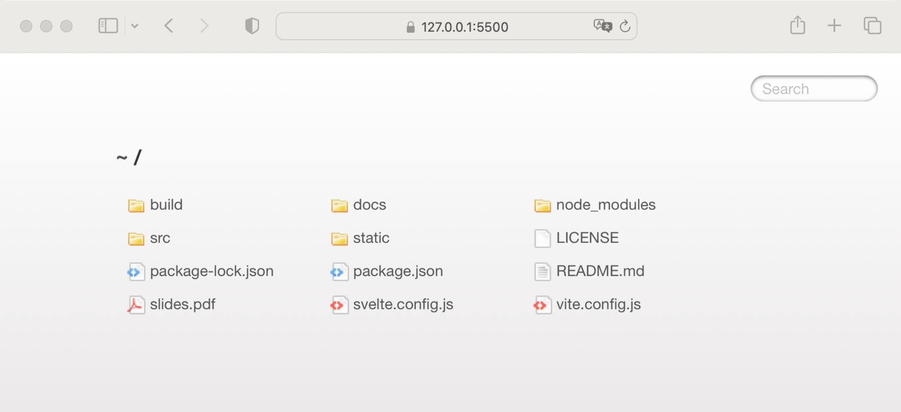
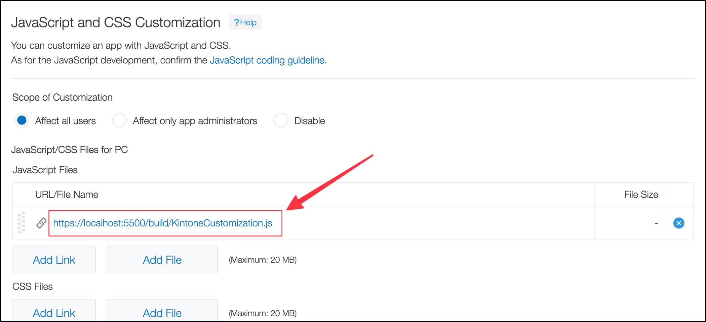

# Kintone 커스터마이징 개발을 위한 Visual Studio Code 설정 가이드

## 목차

- [개요](#개요)
- [준비 사항](#준비-사항)
- [작동 원리](#작동-원리)
- [개발 환경 설정 단계](#개발-환경-설정-단계)
  1. [mkcert 도구를 사용하여 인증서와 개인 키 생성하기](#1-mkcert-도구를-사용하여-인증서와-개인-키-생성하기)
  2. [Live Server 확장에서 HTTPS 활성화](#2-live-server-확장에서-https-활성화)
  3. [Live Server 확장을 사용해 로컬 개발 서버 실행](#3-live-server-확장을-사용해-로컬-개발-서버-실행)
  4. [Kintone 앱 설정에서 HTTPS 기반 localhost URL 설정](#4-kintone-앱-설정에서-https-기반-localhost-url-설정)
  5. [브라우저 새로고침으로 최신 커스터마이징 파일 반영](#5-브라우저-새로고침으로-최신-커스터마이징-파일-반영)
- [Webpack 프로젝트를 위한 추가 단계](#webpack-프로젝트를-위한-추가-단계)

## 개요

이 문서는 **Visual Studio Code (VS Code)**와 **Live Server 확장**을 사용하여  
로컬 커스터마이징 코드 변경 사항을 Kintone 앱에 **즉시 반영하는 방법**을 소개합니다.

이 환경을 구축하면 JavaScript 커스터마이징 개발 중 매번 수동으로  
커스터마이징 파일을 업로드할 필요가 없습니다.

## 준비 사항

이 설정에서는 다음 도구들을 사용합니다:

- [Visual Studio Code](https://code.visualstudio.com) (VS Code) 에디터
- [Live Server](https://marketplace.visualstudio.com/items?itemName=ritwickdey.LiveServer) VS Code 확장
- [mkcert](https://github.com/FiloSottile/mkcert) — 로컬에서 신뢰할 수 있는 개발용 인증서를 생성하는 CLI 도구

로컬 PC에 **VS Code**와 **Live Server 확장**을 설치하세요.

## 작동 원리

로컬 코드가 Kintone 앱과 동기화되는 과정은 다음과 같습니다:

1. VS Code에서 Kintone 커스터마이징 프로젝트를 엽니다.
2. Live Server 확장을 사용해 파일을 로컬에 호스팅합니다.
3. mkcert 명령줄 도구로 HTTPS를 활성화합니다.
4. Kintone 앱 설정에 `localhost`의 HTTPS URL을 등록합니다.
5. Kintone이 해당 URL에서 JavaScript 및 CSS 파일을 가져옵니다.


⚠️ **주의:**  
Kintone 커스터마이징에 등록할 수 있는 URL은 **HTTPS**만 허용됩니다.  
따라서 Live Server에서 HTTPS를 반드시 활성화해야 합니다.

## 개발 환경 설정 단계

다음은 Kintone 커스터마이징 개발 환경을 구성하는 주요 단계입니다:

1. mkcert 도구를 사용해 인증서와 개인 키 생성
2. Live Server 확장에서 HTTPS 활성화
3. Live Server로 로컬 개발 서버 실행
4. Kintone 앱 설정에 HTTPS localhost URL 등록
5. 브라우저 새로고침으로 최신 커스터마이징 파일 반영

💡 **참고:**  
Webpack을 사용하는 프로젝트는 추가 단계가 필요합니다.  
자세한 내용은 [Webpack 프로젝트를 위한 추가 단계](#webpack-프로젝트를-위한-추가-단계)를 참고하세요.

## 1. mkcert 도구를 사용하여 인증서와 개인 키 생성하기

이 단계에서는 `mkcert` CLI 도구를 설치, 초기화하고  
`https://localhost` 접근을 위한 인증서와 개인 키를 생성합니다.

> 2025년 3월 기준, mkcert의 최신 버전은 **v1.4.4**입니다.

### macOS

[Homebrew](https://brew.sh/)

```bash
brew install mkcert
```

### Windows

[Chocolatey](https://chocolatey.org/)

```bash
choco install mkcert
```

### [로컬 인증 기관(CA)](https://en.wikipedia.org/wiki/Certificate_authority) 설치

다음 명령어로 로컬 인증서를 설치합니다.  
비밀번호를 요청받으면 **컴퓨터 로그인 비밀번호**를 입력하세요.  
보안 경고가 표시되면 **Yes**를 클릭합니다.

```bash
mkcert -install
# Created a new local CA 💥
# Sudo password:
# The local CA is now installed in the system trust store! ⚡️
```

### localhost용 인증서와 개인 키 생성

```bash
mkcert localhost 127.0.0.1 ::1
```

출력 예시:

```bash
# Created a new certificate valid for the following names 📜
#  - "localhost"
#  - "127.0.0.1"
#  - "::1"

# The certificate is at "./localhost+2.pem" and the key at "./localhost+2-key.pem" ✅
```

생성된 파일:

- `localhost+2-key.pem` → 개인 키
- `localhost+2.pem` → 인증서

💡 **참고:**

- mkcert는 **Windows**, **macOS**, **Linux**를 모두 지원합니다.
- 자세한 설치 방법은 [mkcert Installation 문서](https://github.com/FiloSottile/mkcert#installation)를 참고하세요.
- GitHub에서 mkcert를 직접 다운로드했다면, mkcert가 위치한 디렉터리에서 명령어를 실행해야 합니다.

⚠️ **주의:**  
이 인증서와 개인 키는 **개발용으로만 사용해야 하며**,  
다른 사람과 **공유하지 마세요.**

## 2. Live Server 확장에서 HTTPS 활성화

이 단계에서는 **Live Server 확장**의 HTTPS 모드를 활성화하고,  
앞서 생성한 인증서와 개인 키를 설정합니다.

### 설정 방법

1. VS Code **명령 팔레트(Command Palette)** 열기
2. `Preferences: Open Settings (UI)` 선택
3. 검색창에 `liveServer.settings.https` 입력
4. 다음 값으로 설정
   - `enable`: `true`
   - `cert`: 이전 단계에서 생성한 인증서 경로
   - `key`: 이전 단계에서 생성한 개인 키 경로


### `.vscode/settings.json` 직접 편집 방법

#### For Windows

```json
{
  "settings": {
    "liveServer.settings.https": {
      "enable": true,
      "cert": "C:\\Users\\yourname\\certs\\server.crt",
      "key": "C:\\Users\\yourname\\certs\\server.key",
      "passphrase": ""
    }
  }
}
```

#### macOS / Linux

```json
{
  "settings": {
    "liveServer.settings.https": {
      "enable": true,
      "cert": "/home/kintone/cert/localhost+2.pem",
      "key": "/home/kintone/cert/localhost+2-key.pem",
      "passphrase": ""
    }
  }
}
```

⚠️ **주의:**  
`settings.json` 파일에는 VS Code의 전체 설정이 포함되어 있으므로  
구문 오류가 있으면 VS Code가 정상 작동하지 않을 수 있습니다.

## 3. Live Server 확장을 사용해 로컬 개발 서버 실행

1. VS Code에서 Kintone 커스터마이징 프로젝트 열기
2. 명령 팔레트에서 **Live Server: Open With Live Server** 선택
3. 웹 브라우저에서 `https://localhost:5500`으로 이동

이제 프로젝트 디렉터리의 파일을 브라우저에서 볼 수 있습니다.



JavaScript 및 CSS 파일을 탐색하여 URL을 확인하세요.

## 4. Kintone 앱 설정에서 HTTPS 기반 localhost URL 설정

1. 브라우저에서 Live Server로 열린 파일의 URL 복사
2. Kintone 앱의 [JavaScript 및 CSS 커스터마이징 설정](https://developer.kintone.io) 페이지로 이동
3. 복사한 `https://localhost:5500/...` URL을 등록
4. **저장(Save)** → **앱 업데이트(Update App)** 클릭



이제 Kintone 커스터마이징 개발 환경 설정이 완료되었습니다.

## 5. 브라우저 새로고침으로 최신 커스터마이징 파일 반영

Kintone 커스터마이징 파일을 수정한 후,  
앱이 열려 있는 브라우저에서 **새로고침(Refresh)** 하면  
최신 변경 사항이 즉시 반영됩니다.

⚠️ **주의:**  
이 환경은 **개발 전용 설정**입니다.  
코드가 Kintone 앱에 업로드되기 전까지는  
다른 기기에서 변경사항이 반영되지 않습니다.

💡 **참고:**  
다른 사용자가 동시에 변경사항을 확인해야 하는 경우  
`customize-uploader` CLI 도구를 사용하는 것을 권장합니다.

## Webpack 프로젝트를 위한 추가 단계

**Webpack**은 여러 파일과 의존성을 포함하는 복잡한 Kintone 커스터마이징 프로젝트를  
하나의 JavaScript 파일로 묶기 위한 모듈 번들러입니다.  
React 등 프레임워크 기반 프로젝트에서도 필수적으로 사용됩니다.

Webpack은 `--watch` 옵션으로 파일 변경 시 자동 재컴파일이 가능하므로,  
설정 과정이 약간 다릅니다.

### 설정 단계

1. Webpack을 watch 모드로 실행:

   ```bash
   npx webpack --mode development --colors --watch
   ```

2. `webpack.config.js`에서 지정한 빌드 결과물(artifact)을  
   `https://localhost:5500`에서 확인하고 해당 URL을 복사합니다.

3. Kintone 앱의 JavaScript 및 CSS 커스터마이징 설정에 URL을 등록합니다.

💡 **참고:**  
[`webpack-dev-server`](https://webpack.js.org/configuration/dev-server/)를 사용하면  
HTTPS 모드로 로컬에서 파일을 호스팅할 수도 있습니다.  
자세한 내용은 공식 개발 가이드를 참고하세요.
