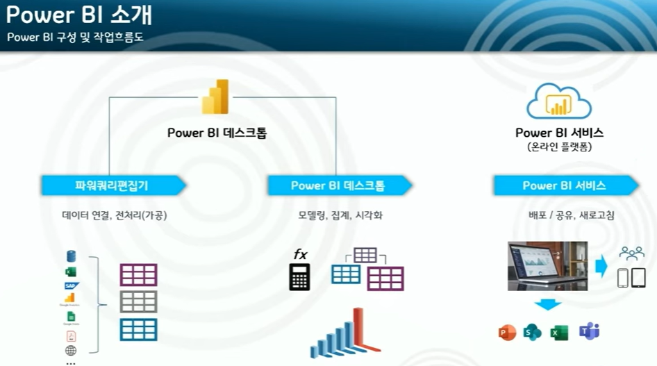
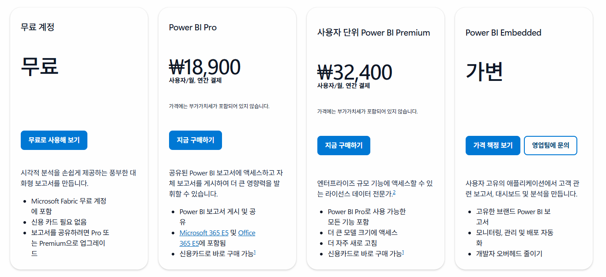

---
description:
---

# Power BI

- Power BI 데스크톱에서 작업 후 Power BI 서비스에 배포하여 공유합니다.
- Power BI 서비스를 이용하려면 작성자와 수신자 모두 Pro 이상의 라이센스가 필요합니다.
- Fabric은 조직 전체가 사용할 수 있는 전용공간

## 26년 2월 기준 라이센스

### 기능 설명

#### Power BI 데이터 세트의 새로 고침 빈도

Power BI Service에 올라간 데이터를 하루에 동기화 할 수 있는 횟수

#### 고급 데이터 흐름

더 큰 데이터 처리를 더 빠른 속도로 가능. 복잡한 Extract → Transform → Load 파이프라인 구축 가능

#### 고급 데이터 마트:

Power BI 안에서 제공하는 사용하기 쉬운 클라우드 데이터베이스. SQL로 조회 가능하며 Power BI Service에 저장됨. 테이블을 넣어두고 분석할 때 빠르게 조회할 수 있음.

#### XMLA 엔드포인트 읽기/쓰기

XMLA는 데이터 모델을 처리하는 Power BI 엔진(SSAS 엔진)과 대화할 수 있게 해주는 공식 통신 규칙(프로토콜)\
아래의 경우에 해당되면 XMLA이 필요.

1. 모델 크기가 크고(수백MB~수GB)
2. 부분 새로고침을 쓰고
3. Tabular Editor / DAX Studio / SSMS 같은 외부 모델링 도구를 사용하고
4. Dev → Test → Prod 파이프라인을 만들고 싶고
5. 1천만 건 이상의 트랜잭션 데이터(주문·로그·IoT 등)를 다루고 6. ower BI를 SSAS(Analysis Services)처럼 회사 전체의 분석 서버로 쓰고 있음

#### 모델 메모리 크기 제한

Power BI가 실행될 때 메모리에 올라가는 데이터 용량(30만 건 이하, 컬럼 10~20개, PBIX 파일 크기가 300MB 이하라면 Pro까지 가능)
