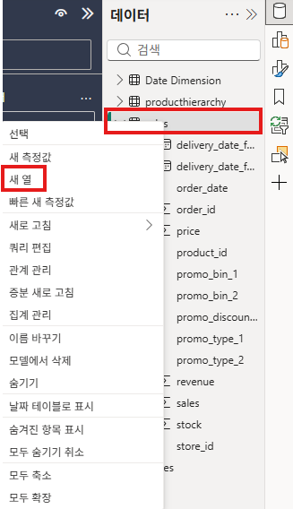
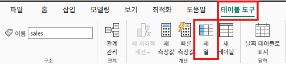

# 데이터 분석 식 (Data Analysis Expression)

## 새 열 만들기

- 테이블의 각 행마다 계산 결과를 만들어 물리적 공간에 저장
- 데이터 새로 고침 시 계산됨





새 열은 계산된 값이 저장되는 것이고, 새 측정값은 저장되지 않는 계산 공식입니다.

## 구문

```m
새열 = '테이블 이름'[열 이름]
```

- 모든 DAX 수식은 반드시 `=`로 시작합니다.

### 명명(Naming) 규칙

- 테이블 이름은 모델 전체에서 고유
- 열 이름은 테이블 내에서만 고유
- 대소문자는 구분하지 않음 (`Sales` = `SALES`)
- 다음 중 하나라도 해당되면 작은따옴표 ' '로 감싸야 합니다.
  - 공백 포함
  - 특수 문자 포함
  - 예약어 포함
  - 영어가 아닌 문자 포함

### 측정값

- 측정값 이름은 항상 대괄호 사용
- 공백 포함 가능
- 모델 내에서 고유해야 함

## 연산자

### 비교 연산자

| 비교 연산자 |       의미       |                   예시                   |
| :---------: | :--------------: | :--------------------------------------: |
|     `=`     |   느슨한 같음    |   `BLANK = 0` or `BLANK = ""` → `TRUE`   |
|    `==`     |   엄격한 같음    | `BLANK  == 0` or `BLANK == ""` → `FALSE` |
|     `>`     |     보다 큼      |       `[판매 날짜] > "2009년 1월"`       |
|     `<`     |       미만       |     `[판매 날짜] < "2009년 1월 1일"`     |
|    `>=`     | 보다 크거나 같음 |            `[금액] >= 20000`             |
|    `<=`     |   작거나 같음    |             `[금액] <= 100`              |
|    `<>`     | 느슨한 같지 않음 |          `BLANK <> 0` → `FALSE`          |

#### 크기 비교 연산자 추가 예시 (느슨한 비교)

```m
// 숫자
10 > 5        → TRUE
BLANK > 0     → FALSE
BLANK >= 0    → TRUE

// 날짜
DATE(2024, 1, 1) > DATE(2023, 12, 31) → TRUE
BLANK < DATE(2020, 1, 1)              → TRUE

// 텍스트 (사전순)
"Apple" < "Banana"  → TRUE
"Korea" > "Japan"   → TRUE
"10" > "2"   → FALSE
```

### 텍스트 연결 연산자

|    텍스트     |                      연산자 의미                       |                                         예시                                          |
| :-----------: | :----------------------------------------------------: | :-----------------------------------------------------------------------------------: |
| `&`(앰퍼샌드) | 두 값을 연결하여 하나의 연속된 텍스트 값을 생성합니다. | `Region = "USA"`<br/>`City = "New York"`<br/>`Region & ", " & City` → "USA, New York" |

### 논리 연산자

|          텍스트          |                                                 연산자 의미                                                 |                          예시                           |
| :----------------------: | :---------------------------------------------------------------------------------------------------------: | :-----------------------------------------------------: |
|   `&&(이중 앰퍼샌드)`    | 두 식이 모두 TRUE를 반환하는 경우 식의 조합도 TRUE반환합니다. <br/>그렇지 않으면 조합이 FALSE를 반환합니다. |    `TRUE && TRUE → TRUE`<br/>`TRUE && FALSE → FALSE`    |
| `\|\|(이중 파이프 기호)` |         두 식 중 하나라도 TRUE를 반환하면 결과는 TRUE<br/>두 식이 모두 FALSE인 경우에만 결과 FALSE.         | `TRUE \|\| FALSE → TRUE`<br/>`FALSE \|\| FALSE → FALSE` |
|           `IN`           |                                           값이 목록에 있으면 TRUE                                           |          `"Red" IN { "Red", "Blue" }` → `TRUE`          |

## 테이블 조작 함수

### 테이블 생성자

임시 테이블을 만드는 문법

#### 열이 한 개인 임시 테이블

```dax
Table = { 값1, 값2, 값3 }
```

| Value |
| :---: |
| `값1` |
| `값2` |
| `값3` |

#### 열이 두 개인 임시 테이블

```
{
  (1, "A"),
  (2, "B"),
  (3, "C")
}
```

| Value1 | Value2 |
| :----: | :----: |
|  `1`   |  `A`   |
|  `2`   |  `B`   |
|  `3`   |  `C`   |

- 같은 타입의 값만 사용 권장

### ADDCOLUMNS

지정된 테이블 또는 테이블 식에 계산 열을 추가합니다.

```dax
ADDCOLUMNS(테이블 이름, 새로 추가할 열 이름, 추가할 열의 값이 될 계산식)
```

## 텍스트 함수

### FORMAT

지정된 형식에 따라 값을 텍스트로 변환합니다.

```dax
FORMAT(형식을 변경할 값, 로케일)
```

## 관계 함수

### RELATED

다른 테이블에서 관련 값을 반환합니다.

```dax
RELATED( 테이블 이름[열 이름] )
```

## 집계 함수

### AVERAGE

열에 있는 모든 숫자의 평균을 반환합니다.

```dax
AVERAGE( 테이블 이름[열 이름] )
```

### AVERAGEX

테이블에 대해 계산된 식 집합의 평균을 계산합니다.

```dax
AVERAGEX( 테이블 이름, 각 행에 대해 계산할 식 )
```

### COUNT

빈 값이 아닌 데이터가 몇 개 있는지 셉니다.

```dax
COUNT( 테이블 이름[열 이름] )
```

### COUNTROWS

테이블의 행 수를 계산합니다.

```dax
COUNTROWS( 테이블 이름 )
```

### DISTINCTCOUNT

해당 열(column)에 들어 있는 값들 중에서 "중복을 제거한 고유한 값의 개수"를 세는 함수

```dax
DISTINCTCOUNT( 테이블 이름[열 이름] )
```

### SUM

열의 모든 숫자를 더합니다.

```dax
SUM( 테이블 이름[열 이름] )
```

### SUMX

테이블의 각 행에 대해 계산된 식의 합계를 반환합니다.

```dax
SUMX( 테이블 이름, 각 행에 대해 계산할 식 )
```

## 필터 함수

### ALL

걸려 있는 필터를 무시하고, 테이블의 모든 행 또는 열의 모든 값을 반환합니다.

```dax
// 테이블 이름에 걸려 있는 모든 필터를 무시
ALL( 테이블 이름 )

// 해당 열에 적용된 필터만 무시
ALL ( 테이블 이름[열 이름] )
```

### ALLEXCEPT

지정된 열의 필터를 제외한 모든 필터가 제거된 테이블을 반환합니다.

```dax
ALLEXCEPT( 테이블 이름, 테이블 이름[필터에 남길 열 이름], ... )
```

### ALLSELECTED

사용자가 선택한 것(슬라이서)만 유지하고, 시각화 내부에서 생긴 필터는 무시한 테이블을 반환합니다.

```dax
ALLSELECTED( 테이블 이름 or 테이블 이름[열 이름] )
```

### CALCULATE

특정 조건(필터)을 적용한 상태에서 계산합니다.

```dax
CALCULATE( 계산 식, 조건1, 조건2, ... )
```

### FILTER

조건에 맞는 행만 남겨서 새로운 표를 반환합니다.

```dax
FILTER( 테이블 이름 또는 테이블 생성 식, 테이블의 각 행에 대해 계산할 boolean 식 )
```

## 논리 함수

### IF

조건을 확인하고 TRUE때 한 값을 반환하고, 그렇지 않으면 두 번째 값을 반환합니다.

```dax
IF( 조건, TRUE일 경우 Return, FALSE일 경우 Return )
```

## 수학 및 트리그 함수

### ROUND

```dax
ROUND( 숫자, 반올림할 자리수 )
```

## 시간 인텔리전스 함수

### DATEADD

필터된 날짜 범위를 기준으로 시간을 앞이나 뒤로 이동시킨 날짜 집합을 만들어줍니다.

```dax
DATEADD( 날짜 테이블 이름[날짜 열 이름], 이동할 수(음수 = 과거, 양수 = 미래), Interval(DAY / MONTH / QUARTER / YEAR) )
```

### DATESYTD

어떤 값이 연도별 누적이 되도록 날짜 필터를 만들어줍니다.

```dax
DATESYTD(Date 테이블 이름[날짜 열 이름])
```
