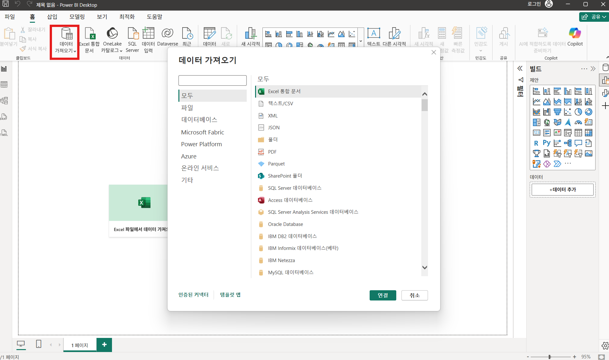
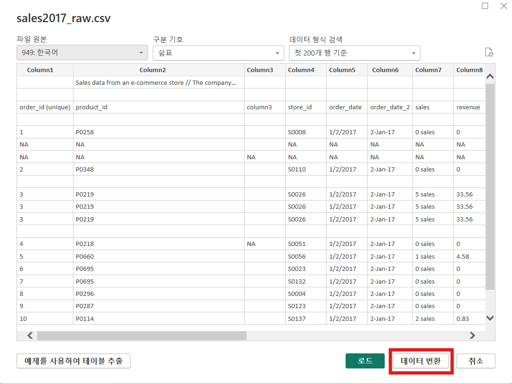
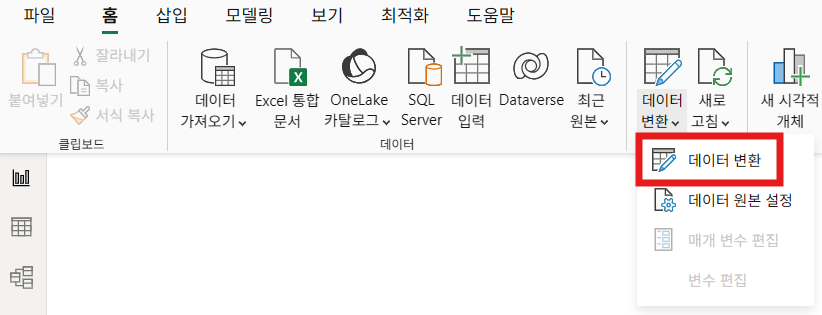
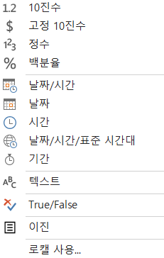
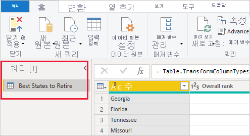
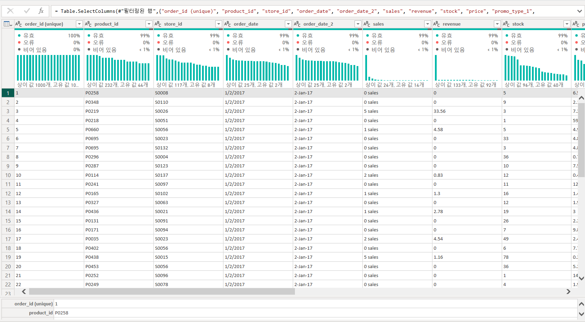
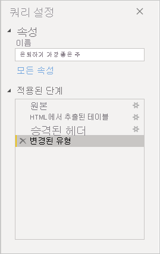

# Power Query 편집기

Power BI에서 데이터를 분석하기 전에 정리하고 가공하는 공간입니다.\

## Power Query 편집기 실행하는 두 가지 방법

### 1. 보고서 보기의 홈 탭의 데이터 가져오기를 클릭합니다.

### 2. 데이터를 가져오기 창에서 '데이터 변환' 버튼을 클릭합니다

### 1. Power BI Desktop의 홈 탭에서 데이터 변환을 선택합니다

## Power Query 편집기 분류

### 1. Power Query 편집기 리본 메뉴

#### 리본 메뉴 홈 탭

- 열/행 추가 또는 제거
  - 불필요한 열 삭제
  - 상단/하단 행 제거
  - 빈 행 제거

- 열 분할
  - 구분자(쉼표, 공백 등) 기준 분할
  - 글자 수 기준 분할
  - 주소, 코드값, 이름 분리 등에서 매우 자주 사용

- 첫 행을 머리글로 사용
  - 컬럼명이 데이터 첫 줄에 들어있는 경우 필수
  - CSV/엑셀 파일 불러올 때 거의 항상 사용

- 쿼리 병합
  - 선택한 쿼리들을 옆으로 이어 붙여서 열을 확장하는 작업
  - 왼쪽 외부 조인: 첫 번째 테이블의 모든 행 유지 + 두 번째 테이블의 일치하는 값만 확장
  - 오른쪽 외부 조인: 두 번째 테이블의 모든 행 유지 + 첫 번째 테이블의 일치하는 값만 확장
  - 완전 외부: 두 테이블 모두의 모든 행 포함하고, (일치하지 않는 행도 다 남김)
    일치하지 않는 값은 Null로 표시
  - 내부: 두 테이블에서 일치하는 행만 남김(공통된 데이터만 보고 싶을 때)
  - 왼쪽 앤티: 첫 번째 테이블에서 일치하지 않는 행만 남김 (첫 번째 테이블에만 존재하는 데이터 찾을 때)
  - 오른쪽 앤티: 두 번째 테이블에서 일치하지 않는 행만 남김 (두 번째 테이블에만 있는 데이터 찾을 때)

- 쿼리 추가
  - 선택한 쿼리를 기준으로 새 쿼리를 상단·하단에 이어 붙여서 하나의 테이블로 결합 가능
  - 기존 쿼리는 그대로 두고, 새로운 쿼리를 별도로 생성 가능

Power Query에서 작업을 마쳤다면 반드시 '닫기 및 적용'을 눌러야 변경 내용이 실제 데이터 모델에 반영됩니다.

#### 리본 메뉴 변환 탭

- 데이터 형식 검색
  - 열의 값을 보고 자동으로 형식을 추정해서 바꿔주는 기능
  - 완벽하게 정확하지는 않기 때문에 검토 필요

- 열 피벗 해제
  - 열(Column) → 행(Row) 으로 펼치는 작업
  - PK의 중복이 생길 수 있기 때문에 데이터 모델이 다대다 관계로 될 수 있음

  ##### `예시) 원본`

  1개의 store에 대해 3개의 cost 컬럼이 존재하는 경우, 모든 store의 전체 비용 합계를 구할 때 시각화에 불리함

  | store_id | land_cost | building_cost | additional_cost |
  | :------: | :-------: | :-----------: | :-------------: |
  |    1     |    100    |      200      |       50        |

  ##### `예시) 열 피벗 해제`

  cost 컬럼만 더하면 총 비용 계산 가능

  | store_id |    cost_type    | cost |
  | :------: | :-------------: | :--: |
  |    1     |    land_cost    | 100  |
  |    1     |  building_cost  | 200  |
  |    1     | additional_cost |  50  |

- 피벗 열
  - 행(Row) → 열(Column) 로 펼치는 작업

- 열 분할
  - 하나의 열에 붙어 있는 값을 여러 열로 나누는 기능

- 서식
  - 공백 제거로 문자열 앞뒤의 불필요한 공백을 제거
  - 줄바꿈 등 눈에 보이지 않는 특수 문자(제어 문자)를 제거

- 추출
  - 문자열에서 일부만 잘라서 가져오는 기능
  - 값을 나누지는 않고, 필요한 부분만 뽑음

##### 데이터 형식

- 숫자 관련
  - 10진수 → 일반 소수 숫자 (예: 12.34)
  - 고정 10진수 → 소수점 자릿수 고정\
    부동소수점 방식으로 계산 하는 컴퓨터(이진법 계산)의 오차를 줄이기 위한 형식으로 금액은 소수점 오차가 발생하면 안 되기 때문에, 고정 10진수를 사용하는 것이 안전
  - 정수 → 소수점 없는 숫자
  - 백분율 → % 형식 숫자

- 날짜/시간 관련
  - 날짜/시간 → 날짜 + 시간
  - 날짜 → 날짜만
  - 시간 → 시간만
  - 날짜/시간/표준 시간대 → 시간대 포함
  - 기간 → 날짜 차이(예: 5일)

- 기타
  - 텍스트 → 문자 데이터
  - True/False → 참/거짓
  - 이진 → 파일, 이미지 등 바이너리 데이터

#### 리본 메뉴 보기 탭

- 수식 입력줄
  - 현재 적용된 변환 수식을 보여줌
  - M 코드가 표시됨

- 열 분포
  - 각 열의 값 분포를 그래프로 보여줌
  - 고유값 수 확인 가능

- 열 품질
  - 유효 / 오류 / 빈 값 비율 표시

### 2. Power Query 편집기 쿼리 창

### 3. Power Query 편집기 데이터 창

### 4. Power Query 편집기 쿼리 설정 창

Power Query는 원본 데이터를 직접 고치는 프로그램이 아닙니다.\
대신, 원본 데이터 위에 적용한 단계를 덧씌우는 방식으로 작동합니다.

이 구조 덕분에 다음이 가능합니다.

1. 중간에 적용한 단계를 다시 수정할 수 있습니다.
2. 특정 단계를 삭제하면 그 단계 이후 작업이 자동으로 다시 계산됩니다.
3. 다른 데이터를 불러와도 동일한 단계를 적용할 수 있습니다.
