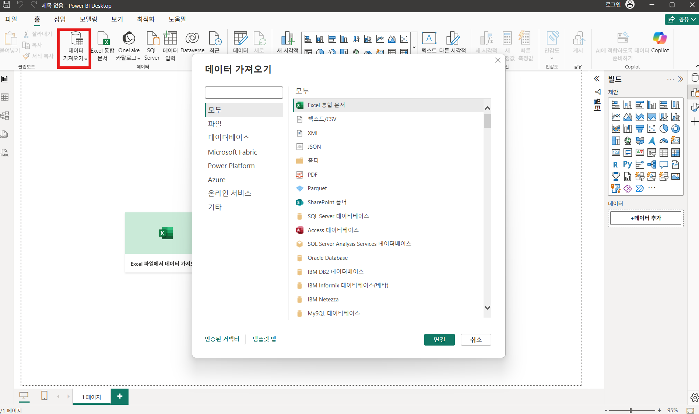
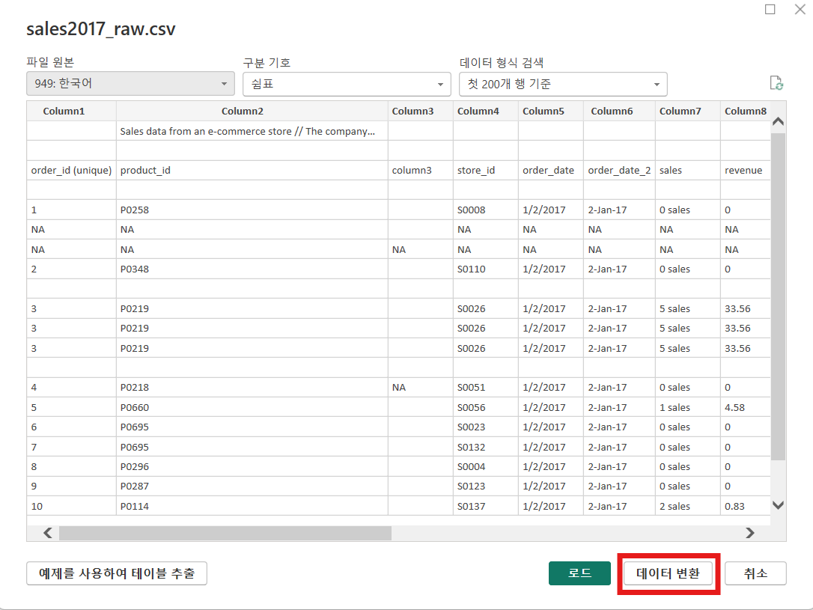
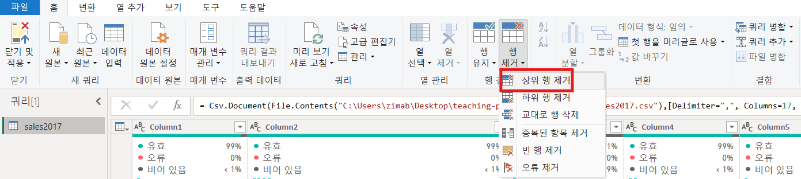
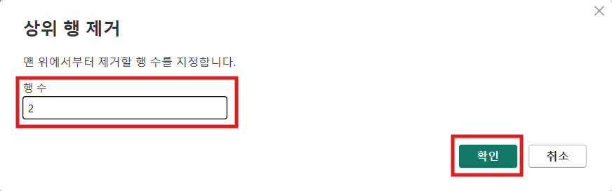

# 실습 가이드

## 1. 데이터 가공

쿼리는 데이터를 불러오고 가공하는 하나의 데이터 처리 단위

### 1-1 sales2017.csv 파일 가져오기

1. Power BI 실행

2. 홈 탭 → 데이터 가져오기 → CSV

   

3. `sales2017.csv` 선택 후 변환 데이터 클릭

   

### 1-2 불필요한 행 제거

1. 파워 쿼리 편집기에서 홈 탭 → 행 제거 → 상위 행 제거

   

2. 숫자 `2` 를 입력 후 확인

   

### 1-3 첫 행을 열의 머리글로 사용

1. 파워 쿼리 편집기에서 홈 탭 -> 첫 행을 머리글로 사용

### 1-4 불 필요한 열과 행 제거

1. 파워 쿼리 편집기에서 보기 탭 -> 열 품질 체크
2. 홈 탭 -> 행 제거 -> 빈 행 제거
3. `product_id` 머리글 화살표 -> `비어 있음`, `NA` 체크 해제
4. `order_id(unique)` 머리글 -> 행 제거 -> 중복된 항목 제거
5. 홈 탭 -> 열 선택 -> `column3` 머리글 체크 해제

### 1-5 열 타입 지정

1. 파워쿼리 편집기에서 모든 열 선택 -> 변환 탭 -> 데이터 형식 검색
2. 데이터 미리보기 에서 오류 발생 열 찾기 (`price`, `delevery_date_format2`)
3. 쿼리 설정창 -> 최근 적용된 단계 삭제
4. `price` 머리글 화살표 -> 추가 로드 -> `NA` 체크 해제
5. `delivery_date_format2` 머리글 타입 -> 로캘 사용 -> 데이터 형식: `날짜`, 로캘: `영어(영국)`
6. 모든 열 선택 -> 변환 탭 -> 데이터 형식 검색
7. `revenue`, `price` 머리글 타입 -> `고정 10 진수`

### 1-6 데이터 일괄 변경

1. 파워쿼리 편집기에서 `pormo_bin_1` -> 홈 탭 -> 값 바꾸기 -> 찾을 값: `verylow`, 바꿀 항목: `very low`
2. `sales` -> 홈 탭 -> 값 바꾸기 -> 찾을 값: `sales`(\*sales 앞 공백) -> 바꿀 항복: 공백
3. `sales` 머리글 타입 -> `정수`

### 1-7 공백 정리

1. 홈 탭 → 데이터 가져오기 → CSV
2. `stores.csv` -> 변환 데이터
3. 파워 쿼리 편집기에서 홈 탭 -> 첫 행을 머리글로 사용
4. 모든 열 선택 -> 변환 탭 -> 데이터 형식 검색
5. `province - district` 머리글 -> 변환 탭 -> 열 분할 -> 구분 기호 기준 -> 구분 기호 선택 또는 입력: `사용자 지정`, `-`
6. `province - district.1`의 이름을 `province`, `province - district.2`의 이름을 `district`로 변경
7. `province`, `district` 머리글 우클릭 -> 변환 -> 공백 제거

### 1-8 여백 제거

1. 홈 탭 → 데이터 가져오기 → CSV
2. `products.csv` -> 변환 데이터
3. 파워 쿼리 편집기에서 홈 탭 -> 첫 행을 머리글로 사용
4. 모든 열 선택 -> 변환 탭 -> 데이터 형식 검색
5. `product (brand)` 머리글 우클릭 -> 변환 -> 정리

### 1-9 쿼리 추가 (행 확장)

1. 홈 탭 → 데이터 가져오기 → CSV
2. `sales2018.csv`, `sales2019.csv` -> 로드
3. 홈 탭 -> 데이터 변환
4. 파워 쿼리 편집기에서 홈 탭 -> 첫 행을 머리글로 사용 (`sales2018`, `sales2019` 모두)
5. 홈 탭 -> `sales2018` 선택 -> 쿼리 추가 -> 쿼리를 새 항목으로 추가
6. 첫 번째 테이블: `sales2018`, 두 번째 테이블: `sales2019`
7. 새 항목으로 추가된 쿼리의 이름을 `sales`로 변경
8. `sales` 쿼리 선택 -> 변환 탭 -> 데이터 형식 검색
9. `price`, `revenue` 타입을 `고정 10진수`로 변경
10. `sales 2017` 쿼리의 `order_id (unique)`의 이름을 `order_id`로 변경
11. 홈 탭 -> 열 선택 -> `delivery_date_format2` 머리글 체크 해제
12. `sales` 쿼리 선택 -> 홈 탭 -> 쿼리 추가 -> 3개 이상의 테이블 -> `sales2017` 추가

### 1-10 쿼리 병합 (열 확장)

1. 홈 탭 → 데이터 가져오기 → Excel 통합 문서
2. `costs.xlsx` -> 데이터 변환
3. 파워 쿼리 편집기에서 홈 탭 -> 첫 행을 머리글로 사용
4. 변환 탭 -> 데이터 형식 검색
5. `stores` 쿼리 선택 -> 홈 탭 -> 쿼리 병합
6. 병합 창 -> `costs` 쿼리 선택 -> 위 아래 쿼리 모두 `store_id` 열 선택
7. `stores` 쿼리의 `costs` 머리글 화살표 -> `store_id`, `원래 열 ~ 접두사로 사용` 체크 해제

### 1-11 피벗 (한 행에 서로 다른 cost열이 3개가 있어 합계를 구하기 어려움)

1. 파워 쿼리 편집기에서 `stores` 쿼리 -> `building-consts`, `land and development costs`, `other related cost` 모두 선택 -> 변환 탭 -> 열 피벗 해제

### 1-12 그룹 생성

1. 파워 쿼리 편집기에서 좌측 쿼리 창 우클릭 -> 새 그룹 -> 이름: `Helper Tables`
2. `sales2017`, `sales2018`, `sales2019`, `costs`를 `Helper Tables` 그룹으로 이동

### 1-13 M언어 (데이터를 가공하기 위한 함수형 쿼리 언어) + 사용자 지정 열

1. 파워 쿼리 편집기에서 `products` 쿼리 -> 열추가 탭 -> 사용자 지정 열 클릭
2. 새 열 이름: `volume`, 사용자 지정 열 수식: `[length]*[depth]*[width]`
3. `volume` 머리글 타입 -> `10진수`

### 1-14 요일 자식 테이블 만들기 + 예제의 열 + 조건 열

1. 파워 쿼리 편집기에서 `sales` 쿼리 우클릭 후 참조
2. 참조로 추가된 새 쿼리를 `dates` 로 이름 변경
3. `order_date` 머리글 우 클릭 -> 다른 열 제거
4. `order date` 머리글 우 클릭 -> 중복된 항목 제거
5. 열 추가 탭 -> 예제의 열
6. 첫 열 더블 클릭 -> 요일 이름
7. `요일 이름` 선택 -> 열 추가 탭 -> 예제의 열(선택 항목에서)
8. 첫 열 더블 클릭 -> `월` 입력 -> `요일 약어` 로 이름 변경
9. 열 추가 탭 -> 조건 열 -> 요일 이름: `요일 약어`, 연산자: `같음`, 값: `월`, 출력: `1`
10. 9 번을 일요일 까지 반복 (출력은 이전 숫자에 +1 을 하며)
11. `요일 순서` 로 이름 변경
12. `요일 순서` 머리글 타입 -> `정수`

## 2. 모델, 테이블 관리

### 2-1 데이터 패널에서 테이블 숨기기

1. 메인 화면 우측 데이터 패널 -> `sales2017`, `sales2018`, `sales2019`, `costs` 우클릭 -> 숨기기
2. 숨겨진 항목 표시, 모두 숨기기 취소를 통해 숨겨진 테이블 확인 가능

### 2-2 category 별 revenue 그래프 + sales 쿼리와 products 쿼리 다대일 관계 연결

1. 홈 탭 -> 삽입 -> 시각적 개체: `누적 세로 막대형 차트`
2. `누적 세로 막대형 차트` 에서 데이터 패널 -> prduct 쿼리 -> x축: `category`
3. 데이터 패널 -> sales 쿼리 -> y축: `revenue`
4. 좌측 `모델보기` -> 데이터 모델
5. `sales` 쿼리의 `poduct_id` 와 `porducts` 쿼리의 `product_id` 연결
6. 관계 편집 창 -> Cardinality: `다 대 일`, 교차 필터 방향: `Single`

### 2-3 province 별 revenue 그래프 + sales 쿼리와 stores 쿼리 다대다 관계 연결

1. 홈 탭 -> 삽입 -> 시각적 개체: `누적 세로 막대형 차트`
2. `누적 세로 막대형 차트` 에서 데이터 패널 -> prduct 쿼리 -> x축: `province`
3. 데이터 패널 -> sales 쿼리 -> y축: `revenue`
4. 좌측 `모델보기` -> 데이터 모델
5. `sales` 쿼리의 `store_id` 와 `stores` 쿼리의 `store_id` 연결
6. 관계 편집 창 -> Cardinality: `다 대 다`, 교차 필터 방향: `단일(stores가 sales를 필터링)`

### 2-4 date 쿼리와 sales 쿼리 다대일 관계 연결

1. 좌측 `모델보기` -> 데이터 모델
2. `sales` 쿼리의 `order_date` 와 `dates` 쿼리의 `order_date`를 연결
3. 관계 편집 창 -> Cardinality: `다 대 일`, 교차 필터 방향: `Single`

## 3. 그래프

### 3-1 빌드 패널의 요약 선택해보기 (district 간 가격 수준의 차이)

1. 홈 탭 -> 삽입 -> 시각적 개체: `누적 세로 막대형 차트`
2. `누적 세로 막대형 차트` 에서 데이터 패널 -> stores 쿼리 -> x축: `district`
3. 데이터 패널 -> sales 쿼리 -> y축: `price`
4. 빌드 패널 y축의 데이터 옵션 -> price 합계를 평균으로 수정
5. 그래프 삭제

#### 빌드 패널의 범례 추가해보기 (각 카테고리별 프로모션 매출 비중)

1. Category 별 매출 합계 그래프의 빌드에서 범례에 프로모션 타입 추가

#### 빌드 패널의 축소 다중 항목 (도시별로 나눠 보기)

1. 축소 다중 항목에 city 입력

### 막대 그래프에 데이터 레이블 적용

1. 서식 패널 -> 데이터 레이블 -> 바깥쪽 끝(옵션), 투명도 조절(배경)

#### 원형 차트로 주 별 매출 비율 만들기

1. state와 revenue를 통해 원형차트 생성
2. 서식 패널의 범례 제거
3. 서식 패널의 세부 정보 레이블에서 범주와 총 퍼센트 선택 (원형 차트는 비율이 효과적)
4. 빌드 패널의 자세히(데이터를 한 단계 더 세분화해서 보여주는 필드 영역)에 city 추가해 보면서 설명해주기 -> 다시 제거
5. 차트의 더보기(...)의 축정렬로 정렬도 바꿔보기

#### 드릴 탐색으로 계층 구조 바꿔보기

1. X축 date 쿼리의 order_date, Y축 revenue로 꺽인 선형 차트 생성
2. 드릴 탐색 설명해주기
3. Category 별 매출 합계 그래프의 X축에 subcategory 추가
4. 드릴 탐색 설명해주기 (확장 다운시 서브카테고리들이 카테고리끼리 붙어 있음)

#### Y축과 보조 Y축 차이, 선형 차트는 계열 레이블

1. X축 order_date, Y축 revenue로 꺽인 선형 차트의 Y축에 sales 추가 해보기
2. 해당 sales를 보조 Y축에 옮겨 보기
3. 서식 패널의 계열 레이블 켜기

### 확대/축소 슬라이더

1. 선형 차트의 서식 패널에 확대/축소 슬라이더 켜기
2. X축으로 드릴 다운 가능한거 보여주기

### 기본 필터와 테이블 차트(날짜별 매출과 주문 건수)

1. 테이블의 열에 order_date를 추가
2. 빌드 패널에 order_date 화살표 -> 날짜를 계층에서 order_date로 변경
3. 데이터 패널에서 order_date를 클릭하고 열 도구 탭에서 서식을 short로 변경
4. 매출과 order ID를 열에 추가 하고 이름 변경(Order Date, Revenue, Orders)
5. 빌드 패널의 Orders의 화살표 클릭 -> 요약을 개수(고유)로 변경
6. 빌드 패널의 Revenue의 요약을 요약 안함으로 바꿈
7. Revenue가 0인 Orders를 확인 후 필터 패널의 Revenue 클릭
8. 기본 필터링에서 모두 선택 후 0은 체크 지우기
9. 빌드 패널에서 Revenue의 요약을 합계로 변경

### Top 3 필터

1. 원형 차트 선택 후 필터 패널 선택
2. 필터 패널에서 state 클릭 후 필터 형식 선택, 상위 N 필터 선택
3. 값에 sales의 revenue 추가 후 필터 적용

### 트리맵 차트 사용해보기

1. 카테고리 별 sales 막대형 차트를 Treemap으로 변경
2. 범주의 sub_category를 자세히로 이동

### 슬라이서 사용해 보기

1. 슬라이서 생성하여 stores의 store_id 추가
2. 서식 패널에서 슬라이서 설정 -> 스타일에서 드롭다운 변경 -> 선택에서 다중선택, 모두 선택 켜기
3. 빌드 패널 빌드에서 값 이름 매장으로 변경
4. 슬라이서 추가 옵션(...) 누른 후 검색을 눌러 검색 가능하도록 변경
5. Cost(초기 투자 비용) 로 사이 슬라이서도 추가해보기
6. 슬라이서 동기화 패널 추가하고 슬라이서 선택
7. 슬라이서 동기화 패널에서 표시 설정

### 상호 작용 편집 설명하기

1. 원형차트 선택 후 리본메뉴 서식 탭에서 상호 작용 편집을 클릭하여 상호 작용 편집 상태로 진입
2. 막대 그래프의 필터/강조표시/없음을 눌러서 어떤식으로 변화 하는지 보여주기

### 드릴 스루 (revenue 관련 상세 페이지)

1. 두 번째 페이지에 텍스트 상자 추가
2. 텍스트 상자 서식 지정에 제목 켜기
3. 텍스트의 조건부 서식 클릭
4. 옵션 선택을 product의 category 클릭
5. 두 번째 페이지(Details)의 빈 캔버스를 선택 후 서식 패널 클릭
6. 페이지 정보의 페이지 유형을 드릴스루로 변경
7. 데이터 추가에 revenue 추가
8. 첫 페이지에 revenue가 포함된 차트에서 특정 값을 우클릭
9. 드릴 스루 클릭 Details 클릭
10. 아래 Detail 페이지 우클릭 후 숨기기

### 두 번째 페이지(디테일) 그래프 추가

1. name과 volume으로 테이블 차트 추가
2. date 쿼리의 요일 이름과 sales의 revenue를 누적 세로 막대형 차트로 생성
3. 차트의 추가 옵션(...) -> 축 정렬 -> 요일 이름
4. 데이터 패널의 요일 이름 선택 -> 열 도구 탭 -> 열 기준 정렬 -> sorting column 선택

### 맵 차트 추가

1. 옵션 -> 보안 -> 사용자 지정 시각적 개체를 보고서에 추가할 때 보안 경고 표시, ArcGIS for Power BI 사용 체크 하기
2. 홈 탭의 맵 차트 생성 -> stores 쿼리의 state 체크
3. 빌드 패널의 위도와 경도에 stores 쿼리의 위도와 경도를 추가
4. 빌드 패널의 위치에 city를 추가하여 계층을 만들기
5. 데이터 패널의 sales쿼리/ sales를 빌드 패널의 거품 크기에 추가
6. 서식 패널의 거품형 -> 색 -> 조건부 서식 -> 서식 스타일은 그라데이션 -> 필드를 기반은 revenue로

### 단추(버튼) 활용하여 드릴 스루 버튼 만들기

1. 삽입 탭 -> 단추 -> 비어 있음 -> 서식 패널 -> 작업
2. 작업 켜기 -> 유형을 드릴 스루로 변경 -> 대상을 Details로
3. 서식 패널 -> 단추 스타일 -> 상태가 사용 안함 일 때 텍스트는 "매출을 선택하세요" / 기본 값 일 때 상세페이지로 이동

### 북마크

1. 책갈피 패널과 선택 패널 열기
2. 책갈피 2개 추가 후 연도별, 연월별 이름 변경
3. 연도별 추가 옵션(...) 클릭 후 데이터와 선택된 시각적 개체만 체크하고 업데이트 클릭
4. 차트를 연월별로 드릴다운 후 연월별 추가 옵션(...) 클릭 후 데이터와 선택된 시각적 개체만 체크하고 업데이트 클릭
5. 삽입 탭의 단추 클릭 -> 탐색기 -> 책갈피 탐색기
6. 서식 패널의 스타일에서 ux 수정

### 툴팁

1. 페이지 생성후 Tooltip으로 이름 바꾸고 숨기기
2. 빈 캔버스 클릭 후 서식 패널 -> 페이지 정보 -> 페이지 유형을 도구 설명으로 변경
3. 도구 설명 표시 켜기에 요일 이름 추가
4. 카테고리와 매출로 세로 막대형 차트 생성
5. 세로 막대형 차트의 필터 -> category의 필터 형식을 상위 N, 위쪽 3, 값에 revenue를 추가 -> 필터 적용
6. 이름을 Top 3 매출 카테고리로 변경 후 요일 그래프 값에 마우스 호버해보기

### 툴팁 추가

1. order date 추가하고 order date를 포함하고 있는 차트의 서식 -> 속성 -> 도구 설명 켜보기

## 4. 배포
