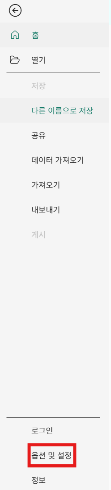
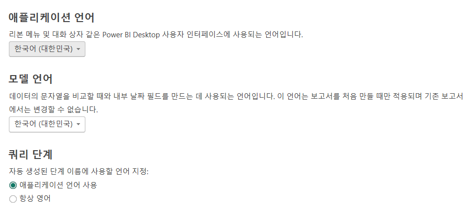
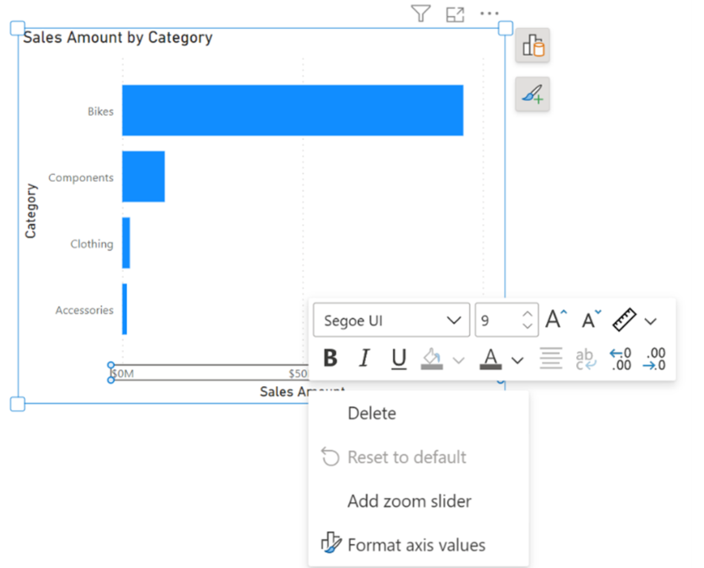

# 프로젝트 세팅

잘못된 관계 자동 생성을 방지하고,
데이터 모델 구조와 숫자·날짜 해석 기준을 명확하게 하기 위한 설정을 진행합니다.

## 옵션 진입

## 전역 설정

모든 Power BI 파일에 적용될 설정

### 전역 설정/데이터 로드

- 자동 형식 감지(Type Detection)이라는 데이터를 불러올 때 자동으로 정리해주는 기능
- 편리하지만 Power BI가 자동으로 작업을 해버려서, 우리가 무엇이 어떻게 바뀌었는지 모르는 문제 발생
- 직접 열 이름과 데이터 형식을 지정할 수 있도록 변경

### 전역 설정/국가별 설정

- 설정에 따라 사용자 인터페이스 및 날짜 필드의 기본 값이 달라짐

### 전역 설정/미리 보기 기능

- 오른쪽 패널을 항상 열어두지 않아도 됨

  

- 차트 안에서 바로 값을 넣고 수정할 수 있음
  

## 현재 파일

### 현재 파일/관계

1. 원본(예: SQL)에 관계가 정의돼 있으면 자동으로 가져옴
2. 새로 고침 시 자동으로 관계를 수정
3. 공통 컬럼이 있으면 자동으로 관계 생성

관계를 자동으로 만들지 않게 하기 위해 모두 해제\
왜냐하면, 왜 연결됐는지, 어떤 기준으로 연결됐는지 모르기 때문에 잘못된 관계가 생겼을 때 발생할 오류 원인 찾기 어려움

### 현재 파일/국가별 설정

파일에서 데이터를 가져올 때 적용할 국가/지역 형식 규칙
