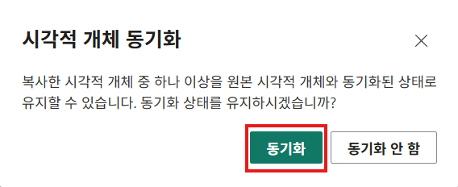
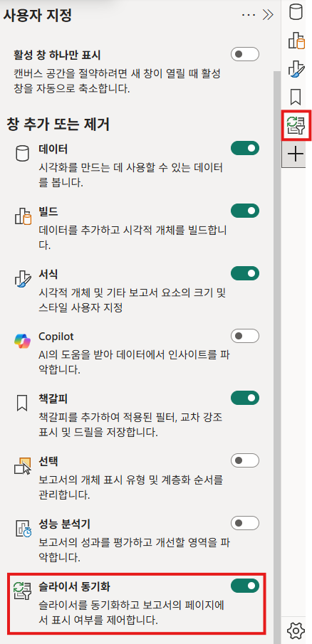
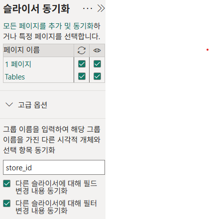
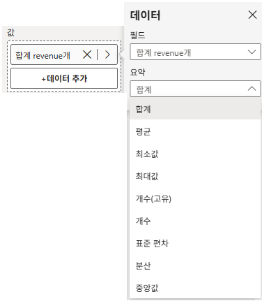
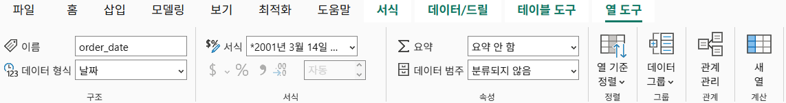
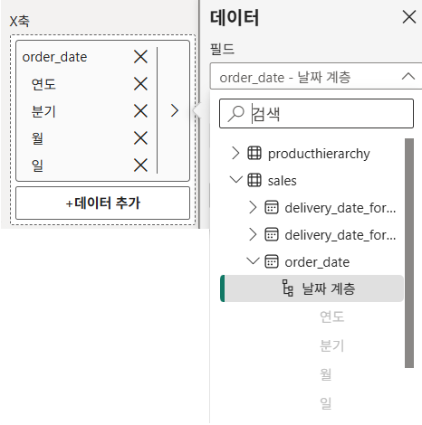
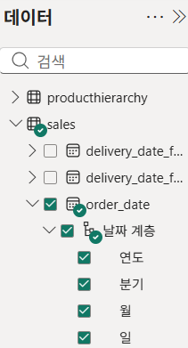
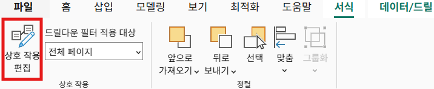

# 보고서 보기

## 시각적 개체 (Graph)

### 원형 차트 (파이 그래프)

- 조각(각도/면적)을 비교하기 어렵기 때문에 값 비교 목적으로 사용 지양
- 전체 대비 비율(Percentage of Total)을 보여줄 때 사용할 것
- 시선을 움직여가며 봐야하기 때문에 서식의 범례사용 X, 레이블을 사용할것

### 슬라이서

- 보고서에 있는 여러 시각화(차트, 테이블 등)를 특정 조건으로 필터링할 수 있게 해주는 시각적 필터
- 서식 패널의 슬라이서 설정을 통해 다른 형태로 바꿀 수 있음
- 필터 패널과 다르게 배포 후에도 필터 값을 손쉽게 바꿀 수 있음

#### 다른 페이지에서 슬라이서 동기화 및 사용법

1. 슬라이서 필터를 복사
   1. 슬라이서 필터를 복사 후 다른 페이지에 붙여넣기
   2. 모달 창에서 동기화 버튼 선택

      

2. 슬라이서 동기화 패널 사용
   1. 창 추가 또는 제거에서 슬라이서 동기화 켜기
      
   2. 동기화 할 슬라이서 선택 후, 동기화 할 페이지 체크
      
   3. 다른 페이지에 동기화 여부와 표시 여부 선택

주의: 슬라이서를 Sync에서 제거하기 전에 반드시 그 슬라이서를 리셋하고 값을 모두 선택 상태로 만들기.

### 트리맵

- 계층 구조(두 단계 정도)를 한 화면에서 보고 싶을 때 사용
- 전체 대비 부분 비중(share)을 직관적으로 볼 때 사용

## 빌드 패널

### 데이터

#### 요약

숫자를 계산하는 기능으로, 숫자로 계산할 수 없는 필드라면 요약 옵션이 비활성화됩니다.

- 합계: 수치들을 모두 더한 값
- 평균: 수치들의 합계를 항목 개수로 나눈 값 (개당 평균 값)
- 최소값: 값들 중에서 가장 작은 값
- 최대값: 값들 중에서 가장 큰 값
- 개수(고유): 값 중에서 '중복을 제외한 서로 다른 값'이 몇 개인지 나타낸 값
- 개수: 몇 개의 항목에 입력되어 있는지 나타낸 값
- 표준 편차: 값들이 평균에서 얼마나 흩어져 있는지를 나타낸 값
- 분산: 값들이 평균 기준으로 얼마나 퍼져 있는지를 숫자로 계산한 값
- 중앙값: 값을 정렬했을 때 한가운데 위치하는 값

#### 범례

차트 안에서 데이터를 "한 번 더 나눠서" 보여주기 위한 기준입니다.

#### 축소 다중 항목

한 차트를 여러 개의 작은 차트로 나눠서 보여주는 기능

#### 보조 Y축

단위나 크기가 달라서 한 축으로는 비교가 어려울 때 사용하는 기능입니다.

## 데이터 패널

데이터 패널에서 테이블 또는 열 값을 선택하면 리본 메뉴에 테이블 도구탭 또는 열 도구 탭을 선택할 수 있습니다.

### 열 도구

## 시각화 조작 기능

### 날짜 계층

날짜 계층은 '날짜'라는 한 덩어리를 연도/분기/월/일로 자동으로 나누어 분석할 수 있게 만들어주는 구조입니다.\
시각화에 날짜를 넣으면, 차트를 연도 단위, 월 단위, 일 단위로 고정해서 보거나 클릭으로 단계별로 내려갈 수 있습니다.

### 드릴업/드릴다운

|         아이콘         |                        이름                        |                                       설명                                       |
| :--------------------: | :------------------------------------------------: | :------------------------------------------------------------------------------: |
|    ⬆ (위쪽 화살표)     |                 드릴 업(Drill Up)                  |     지금 보고 있는 세분화된 단계를 접고, 그 위의 더 큰 단계로 돌아가는 기능      |
| ⬇ (아래쪽 화살표 1개)  |               드릴 다운(Drill Down)                |      전체를 세부 단계로 나누고, 그중 '내가 선택한 부분'을 더 자세히 보는 것      |
| ⬇⬇ (아래쪽 화살표 2개) |   계층 구조에서 한 수준 아래로 이동(Next Level)    | 계층 구조에서 상위 계층을 없애고, 하위 계층을 기준으로 다시 정리해서 보여주는 것 |
|   ⬇＋갈라지는 아이콘   | 계층 구조에서 한 수준 아래로 모두 확장(Expand All) |    상위 계층은 유지하면서, 한 단계 아래의 값으로 더 세분화해서 보여주는 방식     |

### 상호 작용 편집

차트 간 미치는 영향을 사용자가 직접 제어할 수 있도록 해주는 기능입니다.\

즉, 하나의 시각적 개체를 클릭했을 때, 다른 시각적 개체가 어떻게 반응할지 사용자가 지정하는 기능입니다.

#### 필터/강조 표시/없음
