# VB.NET CODING IN UIPATH 번역본

## 1. 소개

### 1.1 왜 이 전자책을 작성했는가

iPath는 주로 드래그 앤 드롭 방식으로 개발하며 많은 코딩을 요구하지 않습니다.

이러한 특징 때문에 많은 비개발자들이 UiPath를 배우고 자동화 개발을 시작하게 되었습니다.

하지만 이러한 비개발자들은 자동화 기능을 확장하기 위해 VB.NET 코드를 작성해야 하는 상황이 되면 큰 어려움에 부딪히곤 합니다. 코드를 작성하는 방법을 모르기 때문에 작업이 막히고 혼란을 느끼게 되며, 결국 비용이 비싼 개발자를 고용하거나 새로운 프로그래밍 언어를 배워야 하는 상황이 발생합니다. 특히 비개발자에게는 이러한 언어의 학습 곡선이 매우 가파릅니다.

그래서 이 책을 작성하게 되었습니다.

이 책은 UiPath에서 VB.NET을 사용하는 방법을 쉽게 이해할 수 있도록 단계별로 설명한 가이드입니다. 또한 실제 산업 현장에서 자주 사용되는 VB.NET 활용 사례들을 중심으로 다루고 있습니다.

이 책은 학습 자료로도 사용할 수 있으며, 자동화를 개발할 때 빠르게 참고할 수 있는 레퍼런스 가이드로도 사용할 수 있습니다.

### 1.2 왜 UiPath에서 VB.NET을 사용해야 하는가?

UiPath 액티비티가 제공하는 프로세스 자동화 기능에는 한계가 있습니다.

실제 업무 프로세스에서는 기본 액티비티에서 제공하지 않는 추가 기능이 필요한 경우가 많습니다.\
UiPath의 액티비티는 사실상 코드를 사용자 친화적인 형태로 패키징한 것으로, 개발 속도를 높이기 위해 제공됩니다.\
따라서 UiPath 액티비티가 제공하지 않는 기능이 필요하다면 대부분 VB.NET 코드로 구현할 수 있습니다.

즉, VB.NET은 자동화의 기능을 확장하여 더욱 고급 자동화를 구현하기 위해 필요합니다.

### 1.3 VB.NET이란 무엇인가?

VB.NET은 Visual Basic .NET의 약자로, Microsoft에서 개발한 컴퓨터 프로그래밍 언어입니다.

VB.NET은 객체 지향 프로그래밍 언어(Object-Oriented Programming Language) 입니다.

즉, 다양한 속성(Properties)을 가진 데이터 객체(Object)로 구성되며, 여러 기능(Function)을 수행할 수 있습니다.

Visual Basic은 .NET Framework 위에서 실행되므로 .NET 라이브러리를 완전히 활용할 수 있습니다.

또한 .NET Framework 기반으로 구축된 다음과 같은 다양한 애플리케이션을 빠르게 개발할 수 있는 매우 생산적인 도구입니다.

- 웹(Web) 애플리케이션
- Windows 애플리케이션
- Office 애플리케이션
- 모바일(Mobile) 애플리케이션

이 가이드에서는 UiPath로 개발한 봇(Bot)에 추가 기능을 구현하기 위해 .NET을 활용할 것입니다.

### 1.4 저자 소개

제 이름은 Leon Petrou입니다.

저는 엔지니어이자 교육자입니다.

저는 프리토리아 대학교(University of Pretoria)에서 산업공학 및 시스템공학(Industrial and Systems Engineering)을 전공하여 우등(Bachelor of Engineering with distinction)으로 졸업했습니다.

저는 경험이 풍부한 RPA 개발자이며, [Udemy 수상 강사](https://completerpabootcamp.com/courses/uipath)이자 FutureRPA의 설립자입니다.

[FutureRPA](https://futurerpa.com/)는 지능형 자동화 컨설팅 회사로, RPA를 활용하여 고객사의 비즈니스 프로세스를 효율화하고 있습니다.

또한 저는 Complete RPA Bootcamp의 대표 강사로 활동하며, 학생들이 고급 RPA 기술을 습득하여 RPA 개발자로 커리어를 시작할 수 있도록 교육하고 있습니다.

### 1.5 고연봉 RPA 개발자가 되는 방법

[별도의 무료 교육 및 웨비나](https://www.completerpabootcamp.com/rpatraining)는 다음 링크에서 확인할 수 있습니다.

### 1.6 무료 UiPath 지원 받기

RPA / UiPath / VB.NET 관련 질문을 할 수 있는 비공개 [Facebook 그룹](https://www.facebook.com/groups/2481744772043143/)에 참여할 수 있습니다.

### 1.7 VB.NET 사용 예제

사용자가 숫자를 입력하면 해당 숫자의 제곱근(Square Root)을 계산한 뒤, 다음과 같은 형식으로 메시지 박스에 표시한다고 가정해 보겠습니다.

```vb
The answer is X
```

[예시 다운로드](https://drive.google.com/drive/folders/1El3J8Ej-7Fe6pDiCQykSNXVVcQW2iq54?usp=sharing)

#### Step 1

`Input Dialog` 액티비티를 추가하여 사용자가 숫자를 입력하도록 합니다.

입력된 숫자는 문자열(`String`) 변수에 저장합니다.

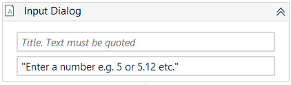

#### Step 2

`Assign` 액티비티를 사용하여 문자열(`String`)을 `Double` 형식으로 변환합니다.

`Double`은 소수점과 음수를 포함할 수 있는 숫자 데이터 형식입니다.

문자열(`String`)로는 수학 연산을 수행할 수 없지만, `Double`로 변환하면 계산이 가능합니다.

다음 코드를 사용합니다.

```vb
Convert.ToDouble(stringNumber)
```

> Note
>
> stringNumber 를 자신의 문자열 변수명으로 변경합니다.

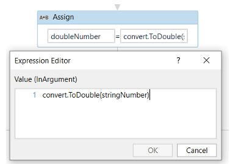

`Double` 형식으로 저장할 변수인 `doubleNumber` 의 타입을 변수 패널에서 `System.Double` 로 설정하는 것을 잊지 마세요.

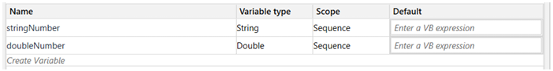

#### Step 3

`Message Box` 액티비티에 다음 코드를 입력합니다.

`Message Box` 액티비티는 `String` 형식의 입력값을 필요로 합니다.

```vb
"The answer is " + Math.Sqrt(doubleNumber).ToString
```

VB.NET에서는 문자열을 다음과 같이 큰따옴표(`"`)로 작성합니다.

```vb
"The answer is "
```

또는 `.ToString` 메서드를 사용하여 변수나 식(Expression)을 문자열로 변환할 수 있습니다.

위 예제에서도 이 방법을 사용하고 있습니다.

```vb
Math.Sqrt(doubleNumber).ToString
```

두 개의 문자열을 하나로 연결(Concatenate)하려면 `+` 연산자를 사용합니다.

위 예제에서도 동일하게 사용하고 있습니다.

```vb
"The answer is " + ...
```

제곱근을 계산하기 위해서는 `System` 네임스페이스(namespace)에 있는 `Math` 함수를 사용할 수 있습니다.

만약 `Imports` 패널에 `System` 네임스페이스가 이미 추가되어 있다면

```vb
Math
```

만 사용하면 됩니다.

반대로 `System` 네임스페이스가 추가되어 있지 않다면 다음과 같이 작성해야 합니다.

```vb
System.Math
```

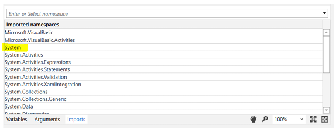

네임스페이스를 가져오려면(Import) `Imports` 패널의 `Enter or select namespace` 입력란에 네임스페이스 이름을 입력하면 됩니다.

Math 함수 뒤에 마침표(.)를 입력하면 사용할 수 있는 메서드 목록이 표시됩니다.

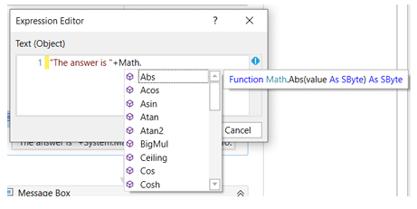

Math 함수 뒤에 마침표(.)를 입력하면 사용 가능한 메서드 목록이 표시됩니다.

제곱근을 계산하려고 하므로 `Sqrt()` 메서드를 선택합니다.

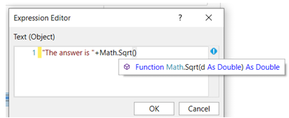

`Sqrt()` 메서드는 Double 데이터 형식의 매개변수(Parameter)를 필요로 합니다.

따라서 괄호 안에 `doubleNumber` 변수를 넣습니다.

```vb
Math.Sqrt(doubleNumber)
```

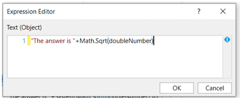

위 화면에서는 파란색 느낌표(Blue Exclamation Mark)로 표시된 오류가 발생한 것을 확인할 수 있습니다.

느낌표 위에 마우스를 올리면 오류 메시지를 확인할 수 있습니다.

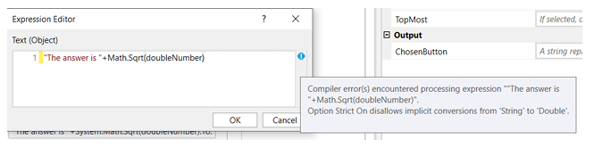

```vb
Math.Sqrt(doubleNumber)
```

위 오류는 `Math.Sqrt(doubleNumber)` 의 결과가 Double 데이터 형식 이기 때문입니다.

하지만 Message Box는 String 데이터 형식 을 요구합니다.

따라서 .ToString 메서드를 사용하여 Double을 String으로 변환하면 됩니다.

```vb
Math.Sqrt(doubleNumber).ToString
```

이제 오류가 사라집니다.

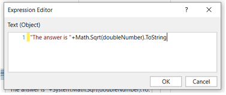

### Step 4

워크플로우를 실행합니다.

`Input Dialog`에 숫자를 입력하면 Message Box에 결과가 표시됩니다.

예제에서는 숫자 `5`를 입력했습니다.

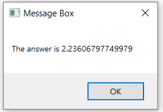

### 1.8 용어 정리

앞에서 사용한 다음 코드를 기준으로 설명합니다.

```vb
System.Math.Sqrt(doubleNumber).ToString
```

#### System

`System`은 Namespace(네임스페이스) 입니다.

.NET에서 관련 클래스와 기능들을 묶어 놓은 논리적인 그룹입니다.

#### Math

`Math`는 Function(함수) 입니다.

(저자는 Function이라고 표현했지만, 엄밀히 말하면 .NET에서는 `System.Math`는 클래스(Class)입니다.)

#### Sqrt()

`Sqrt()`는 Math 함수의 Method(메서드) 입니다.

제곱근(Square Root)을 계산하는 역할을 합니다.

#### doubleNumber

`doubleNumber`는 Parameter(매개변수) 입니다.

여기서는 우리가 만든 로컬 변수 `doubleNumber`를 전달했습니다.

```vb
Math.Sqrt(doubleNumber)
```

#### ToString

`ToString()` 역시 Method(메서드) 입니다.

값을 문자열(String)로 변환할 때 사용합니다.

예시:

```vb
Math.Sqrt(doubleNumber).ToString
```

Math 함수와 메서드에 대해 더 자세히 알아보고 싶다면 Microsoft의 [Math 관련 문서](https://learn.microsoft.com/en-us/dotnet/visual-basic/language-reference/functions/math-functions)를 참고할 수 있습니다.

또한 .ToString() 메서드 역시 [Microsoft 공식 문서](https://learn.microsoft.com/en-us/dotnet/api/system.object.tostring?view=netcore-3.1)에서 자세히 확인할 수 있습니다.

### 1.9 Symbols

UiPath의 Expression Editor에서 `Ctrl + Space`를 누르면 IntelliSense 창이 표시됩니다.

이 창에는 사용 가능한 객체들이 나타나며, 왼쪽의 아이콘은 객체의 종류를 의미합니다.

VB.NET 코드를 작성할 때 이 아이콘들의 의미를 알고 있으면 도움이 됩니다.

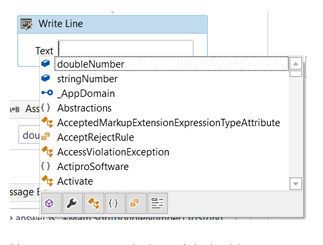

Namespace (네임스페이스)

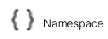

예시:

System

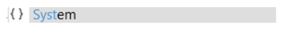

Class (클래스, 함수라고도 부름)

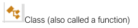

예시:

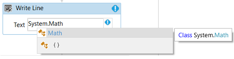

Method (메서드)


예시:

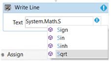

Variable (변수)

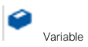

예시:

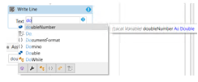

이 외에도 여러 종류가 있지만, 위 네 가지가 가장 자주 사용됩니다.

### 1.10 VB.NET Reference Cheat Sheet

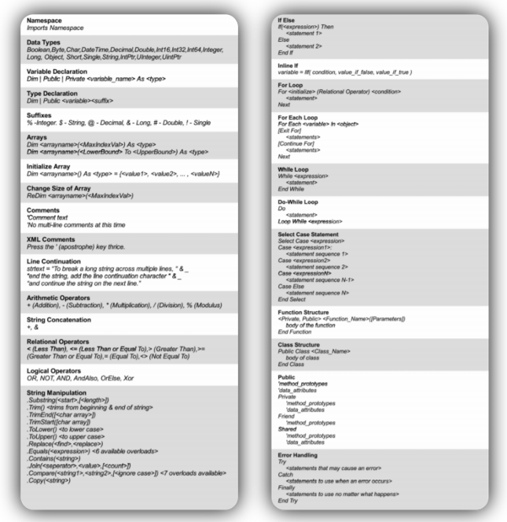

추가적인 [VB.NET 치트시트](./visual-basic-cheat-sheet)는 다음 링크에서 확인할 수 있습니다.

이제 본격적으로 예제를 살펴보겠습니다.

## 2. Excel

### 2.1 DataTable의 행 수(Row Count) 구하기

Excel을 다루다 보면 데이터의 총 레코드 수(행 수)를 확인해야 하는 경우가 있습니다.

이를 위해 다음 코드를 사용할 수 있습니다.

```vb
total_Count = my_DataTable.Rows.Count
```

> 참고:
>
> `my_DataTable`은 행 수를 확인할 DataTable 변수입니다.

#### UiPath 구현 방법

#### Step 1

`Workbook` 라이브러리의 `Read Range` 액티비티를 추가합니다.

그리고 File Path 를 입력합니다.

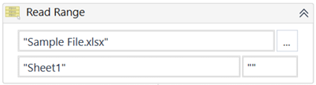

#### Step 2

`Add Headers` 속성이 체크되어 있는지 확인합니다.

또한 출력용 DataTable 변수를 생성합니다.

이 예제에서는 다음 이름을 사용합니다.

```vb
my_DataTable
```

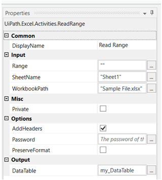

#### Step 3

`Message Box` 액티비티를 추가하여 행 개수를 출력합니다.

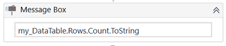

#### Step 4

이제 워크플로우를 실행합니다.

결과는 `3` 입니다.

Excel 시트에 헤더(Header)를 제외한 데이터 행이 3개 있기 때문입니다.

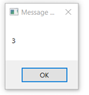

[예제 프로젝트 다운로드 링크](https://drive.google.com/open?id=1OgRsFEypWz1G3nTP5f_lFrxXUHtAcpPn)

### 2.2 특정 컬럼만 포함한 DataTable 만들기

DataTable을 다루다 보면 특정 컬럼만 추출해야 하는 경우가 있습니다.

다음 코드를 사용합니다.

```vb
dt_New = dt_Original.DefaultView.ToTable(False, "Column1", "Column2", ...)
```

> 참고
>
> `"Column1"`, `"Column2"` 등을 원하는 컬럼명으로 변경하면 됩니다.

#### UiPath 구현 방법

DataTable을 입력받아 특정 컬럼만 포함된 새로운 DataTable을 만드는 워크플로우를 만들어 보겠습니다.

이 예제에서는 `Name` 컬럼만 가져옵니다.

#### Step 1

Build Data Table 액티비티를 디자인 패널에 추가하고 샘플 데이터를 입력합니다.

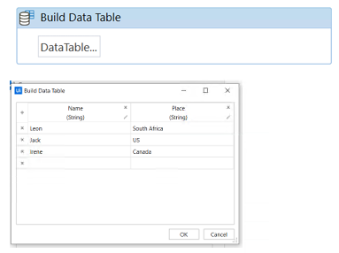

#### Step 2

`Assign` 액티비티를 디자인 패널에 추가하고 위 코드를 입력합니다.

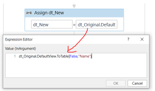

#### Step 3

`Message Box` 액티비티를 추가하여 결과를 출력합니다.

> Note
>
> 여기서는 Output DataTable 액티비티 대신 LINQ를 사용하여 DataTable을 문자열로 변환하여 출력합니다.
>
> LINQ(Language Integrated Query)는 Microsoft .NET Framework의 기능으로, .NET 언어에서 데이터를 쉽게 조회(Query)할 수 있도록 지원합니다.

아래 식은 Output DataTable 액티비티와 동일한 역할을 수행합니다.

(DataTable → String 변환)

```vb
String.Join(
  System.Environment.NewLine,
  dt_YourDataTable.Rows.Cast(Of DataRow).
  Select(Function(row) String.Join(",", row.ItemArray))
)
```

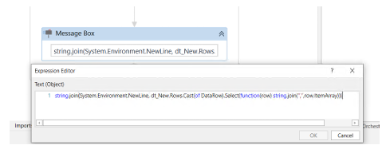

#### Step 4

최종 결과는 다음과 같습니다.

현재 DataTable에서 "Name" 컬럼만 추출된 것을 확인할 수 있습니다.

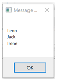

[예제 프로젝트 다운로드 링크](https://drive.google.com/open?id=1LLC_7bsfnpUQWDVnHHQWZo7tLlcfEIux)

### 2.3 Excel에서 시트 이름 가져오기

Excel은 업무 자동화에서 가장 많이 사용되는 프로그램 중 하나입니다.

Excel 파일을 처리할 때 해당 파일에 어떤 시트들이 존재하는지 알아야 하는 경우가 있습니다.

다음 코드를 사용합니다.

```vb
wb as WorkbookApplication

wb.GetSheets
```

#### UiPath 구현 방법

샘플 Excel 파일에 존재하는 모든 시트 이름을 출력해 보겠습니다.

#### Step 1

Excel Application Scope 액티비티를 추가합니다.

속성을 다음과 같이 설정합니다.

Excel Application Scope를 사용하려면 PC에 Excel이 설치되어 있어야 합니다.

설정값:

```vb
WorkbookPath : "Sample_Excel.xlsx"
Workbook : myWorkbook
```

변수 타입:

```vb
WorkbookApplication
```

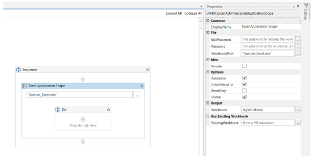

#### Step 2

For Each 액티비티를 추가합니다.

반복 대상은 다음과 같이 설정합니다.

```vb
myWorkbook.GetSheets
```

#### Step 3

각 시트 이름을 표시하기 위해 Message Box를 사용합니다.

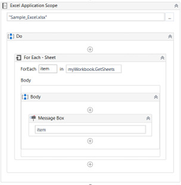

#### Step 4

워크플로우를 실행합니다.

모든 시트 이름이 순서대로 표시됩니다.

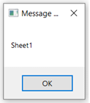

[예제 프로젝트 다운로드 링크](https://drive.google.com/open?id=1ON0JghAo07tljlrjN8R7kaUWN7aRwPXR)

### 2.4 DataTable에서 상위 N개 레코드 가져오기

전체 데이터 중 일부만 처리해야 하는 경우가 있습니다.

예를 들어 상위 3개 행만 처리하고 싶을 수 있습니다.

다음 코드를 사용합니다.

```vb
new_DataTable =
old_DataTable.AsEnumerable().
Take(N).
CopyToDataTable()
```

참고:

`old_DataTable` → 원본 `DataTable`

`N` → 가져올 행 개수

예시:

Take(1)
Take(3)
Take(10)

#### UiPath 구현 방법

#### Step 1

Build Data Table 액티비티를 추가하고 샘플 데이터를 입력합니다.

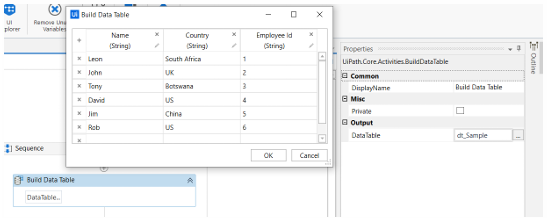

#### Step 2

Assign 액티비티를 추가합니다.

상위 3개 행만 가져오도록 설정합니다.

```vb
dt_Sample.
AsEnumerable().
Take(3).
CopyToDataTable()
```

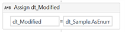

#### Step 3

Output Data Table 액티비티를 추가합니다.

DataTable을 String으로 변환합니다.

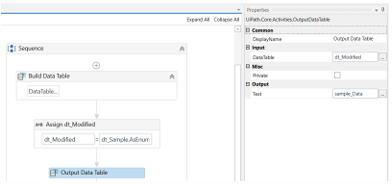

#### Step 4

Message Box 액티비티를 추가하여 결과를 출력합니다.

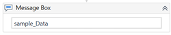

#### Step 5

프로젝트를 실행합니다.

상위 3개의 행만 출력되는 것을 확인할 수 있습니다.

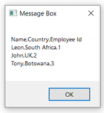

예제 프로젝트 다운로드 링크:

https://drive.google.com/open?id=1_3sevd7NpAgY2huoNMKWphuQ3amZRYnR

### 2.5 DataTable에서 최대값(Max)과 평균값(Average) 구하기

특정 컬럼의 최대값과 평균값을 계산해야 하는 경우가 있습니다.

MAX 값

```vb
myMax_Value =
dt_Sample.AsEnumerable().
Max(Function(row) CInt(row("ColumnName")))
```

AVERAGE 값

```vb
myAverageValue =
dt_Sample.AsEnumerable().
Average(Function(row) CInt(row("ColumnName")))
```

참고:

1. dt_Sample → 사용할 DataTable
2. "ColumnName" → 계산할 컬럼명

#### UiPath 구현 방법

특정 컬럼의 최대값과 평균값을 계산해 보겠습니다.

#### Step 1

Build Data Table 액티비티를 추가하고 샘플 데이터를 입력합니다.

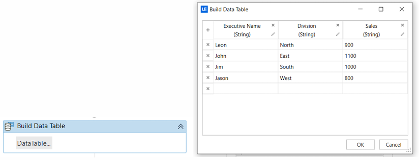

#### Step 2

Message Box 액티비티를 추가하고 Sales 컬럼의 최대값을 출력합니다.

```vb
dt_Sample.
AsEnumerable().
Max(Function(row) CInt(row("Sales")))
```

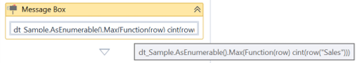

#### Step 3

다른 Message Box 액티비티를 추가하여 Sales 컬럼의 평균값을 출력합니다.

```vb
dt_Sample.
AsEnumerable().
Average(Function(row) CInt(row("Sales")))
```

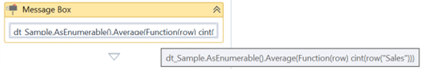

#### Step 4

프로젝트를 실행합니다.

최대값 결과

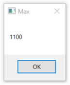

평균값 결과

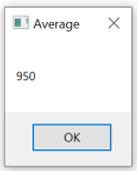

예제 프로젝트 다운로드 링크

https://drive.google.com/open?id=1JgHyueNlR59U8tJVUfIMr31w67G2cKKw

### 2.6 DataTable 컬럼 순서 변경하기

Excel이나 DataTable을 처리할 때 컬럼 순서를 변경해야 하는 경우가 있습니다.

다음 코드를 사용합니다.

```vb
dt_Sample.Columns("ColumnName").SetOrdinal(Parameter)
```

참고:

ColumnName : 위치를 변경할 컬럼명
Parameter : 이동할 위치(Index)
Index는 0부터 시작

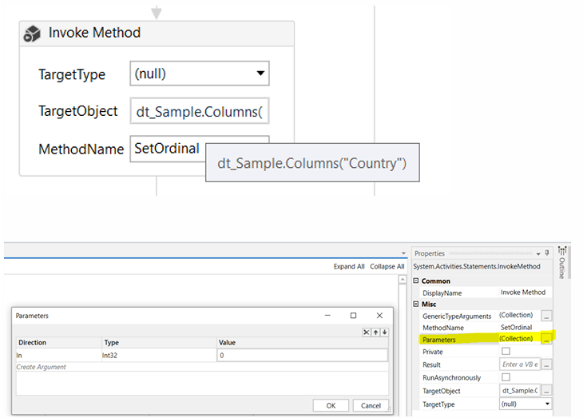

예시:

```vb
dt_Sample.Columns("Country").SetOrdinal(0)
```

위 코드는 Country 컬럼을 첫 번째 컬럼으로 이동시킵니다.

#### UiPath 구현 방법

Excel을 읽은 후 컬럼 순서를 변경해 보겠습니다.

#### Step 1

Workbook의 Read Range 액티비티를 사용하여 Excel을 DataTable로 읽어옵니다.

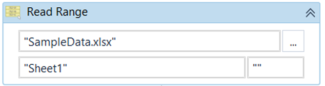

#### Step 2

Invoke Method 액티비티를 추가합니다.

설정값:

```
TargetObject : dt_Sample.Columns("Country")
MethodName : SetOrdinal
In Parameter : 0
```

의미:

Country 컬럼을 첫 번째 위치로 이동

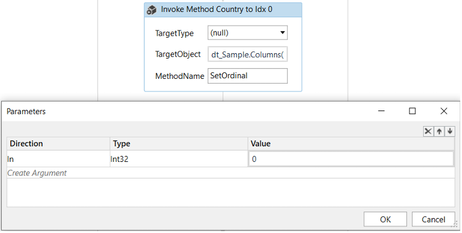

두 번째 Invoke Method 액티비티를 추가합니다.

설정값:

```
TargetObject : dt_Sample.Columns("City")
MethodName : SetOrdinal
In Parameter : 1
```

의미:

City 컬럼을 두 번째 위치로 이동

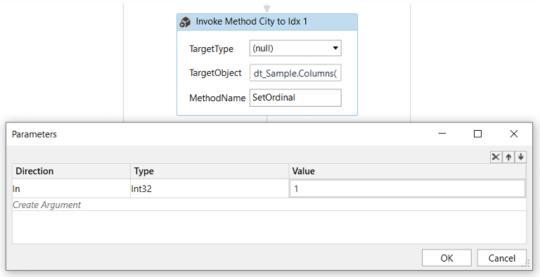

#### Step 3

Output Data Table 액티비티를 추가하여 DataTable을 String으로 변환합니다.

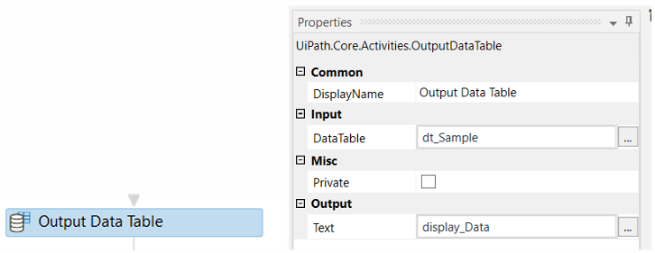

#### Step 4

Message Box 액티비티를 추가하여 변경된 DataTable을 출력합니다.

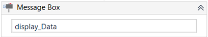

#### Step 5

워크플로우를 실행합니다.

컬럼 순서가 변경된 것을 확인할 수 있습니다.

원래 순서:

```
Name
Country
City
```

변경 후:

```
Country
City
Name
```

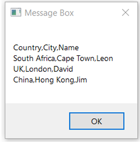

[예제 프로젝트 다운로드 링크](https://drive.google.com/drive/folders/136dTOAt9GMl3e8ycxISufwXYuR_zQfzH?usp=sharing)

### 2.7 DataTable 컬럼명 변경하기

RPA에서는 Excel 데이터를 자주 다루게 됩니다.

기존 컬럼명을 다른 이름으로 변경해야 하는 경우 다음 코드를 사용할 수 있습니다.

```vb
dataTable.Columns("old_ColumnName").ColumnName = "new_ColumnName"
```

> 참고:
>
> old_ColumnName : 기존 컬럼명
>
> new_ColumnName : 변경할 컬럼명

#### UiPath 구현 방법

예제에서는 `"Name"` 컬럼을 `"FirstName"`으로 변경합니다.

#### Step 1

Build Data Table 액티비티를 추가하고 샘플 데이터를 입력합니다.

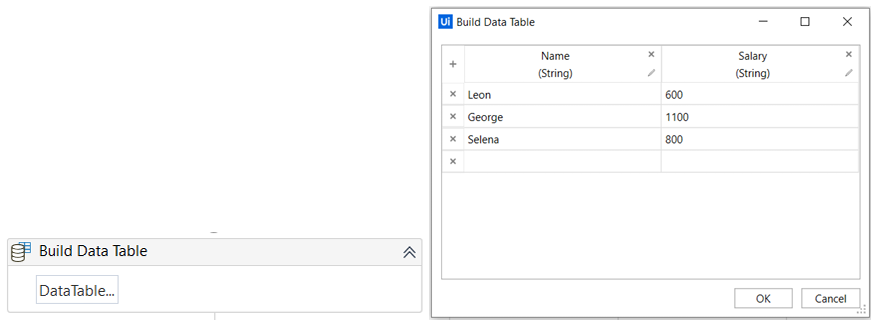

#### Step 2

Assign 액티비티를 추가하고 다음 코드를 입력합니다.

```vb
dataTable.Columns("Name").ColumnName = "FirstName"
```

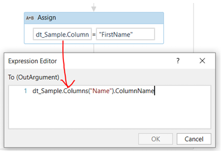

#### Step 3

Output Data Table 액티비티를 추가하여 DataTable을 String으로 변환합니다.

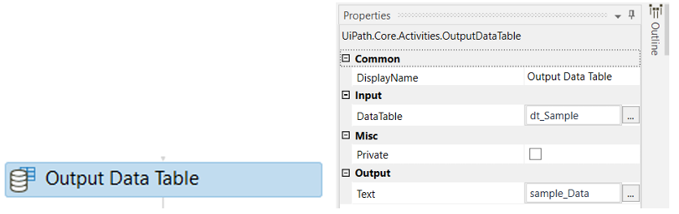

#### Step 4

Message Box 액티비티를 추가하여 결과를 출력합니다.


#### Step 5

프로젝트를 실행합니다.

컬럼명이 다음과 같이 변경된 것을 확인할 수 있습니다.

```
Name
↓
FirstName
```


[예제 프로젝트 다운로드 링크](https://drive.google.com/open?id=1K26DHdDYFgRffuyq3qqIOQ4-D9vQ1czws)

### 2.8 DataTable 컬럼을 List로 변환하기

DataTable의 특정 컬럼 값들을 List로 변환하면 이후 조건 처리나 반복 작업을 수행하기 편리합니다.

다음 코드를 사용합니다.

```vb
MyList =
(
From row In dt_Sample.AsEnumerable()
Select Convert.ToString(row("ColumnName"))
).ToList()
```

> 참고:
>
> ColumnName : List로 변환할 컬럼
>
> MyList : 결과를 저장할 List 변수

#### UiPath 구현 방법

특정 컬럼을 문자열 리스트(List(Of String))로 변환해 보겠습니다.

#### Step 1

Build Data Table 액티비티를 추가하고 샘플 데이터를 입력합니다.


#### Step 2

Assign 액티비티를 추가하고 위 코드를 입력합니다.


#### Step 3

`For Each` 액티비티를 추가합니다.

반복 대상은 다음 변수입니다.

```vb
MyList
```


#### Step 4

`For Each` 내부에 `Message Box` 액티비티를 추가합니다.

출력값: `item`


#### Step 5

워크플로우를 실행합니다.

리스트의 모든 값이 순서대로 표시됩니다.

각 Message Box에서 OK를 누르면 다음 값이 출력됩니다.


[예제 프로젝트 다운로드 링크](https://drive.google.com/open?id=1iOaeCwh18p0EJ8td6kudYIBnPNIM67Vj)

### 2.9 DataTable에서 헤더만 가져오기

Excel의 구조(스키마)만 복사하고 데이터는 복사하지 않으려는 경우가 있습니다.

이때는 `Clone()`을 사용합니다.

```vb
dt_New = dt_Original.Clone
```

이 코드는 다음만 복사합니다.

```
컬럼명
데이터 타입
DataTable 구조
```

데이터(Row)는 복사하지 않습니다.

반대로 데이터까지 모두 복사하려면 `Copy()`를 사용합니다.

```vb
dt_New = dt_Original.Copy
```

#### UiPath 구현 방법

DataTable의 헤더만 복사해 보겠습니다.

#### Step 1

Build Data Table 액티비티를 추가하고 샘플 데이터를 입력합니다.


#### Step 2

Assign 액티비티를 추가합니다.

```vb
dt_New = dt_Original.Clone
```


#### Step 3

Output Data Table 액티비티를 추가하여 String으로 변환합니다.


#### Step 4

Message Box 액티비티를 추가하여 결과를 출력합니다.


#### Step 5

프로젝트를 실행합니다.

`Clone()`을 사용했기 때문에 컬럼 구조(헤더)만 복사되고 데이터는 복사되지 않습니다.


예제 프로젝트 다운로드 링크

https://drive.google.com/open?id=1uRdAHkqWojMstGQ562FWF3oqaBtdcmLJ

### 2.10 DataTable 순서 뒤집기

Excel 또는 DataTable의 데이터를 역순으로 처리해야 하는 경우가 있습니다.

다음 코드를 사용합니다.

```vb
dt_Reverse = dt_Original.AsEnumerable.Reverse.CopyToDataTable
```

참고:

`dt_Original`을 원하는 DataTable 변수로 변경합니다.

#### UiPath 구현 방법

#### Step 1

Build Data Table 액티비티를 추가하고 샘플 데이터를 입력합니다.


#### Step 2

Assign 액티비티를 추가하고 다음 코드를 입력합니다.

```vb
dt_Reverse = dt_Original.AsEnumerable.Reverse.CopyToDataTable
```


#### Step 3

Output Data Table 액티비티를 추가하여 DataTable을 String으로 변환합니다.


#### Step 4

Message Box 액티비티를 추가하여 결과를 출력합니다.


#### Step 5

프로젝트를 실행합니다.

DataTable의 행 순서가 반대로 변경된 것을 확인할 수 있습니다.


[예제 프로젝트 다운로드 링크](https://drive.google.com/open?id=1V4KvRcwonDDzUd6lhcNS-DP-uyRElFMh)

### 2.11 How to Remove Duplicates from a Datatable

#### DataTable 중복 제거

DataTable에 중복 데이터가 포함되어 있는 경우가 있습니다.

특정 컬럼 기준으로 중복을 제거하려면 다음 LINQ를 사용할 수 있습니다.

```vb
new_dt = old_dt
  .AsEnumerable()
  .GroupBy(
    Function(i) i.Field(Of String)("ColumnWithDuplicate")
  )
  .Select(
    Function(g) g.First
  )
  .CopyToDataTable
```

> 참고:
>
> `"ColumnWithDuplicate"` 부분을 중복 제거 기준 컬럼명으로 변경합니다.

모든 컬럼을 기준으로 완전히 동일한 행을 제거하려면 다음 방법을 사용할 수 있습니다.

```vb
new_dt = old_dt.DefaultView.ToTable(True)
```

> 참고:
>
> True는 중복 제거(Distinct)를 의미합니다.
>
> 모든 컬럼값이 동일한 행만 제거됩니다.

#### UiPath 구현 방법

예제에서는 고객 데이터가 포함된 DataTable을 사용합니다.

#### Step 1

Build Data Table 액티비티를 추가합니다.


#### Step 2

샘플 데이터를 입력합니다.


#### Step 3

DataTable 타입 변수를 생성합니다.

Build Data Table의 Output 속성에 지정합니다.


#### Step 4

Assign 액티비티를 추가합니다.

다음 코드를 입력합니다.

예제에서는 "Name" 컬럼을 기준으로 중복을 제거합니다.

```vb
new_dt =
  old_dt.AsEnumerable().
  GroupBy(Function(i) i.Field(Of String)("Name")).
  Select(Function(g) g.First).
  CopyToDataTable
```


#### Step 5

Output Data Table 액티비티와 Message Box 액티비티를 추가하여 결과를 출력합니다.


#### Step 6

워크플로우를 실행합니다.

중복 데이터가 제거된 결과를 확인할 수 있습니다.


[예제 프로젝트 다운로드 링크](https://drive.google.com/open?id=1eN9M1_usqzO_k5d_FNJQga2JBZtGRTWC)

### 2.12 DataTable 행과 열 바꾸기 (Transpose)

DataTable을 다루다 보면 행(Row)을 열(Column)로, 열(Column)을 행(Row)으로 변환해야 하는 경우가 있습니다.

#### UiPath 구현 방법

DataTable의 행과 열을 서로 바꿔보겠습니다.

샘플 파일: 

#### Step 1

Workbook의 Read Range 액티비티를 사용하여 Excel 데이터를 읽어옵니다.


#### Step 2

다음 액티비티를 추가합니다.

```
While
Add Data Column
Assign
```

헤더도 함께 전치(Transpose)하기 위해 임시 컬럼(Dummy Column)을 생성합니다.


#### Step 3

다음 액티비티를 추가합니다.

```
For Each Row
While
Add Data Row
Assign
```

행을 열로 변환하는 로직을 구현합니다.


#### Step 4

프로젝트를 실행합니다.

행과 열이 서로 바뀐 결과를 확인할 수 있습니다.


[예제 프로젝트 다운로드 링크](https://drive.google.com/drive/folders/1ZmAYAl32LZlnFnz08JA-ZFlsGKza3ira?usp=sharing)

### 2.13 How to Compare Two Excel Files of the Same Format and Get Matched Data

#### 동일한 형식의 두 Excel 파일 비교하기

두 개의 DataTable을 비교하여 특정 컬럼이 일치하는 데이터만 추출할 수 있습니다.

다음 LINQ를 사용합니다.

```vb
(From a In SourceDT.AsEnumerable
 Join b In Destination_Table.AsEnumerable
 On a("Column_Name").ToString Equals b("Column_Name").ToString
 Select a
).CopyToDataTable.
 Select().
 CopyToDataTable().
 DefaultView.ToTable(False,"Column_Name_To_Output")
```

> 참고:
>
> SourceDT : 원본 DataTable
>
> Destination_Table : 비교 대상 DataTable
>
> Column_Name : 비교 기준 컬럼
>
> Column_Name_To_Output : 출력할 컬럼

#### UiPath 구현 방법

두 Excel 파일에서 일치하는 데이터를 찾아보겠습니다.

#### Step 1

Workbook의 Read Range 액티비티를 사용하여 첫 번째 Excel 파일을 읽습니다.

```vb
Source.xlsx
```

출력 변수:

```vb
SourceDT
```


두 번째 Excel 파일을 읽습니다.

```vb
Destination.xlsx
```

출력 변수:

```vb
Destination_Table
```


#### Step 2

Assign 액티비티를 추가합니다.

위의 LINQ 코드를 입력합니다.

예제에서는 "S.No" 컬럼을 기준으로 매칭합니다.

매칭된 경우 "Name" 컬럼을 출력합니다.


#### Step 3

`Message Box` 액티비티를 추가하여 결과를 출력합니다.

여기서는 Output DataTable 대신 LINQ를 사용하여 DataTable을 문자열로 변환합니다.


#### Step 4

프로젝트를 실행합니다.

일치하는 데이터만 출력됩니다.


전체 행(Row)을 출력하려면

```vb
DefaultView.ToTable(False,"Column_Name_To_Output")
```

부분을 제거하고 다음처럼 사용합니다.

```vb
(From a In SourceDT.AsEnumerable
 Join b In Destination_Table.AsEnumerable
 On a("S.No").ToString Equals b("S.No").ToString
 Select a
).CopyToDataTable().
Select().
CopyToDataTable().
DefaultView.ToTable(True)
```


전체 행을 출력하면 다음과 같은 결과를 얻을 수 있습니다.

[예제 프로젝트 다운로드 링크](https://drive.google.com/drive/folders/1DXCDIIwAboBylG-UUOPw4CfojkNYemiu?usp=sharing)

### 2.14 How to Find Common/Uncommon Rows Between Two Datatables

#### 두 DataTable 간 공통 행 / 차집합 찾기

DataTable은 행(Row)과 열(Column) 형태의 데이터를 저장하는 데 사용됩니다.

두 개의 DataTable 사이에서 공통 행(Common Rows)과 서로 다른 행(Uncommon Rows)을 찾아야 하는 경우가 있습니다.

#### 공통 행 찾기

```vb
dt_CommonRows =
  dt1.AsEnumerable().
  Intersect(
    dt2.AsEnumerable(),
    System.Data.DataRowComparer.Default
  ).
  CopyToDataTable
```

#### 서로 다른 행 찾기

```vb
dt_UnCommonRows =
  dt1.AsEnumerable().
  Except(
    dt2.AsEnumerable(),
    System.Data.DataRowComparer.Default
  ).
  CopyToDataTable
```

참고:

`dt1`, `dt2`를 실제 DataTable 변수명으로 변경합니다.

#### UiPath 구현 방법

#### Step 1

첫 번째 샘플 DataTable을 생성합니다.

Build DataTable 액티비티를 사용합니다.


#### Step 2

두 번째 샘플 DataTable을 생성합니다.

Build DataTable 액티비티를 사용합니다.


#### Step 3

공통 행(Common Rows)을 찾기 위한 Assign 액티비티를 추가합니다.

```vb
dt1.AsEnumerable().
Intersect(
  dt2.AsEnumerable(),
  System.Data.DataRowComparer.Default
).
CopyToDataTable
```

결과를 확인하기 위해

```
Output Data Table
Message Box
```

를 추가합니다.


#### Step 4

서로 다른 행(Uncommon Rows)을 찾기 위한 Assign 액티비티를 추가합니다.

```vb
dt1.AsEnumerable().
Except(
  dt2.AsEnumerable(),
  System.Data.DataRowComparer.Default
).
CopyToDataTable
```

결과를 확인하기 위해

```
Output Data Table
Message Box
```

를 추가합니다.


#### Step 5

프로젝트를 실행합니다.

공통 행 결과


차집합 결과


[예제 프로젝트 다운로드 링크](https://drive.google.com/drive/folders/1imgyq_0upuBbqbrAAOzpqmTg3er3kaSp?usp=sharing)

### 2.15 How to Include a HTML Table in Mail Body with Dynamic Values

#### 메일 본문에 동적 HTML 테이블 넣기

자동화에서 메일을 발송할 때 표(Table) 형태의 데이터를 포함해야 하는 경우가 있습니다.

HTML 템플릿을 사용하면 메일 본문에 테이블을 넣을 수 있습니다.

#### UiPath 구현 방법

HTML 템플릿 파일에서 필요한 행(Row) 수만큼 태그를 추가합니다.


#### Step 1

Read Text File 액티비티를 사용합니다.

HTML 파일을 읽어옵니다.

출력 변수:

```vb
UserData
```

(String 타입)


#### Step 2

Assign 액티비티를 사용합니다.

HTML 내의 varXXX 값을 실제 변수값으로 변경합니다.

즉, Replace 메서드를 사용하여 동적으로 데이터를 삽입합니다.


#### Step 3

Send Outlook Mail Message 액티비티를 추가합니다.

다음 항목을 설정합니다.

```
Subject
To
Body
```

Body에는 앞에서 만든 UserData 변수를 넣습니다.

그리고 반드시 다음 옵션을 체크합니다.

```vb
IsBodyHtml
```


최종 워크플로우 예시


#### Step 4

프로젝트를 실행합니다.

메일이 전송됩니다.

전송된 메일 예시


예제 프로젝트 다운로드 링크

https://drive.google.com/drive/folders/11SCFzAuCOZGhmPYYUztrj7ttdFNZ3jQ_?usp=sharing

## 3 File / Folder Operations

### 3.1 How to Get the Latest File from a Folder

#### 폴더에서 가장 최신 파일 찾기

브라우저나 다른 프로그램에서 파일을 다운로드한 후,

가장 최근에 생성된 파일을 가져와야 하는 경우가 있습니다.

다음 코드를 사용합니다.

```vb
String.Join(
    "",
    Directory.GetFiles(
        our_FolderPath,
        "*",
        SearchOption.AllDirectories
    ).
    OrderByDescending(
        Function(d) New FileInfo(d).CreationTime
    ).
    Take(1)
)
```

> 참고:
>
> our\*FolderPath → 검색할 폴더 경로
>
> "\*" → 모든 파일
>
> "\_.xlsx" → Excel만
>
> "\*.pdf" → PDF만

#### UiPath 구현 방법

#### Step 1

`Assign` 액티비티를 추가합니다.

폴더 경로를 지정합니다.

예제에서는 `Main.xaml`과 같은 위치에 있는 `SampleFolder`를 사용합니다.

```vb
our_FolderPath = "SampleFolder"
```


#### Step 2

`Message Box` 액티비티를 추가합니다.

다음 코드를 입력합니다.

```vb
String.Join(
    "",
    Directory.GetFiles(
        our_FolderPath,
        "*",
        SearchOption.AllDirectories
    ).
    OrderByDescending(
        Function(d) New FileInfo(d).CreationTime
    ).
    Take(1)
)
```


#### Step 3

워크플로우를 실행합니다.

가장 최근에 생성된 파일의 경로가 출력됩니다.


[예제 프로젝트 다운로드 링크](https://drive.google.com/drive/folders/1O44zFQNLP5q1O06Q_pXJu_rgiVKwaZMt?usp=sharing)

### 3.2 How to Delete Multiple Files in a Folder

#### 폴더 내 여러 파일 삭제하기

자동화 업무에서는 파일을 삭제, 이동, 이름 변경하는 작업을 자주 수행합니다.

폴더 안의 모든 파일을 삭제하려면 다음 코드를 사용할 수 있습니다.

```vb
Array.ForEach(
    Directory.GetFiles(our_DirectoryPath),
    Sub(x) File.Delete(x)
)
```

> 참고:
>
> our_DirectoryPath를 원하는 폴더 경로로 변경합니다.
>
> 절대 경로, 상대 경로 모두 사용 가능합니다.

#### UiPath 구현 방법

#### Step 1

`Assign` 액티비티를 추가합니다.

삭제할 파일이 있는 폴더 경로를 지정합니다.


#### Step 2

`If` 액티비티를 추가합니다.

폴더에 파일이 존재하는지 확인합니다.

```vb
Directory.GetFiles(DirectoryPath).Count > 0
```


#### Step 3

`Invoke Code` 액티비티를 추가합니다.

다음 코드를 입력합니다.

```vb
Array.ForEach(
    Directory.GetFiles(DirectoryPath),
    Sub(x) File.Delete(x)
)
```


위 코드는 사실상 다음 로직과 동일합니다.

```vb
For Each file In Directory.GetFiles(DirectoryPath)
    File.Delete(file)
Next
```


#### Step 4

워크플로우를 실행합니다.

폴더 안의 모든 파일이 삭제됩니다.

삭제 전


삭제 후


예제 프로젝트 다운로드 링크

https://drive.google.com/drive/folders/1Bov66E67ZQs-7Y8h1dOrGtjUhyWbchor?usp=sharing

### 3.3 How to Get Specific Types of Files from a Folder

#### 특정 확장자 파일만 가져오기

업무 자동화에서는 복사, 이동, 삭제, 처리 등을 특정 파일 형식에 대해서만 수행해야 하는 경우가 많습니다.

다음 코드를 사용합니다.

```vb
myList =
  Directory.GetFiles(
      folderPath,
      "*.xlsx",
      System.IO.SearchOption.AllDirectories
  )
```

> 참고:
>
> folderPath : 검색할 폴더
>
> myList : 결과 저장 변수
>
> "\_.xlsx" : Excel 파일만 검색
>
> "\_.pdf" : PDF 파일만 검색

파일명 패턴도 사용할 수 있습니다.

예시:

```vb
"Invoice-2020-09-*.pdf"
```

2020년 9월 인보이스 PDF만 검색합니다.

#### UiPath 구현 방법

#### Step 1

`Assign` 액티비티를 추가합니다.

폴더 경로를 지정합니다.

예제:

```
"MyFolder"
```


#### Step 2

`Assign` 액티비티를 추가합니다.

다음 코드를 입력합니다.

```vb
Directory.GetFiles(
    folderPath,
    "*.xlsx",
    System.IO.SearchOption.AllDirectories
)
```


#### Step 3

`For Each` 액티비티를 추가합니다.

반복 대상: filesList

`TypeArgument`는 다음으로 설정합니다.

```
String
```


#### Step 4

`For Each` 내부에 `Message Box` 액티비티를 추가합니다.

출력값: `item`


#### Step 5

프로젝트를 실행합니다.

폴더 내의 .xlsx 파일 목록이 순서대로 표시됩니다.


[예제 프로젝트 다운로드 링크](https://drive.google.com/drive/folders/1OhaftBlK1Z-6Eigp256cachh1Jw4CpvU?usp=sharing)

## 4 Text and List Manipulations

### 4.1 How to Read / Write to a Text File

#### 텍스트 파일 읽기 / 쓰기

텍스트 파일은 데이터를 저장하거나 수정할 때 유용하게 사용됩니다.

이번 예제에서는 다음 작업을 수행합니다.

- 텍스트 파일에 쓰기
- 텍스트 파일 읽기
- 기존 텍스트 파일에 내용 추가(Append)

#### UiPath 구현 방법

#### Step 1

`Input Dialog` 액티비티를 추가합니다.

사용자가 입력한 값을 저장할 변수를 생성합니다.


#### Step 2

`Write Text File` 액티비티를 추가합니다.

사용자가 입력한 값을 텍스트 파일에 저장합니다.

> 참고:
>
> 지정한 txt 파일이 존재하지 않으면 새로 생성됩니다.


#### Step 3

`Read Text File` 액티비티를 추가합니다.

텍스트 파일 내용을 읽어옵니다.


#### Step 4

`Message Box` 액티비티를 추가합니다.

읽어온 텍스트를 출력합니다.


#### Step 5

`Append Line` 액티비티를 추가합니다.

텍스트 파일 마지막에 새로운 내용을 추가합니다.

`Append Line`은 기존 내용을 덮어쓰지 않고 새 줄에 추가합니다.

반면 `Write Text File`은 기존 내용을 덮어씁니다.


프로젝트를 실행합니다.

최종 결과는 `SampleFile.txt`에서 확인할 수 있습니다.

[예제 프로젝트 다운로드 링크](https://drive.google.com/drive/folders/1jbl6Ztcwx_JEcdJZoRb1V-zCmWS7M9aQ?usp=sharing)

### 4.2 How to Define a Dictionary, Add Items To a Dictionary and Access Items From a Dictionary

#### Dictionary 정의, 데이터 추가 및 조회하기

Dictionary란 Key와 Value의 쌍으로 구성된 컬렉션입니다.

예를 들면:

```vb
{
 {"South Africa","Pretoria"},
 {"USA","Washington DC"}
}
```

여기서

```
Key → 국가명
Value → 수도
```

입니다.

Dictionary는 `System.Collections.Generic` 네임스페이스에 포함되어 있습니다.

#### UiPath 구현 방법

이번 예제에서는 다음을 수행합니다.

- Dictionary 생성
- 데이터 추가
- 데이터 조회

#### Step 1

`Assign` 액티비티를 추가합니다.

`Dictionary`를 생성합니다.

```vb
my_Dictionary = New Dictionary(Of String, String)
```

변수 타입:

```vb
System.Collections.Generic.Dictionary(Of String,String)
```


#### Step 2

`Invoke Method` 액티비티를 사용하여 `Dictionary`에 데이터를 추가합니다.

예시:

```
Key : South Africa
Value : Pretoria
```

`Invoke Method`의 `Parameters`를 설정합니다.


#### Step 3

또 다른 방법으로

`Add To Dictionary` 액티비티를 사용할 수 있습니다.


(Microsoft.Activities.Extensions 패키지 필요)

예시:

```
Key   : USA
Value : Washington, D.C
```


#### Step 4

첫 번째 데이터를 조회합니다.

```vb
my_Dictionary("South Africa")
```

결과:

```
Pretoria
```

`Message Box`를 사용하여 출력합니다.


#### Step 5

두 번째 데이터를 조회합니다.

```vb
my_Dictionary("USA")
```

결과:

```
Washington, D.C
```

`Message Box`를 사용하여 출력합니다.


#### Step 6

프로젝트를 실행합니다.

추가한 값들이 정상적으로 조회됩니다.


예제 프로젝트 다운로드 링크

https://drive.google.com/drive/folders/1jbl6Ztcwx_JEcdJZoRb1V-zCmWS7M9aQ?usp=sharing

### 4.3 How to Use Regular Expressions (Regex)

#### 정규표현식(Regex) 사용하기

정규표현식은 특정 패턴을 찾기 위한 문자열 검색 규칙입니다.

주로 다음 작업에 사용됩니다.

- 이메일 추출
- 전화번호 추출
- 주민등록번호 검증
- 우편번호 검증
- URL 추출
- 문자열 치환
- UiPath 구현 방법

이번 예제에서는 문자열에서 이메일 주소를 추출합니다.

#### Step 1

Assign 액티비티를 추가합니다.

예제 문자열:

```vb
"My email address is leon@futurerpa.com and my other email is leon@completerpabootcamp.com"
```


#### Step 2

`Is Match` 액티비티를 추가합니다.

이메일 존재 여부를 확인합니다.

사용 Regex:

```vb
([a-zA-Z0-9_\-\.]+)@
([a-zA-Z0-9_\-\.]+)\.
([a-zA-Z]{2,5})
```

출력 타입:

`Boolean`


`Regex Builder`를 사용하면 정규식을 쉽게 만들 수 있습니다.


#### Step 3

`If` 액티비티를 추가합니다.

이메일이 발견되었는지 확인합니다.


#### Step 4

`Matches` 액티비티를 추가합니다.

모든 이메일을 추출합니다.

결과는 Match 목록(List)으로 반환됩니다.


#### Step 5

`For Each` 액티비티를 추가합니다.

TypeArgument:

```vb
System.Text.RegularExpressions.Match
```


#### Step 6

`For Each` 내부에 `Message Box`를 추가합니다.

추출된 이메일을 출력합니다.


#### Step 7

`Replace` 액티비티를 사용하여 이메일에서 도메인(URL) 부분만 추출합니다.

다음 Regex를 빈 문자열로 변경합니다.

```vb
([a-zA-Z0-9_\-\.]+)@
```

즉,

```
leon@
```

부분을 제거합니다.

예시:

```
leon@futurerpa.com

↓

futurerpa.com
```


#### Step 8

프로젝트를 실행합니다.

첫 번째 이메일 주소가 출력됩니다.


두 번째 이메일 주소가 출력됩니다.


Replace 결과도 확인할 수 있습니다.

```vb
futurerpa.com
```

[예제 프로젝트 다운로드 링크](https://drive.google.com/drive/folders/1Q2H8D4Jg0W7mU8nD4v7n7mQK4Y3kJ5v?usp=sharing)

### 4.4 리스트(List) 초기화, 항목 추가 및 제거하기

리스트를 사용할 때는 먼저 초기화가 필요할 수 있습니다.

리스트는 항목 수가 정해져 있지 않을 때 사용합니다. (고정 길이인 배열(Array)과 반대)

리스트에서는 항목을 자유롭게 추가하거나 제거할 수 있습니다.

이번 예제에서 구현할 내용:

- 리스트 초기화
- 리스트에 항목 추가
- 리스트에서 항목 제거

#### UiPath 구현

#### Step 1: 리스트 초기화

```vb
my_List = New List(Of String)(New String(){"value1", "value2"})
```

> 참고:
>
> 필요한 데이터 형식(String, Int, Boolean 등)에 맞춰 List를 생성합니다.

먼저 리스트를 초기화하고 기본 색상 3개를 추가합니다.

- Blue
- Red
- Yellow

변수 형식은 다음으로 설정합니다.


```vb
ICollection(Of String)
```

이는 문자열 목록(List of Strings)을 의미합니다.


#### Step 2: 리스트에 항목 추가

다음으로 `Invoke Method` 액티비티를 사용하여 `Orange` 색상을 리스트에 추가합니다.


사용 메서드: `Add` 또는 Statements 라이브러리의 `Add To Collection` 액티비티를 사용해도 됩니다.


#### Step 3: 리스트에서 항목 제거

`Remove From Collection` 액티비티를 사용하여 항목을 제거합니다.


이번 예제에서는 `Red`를 제거합니다.

그 후 아래와 같이 For Each를 사용하여 최종 리스트를 출력 패널에 표시합니다.


#### Step 4: 결과 확인

초기 리스트:

- Blue
- Red
- Yellow

추가:

- Orange

제거:

- Red

최종 결과:


[예제 프로젝트 다운로드](https://drive.google.com/drive/folders/1tPs_fu4Jsmf0fffUjq33MVZ5ZRzf2xXN?usp=sharing)

### 4.5 문자열 Trim / Clean 하기

문자열에는 실수로 앞뒤 공백이 포함될 수 있으며, 데이터 처리 전에 이러한 공백을 제거해야 하는 경우가 많습니다.

#### 문자열 앞뒤 공백 모두 제거

```vb
our_String.Trim
```

#### 문자열 앞쪽 공백만 제거

```vb
our_String.TrimStart
```

#### 문자열 뒤쪽 공백만 제거

```vb
our_String.TrimEnd
```

참고

```vb
our_String
```

부분을 자신의 문자열 변수명으로 변경합니다.

#### UiPath 구현

사용자가 입력한 문자열에서 불필요한 공백을 제거하는 워크플로우를 만들어 보겠습니다.

#### Step 1

디자인 패널에 `Assign` 액티비티 3개를 추가합니다.

아래와 같은 예제 문자열을 사용합니다.


#### Step 2

`Write Line` 액티비티를 추가합니다.

모든 앞뒤 공백을 제거하기 위해 `Trim` 메서드를 사용합니다.


#### Step 3

다른 `Write Line` 액티비티를 사용하고, 앞쪽(Leading)의 공백 문자를 제거하기 위해 `TRIMSTART` 메서드를 사용합니다.


#### Step 4

추가로 `Write Line` 액티비티를 하나 더 사용하고, 뒤쪽(Trailing)의 공백 문자를 제거하기 위해 `TRIMEND` 메서드를 사용합니다.


#### Step 5

이제 워크플로우를 실행하여 결과를 확인합니다.

출력 패널(Output Panel)에서는 공백이 제거된 것처럼 보이지 않을 수 있습니다.

하지만 세 개의 로그를 각각 더블 클릭하면 실제 출력 결과가 어떻게 표시되는지 확인할 수 있습니다.


[예제 프로젝트 다운로드](https://drive.google.com/drive/folders/1RGrv2hULPNpE0Da2MLh5pNSTjVA9HLJZ?usp=sharing)

### 4.6 How to Split a String

#### 문자열 나누기(Split)

때로는 문자열(String) 값을 특정 구분자(Delimiter)를 기준으로 여러 개의 하위 문자열 배열(Array)로 분리해야 할 때가 있습니다.

구분자는 다음과 같은 문자일 수 있습니다.

- 공백(Space)
- 쉼표(Comma)
- 줄바꿈(NewLine)

등

단어(Word)는 구분자로 사용할 수 없고, 한 글자(Character) 만 구분자로 사용할 수 있습니다.

하지만 Replace 메서드를 사용하여 단어를 문자로 변경한 뒤 해당 문자를 구분자로 사용할 수 있습니다.

(Replace 사용법은 다음 섹션에서 설명합니다.)

쉼표로 구분된 숫자 문자열을 배열로 분리하는 예제를 살펴보겠습니다.

다음과 같은 문자열이 있다고 가정합니다.

```vb
numbers_Data = "1,2,3,4,5"
```

그 다음 `Assign`를 사용하여 문자열을 분리합니다.

```vb
result_List = numbers_Data.Split(","c)
```

> Note
>
> 1. numbers_Data 를 원하는 문자열 변수명으로 변경합니다.
> 2. result_List 는 문자열 배열(String[])입니다.

같은 작업을 `Split String` 액티비티로도 수행할 수 있습니다.

#### Implementation with UiPath

쉼표로 구분된 숫자 문자열을 입력받아 각 값을 출력하는 프로젝트를 만들어 보겠습니다.

#### Step 1

`Assign` 액티비티를 디자인 패널에 추가하고 아래와 같이 문자열 변수를 초기화합니다.

```vb
numbers_Data = "1,2,3,4,5"
```


#### Step 2

`Split String` 액티비티를 디자인 패널에 추가하고 아래 값을 입력합니다.

`Activities` 패널에 `Split String` 액티비티가 보이지 않으면 `Microsoft.Activities` 패키지를 설치합니다.

```vb
Input : numbers_Data
Result : result_List
Separator : ","
```


설정 항목 설명:

- Input : 입력 문자열
- Result : 출력 리스트
- Separator : 구분자 (예: 쉼표, 공백, 하이픈 등)

#### Step 3

`For Each` 액티비티를 디자인 패널에 추가합니다.

앞에서 생성한 리스트 변수를 반복 대상으로 지정합니다.

그 다음 `Message Box` 액티비티를 추가하여 리스트에 저장된 값을 표시합니다.


#### Step 4

프로젝트를 실행합니다.

리스트에 있는 모든 값이 하나씩 표시됩니다.


#### 배열(Array)에서 특정 항목 가져오기

`result_List` 배열의 특정 항목은 인덱스(Index)를 사용하여 접근할 수 있습니다.

첫 번째 항목의 인덱스는 `0`입니다.

예를 들어 첫 번째 값을 가져오려면 다음과 같이 작성합니다.

```vb
result_List(0)
```

결과:

```vb
1
```

다른 인덱스도 동일합니다.

```vb
result_List(0) = 1
result_List(1) = 2
result_List(2) = 3
result_List(3) = 4
result_List(4) = 5
```

마지막 항목을 가져오는 방법도 있습니다.

위 예제에서는 마지막 값이 4번 인덱스라는 것을 알고 있으므로 `result_List(4)` 를 사용할 수 있습니다.

하지만 배열의 길이를 모르는 경우도 있습니다.

그럴 때는 `Last` 메서드를 사용합니다.

```vb
result_List.Last = 5
```

[예제 프로젝트 다운로드](https://drive.google.com/drive/folders/11xIFbLER0zaXvESGFkI0cjtW09iyfio-?usp=sharing)

### 4.7 How to Replace Text in a String

#### 문자열의 텍스트 바꾸기

문자 또는 문자열을 다른 값으로 변경해야 하는 경우가 있습니다.

다음과 같은 식을 사용할 수 있습니다.

```vb
sample_String = sample_String.Replace("Before","After")
```

> Note
>
> sample_String 은 자신의 문자열 변수명으로 변경합니다.
> "Before" 는 변경할 문자 또는 문자열입니다.
> "After" 는 변경 후 사용할 문자 또는 문자열입니다.

#### Implementation with UiPath

예를 들어 아래와 같은 문자열이 있다고 가정합니다.

```vb
(25/12/2020)
```

이를 다음 형태로 변경하고 싶습니다.

```vb
25-12-2020
```

`Replace` 메서드를 사용하여 괄호를 제거하고 슬래시(`/`)를 하이픈(`-`)으로 변경할 수 있습니다.

#### Step 1

`Assign` 액티비티를 추가하고 `sample_String` 값을 설정합니다.

[이미지]

#### Step 2

다른 `Assign` 액티비티를 추가하고 아래 식을 입력합니다.

```vb
sample_String = sample_String.Replace("(","").Replace(")","").Replace("/","-")
```

이 식은 다음 순서로 동작합니다.

1. 여는 괄호 제거
2. 닫는 괄호 제거
3. 슬래시(`/`)를 하이픈(`-`)으로 변경


#### Step 3

결과를 표시하기 위해 `Message Box` 액티비티를 추가합니다.


#### Step 4

워크플로우를 실행합니다.


예제 프로젝트 다운로드:

https://drive.google.com/drive/folders/1wPOVuLYTv3kjNIIueEV9whJSz7ekgpFw?usp=sharing

### 4.8 How to Find Common/Uncommon Items Between Two Lists

#### 두 개의 리스트에서 공통 항목 / 공통이 아닌 항목 찾기

프로그래밍에서 리스트(List)는 String, Int 등 다양한 데이터 형식의 항목 집합을 저장하는 데 자주 사용됩니다.

때로는 두 개의 리스트 또는 배열(Array) 사이에서 공통 항목(Common Items)과 공통이 아닌 항목(Uncommon Items)을 찾아야 할 수 있습니다.

다음과 같이 구현할 수 있습니다.

공통 값(Common Values)

```vb
list_1.Intersect(list_2)
```

공통이 아닌 값(UnCommon Values)

```vb
list_1.Except(list_2)
```

> Note
>
> list_1, list_2를 실제 사용하는 리스트 변수명으로 변경합니다.

#### Implementation with UiPath

샘플 리스트 2개를 사용하여 공통 값과 공통이 아닌 값을 출력하는 워크플로우를 만들어 보겠습니다.

#### Step 1

Assign 액티비티를 디자인 패널에 추가하고 아래와 같이 List 1을 초기화합니다.

```vb
list_1 = New List(Of Int32)(New Int32(){1, 3, 4, 6, 7})
```


#### Step 2

`Assign` 액티비티를 하나 더 추가하고 아래와 같이 `List 2`를 초기화합니다.

```vb
list_2 = New List(Of Int32)(New Int32(){2, 3, 5, 6, 8})
```


#### Step 3

`For Each` 액티비티를 디자인 패널에 추가하고 아래 코드를 입력합니다.

공통 값을 표시하기 위해 `Message Box` 액티비티를 사용합니다.

```vb
list_1.Intersect(list_2)
```


#### Step 4

`Assign` 액티비티를 추가하고 공통이 아닌 값을 구합니다.

```vb
list_1.Except(list_2)
```


#### Step 5

공통 값과 공통이 아닌 값을 출력하기 위해 `For Each` 액티비티와 `Message Box` 액티비티를 추가합니다.

[이미지]

#### Step 6

워크플로우를 실행합니다.

공통 값과 공통이 아닌 값이 출력됩니다.

[이미지]

예제 프로젝트 다운로드:

https://drive.google.com/drive/folders/1xwY0R1xK5Yy0QmFq6Yx7kJ5Qj5j9Qp6R?usp=sharing

[이미지]

### 4.9 How to Check If a String is Numeric

#### 문자열이 숫자인지 확인하기

때로는 시스템에 값을 입력하기 전에, 또는 Double이나 Integer로 변환하기 전에 해당 문자열이 숫자인지 확인해야 할 수 있습니다.

입력된 문자열이 숫자인지 아닌지 확인하는 방법을 살펴보겠습니다.

```vb
booleanResult = Information.IsNumeric(user_Input)
```

> Note
>
> user_Input 은 IsNumeric 함수에 전달되는 인수(Argument)입니다.
> booleanResult 는 입력값에 따라 True 또는 False를 반환합니다.

#### Implementation with UiPath

사용자로부터 문자열을 입력받고, 해당 값이 숫자인지 아닌지 확인하는 워크플로우를 만들어 보겠습니다.

#### Step 1

`Input Dialog` 액티비티를 디자인 패널에 추가합니다.

사용자가 입력한 값을 이후 작업에 사용할 수 있도록 변수에 저장합니다.

[이미지]

#### Step 2

`If` 액티비티를 디자인 패널에 추가합니다.

그리고 위에서 설명한 코드를 조건식으로 입력합니다.

[이미지]

#### Step 3

`If` 액티비티 내부에 `Message Box` 액티비티 2개를 추가합니다.

상황에 맞는 메시지를 표시합니다.

> Note
>
> If 액티비티가 True를 반환하면:

```
Is a Numeric
```

그 외의 경우:

```
Is not a numeric
```


#### Step 4

마지막으로 프로젝트를 실행합니다.


> Note
>
> IsNumeric 외에도 다른 데이터 형식을 확인할 수 있습니다.


예제 프로젝트 다운로드:

https://drive.google.com/drive/folders/1RfqmC2R3TjUGCQoGQzV0uJHaY7YwpHfC?usp=sharing

### 4.10 How to Get the Word Count from a String

#### 문자열의 단어 수 구하기

일부 업무 프로세스에서는 문장을 검증한 후 다음 단계로 진행해야 할 수 있습니다.

그렇다면 문자열에 포함된 단어 수는 어떻게 구할 수 있을까요?

문장을 공백(Space)을 구분자로 사용하여 나눈 뒤, 배열에 포함된 항목 수를 계산하면 됩니다.

```vb
no_OfWords = (our_String).Split(" "c).Count.ToString
```

> Note
>
> our_String 을 원하는 문장 문자열로 변경하면 됩니다.

#### Implementation with UiPath

사용자로부터 문장을 입력받고, 단어 수를 표시하는 워크플로우를 만들어 보겠습니다.

#### Step 1

Input Dialog 액티비티를 디자인 패널에 추가하고 사용자가 입력한 값을 변수에 저장합니다.

예:

```
My name is Leon Petrou
```


#### Step 2

Message Box 액티비티를 디자인 패널에 추가하고 위에서 설명한 코드를 입력합니다.


#### Step 3

워크플로우를 실행합니다.


[예제 프로젝트 다운로드](https://drive.google.com/drive/folders/18OK6-0iSzckHFlMPUsrjwTMiPZsRRCT2?usp=sharing)

### 4.11 How to Count the Characters in a String

#### 문자열의 문자 수 세기

일부 업무 프로세스에서는 입력 필드에 값을 입력하기 전에 문자열의 문자 수를 검증해야 할 수 있습니다.

이는 일부 웹 입력 필드가 입력 가능한 문자 수를 제한하기 때문입니다.

그렇다면 문자열의 문자 수는 어떻게 구할 수 있을까요?

`.Length` 메서드를 사용하면 됩니다.

```vb
no_OfCharacters = (our_String).Length
```

> Note
>
> our_String 을 원하는 문장(String)으로 변경하면 됩니다.

#### Implementation with UiPath

사용자로부터 문장을 입력받고 문자 수를 표시하는 워크플로우를 만들어 보겠습니다.

이 예제에서는 문자 수가 10 이하이면 유효(Valid) 하고, 그렇지 않으면 유효하지 않음(Not Valid) 으로 판단합니다.

#### Step 1

Input Dialog 액티비티를 디자인 패널에 추가하고 사용자가 입력한 값을 변수에 저장합니다.

예:

```
Leon Petrou
```


#### Step 2

`Assign` 액티비티를 디자인 패널에 추가하고 위에서 설명한 코드를 입력합니다.

no_OfCharacters 변수 타입은 Int32 로 설정합니다.


#### Step 3

아래 코드를 사용하여 전체 문자 수가 10 이하인지 확인합니다.

```vb
no_OfCharacters <= 10
```


#### Step 4

`Message Box` 액티비티 2개를 추가하고 아래 코드를 입력합니다.

Then

```vb
"Valid: " + no_OfCharacters.ToString + " is less than or equal to 10"
```

Else

```vb
"Not valid: " + no_OfCharacters.ToString + " greater than 10"
```


#### Step 5

Leon Petrou 를 입력하고 워크플로우를 실행합니다.

다음과 같은 결과를 얻습니다.


예제 프로젝트 다운로드:

https://drive.google.com/drive/folders/1xkXk-VXoeUfmjb1g4xS6yCWLAINJytHS?usp=sharing

### 4.12 How to Convert a List to an Array

#### List를 Array로 변환하기

프로그래밍에서는 하나의 데이터 형식을 다른 데이터 형식으로 변환하는 작업을 매우 자주 수행합니다.

이번에는 List를 Array로, 그리고 Array를 List로 변환하는 방법을 살펴보겠습니다.

List와 Array는 각각 유용한 메서드와 함수들을 가지고 있기 때문에 이런 변환이 필요할 수 있습니다.

예를 들어,

List는 항목 추가(Add) 및 삭제(Remove)가 가능합니다.
Array는 항목 추가 및 삭제가 불가능합니다.

이번 예제에서는 다음 내용을 다룹니다.

- List → Array 변환
- Array → List 변환

#### Convert List to Array

```vb
our_Array = our_List.ToArray
```

#### Implementation with UiPath

List를 Array로 변환하는 워크플로우를 만들어 보겠습니다.

#### Step 1

아래와 같이 변수를 생성합니다.


#### Step 2

`Assign` 액티비티를 디자인 패널에 추가하고 String 타입 List를 초기화합니다.


#### Step 3

`Assign` 액티비티를 하나 더 추가합니다.

위에서 설명한 코드를 사용하면 변환이 완료됩니다.

```vb
our_Array = our_List.ToArray
```


[예제 프로젝트 다운로드](https://drive.google.com/drive/folders/154g98JoEk3MEIT39jj3xDHsnBCOxKQDW?usp=sharing)

#### Array를 List로 변환하기

Array를 List로 변환하는 워크플로우를 만들어 보겠습니다.

#### Step 1

아래와 같이 변수를 생성합니다.


#### Step 2

`Assign` 액티비티를 디자인 패널에 추가하고 String 타입 Array를 초기화합니다.


#### Step 3

`Assign` 액티비티를 하나 더 추가합니다.

위에서 설명한 코드를 사용하면 변환이 완료됩니다.


[예제 프로젝트 다운로드](https://drive.google.com/drive/folders/1-AUiIPDb-6pYVs89SKL_jw2AKtwYDZ2H?usp=sharing)

### 4.13 문자열 뒤집기

문자열을 다룰 때 문자열을 뒤집어야 하는 경우가 있을 수 있습니다.

이는 문자열을 문자(Character) 배열로 변환한 뒤, 배열을 뒤집고 다시 모든 문자를 하나로 합쳐서 구현할 수 있습니다.

```vb
reversedString = stringToBeReversed.AsEnumerable.Reverse.ToArray
```

> Note
>
> stringToBeReversed 를 원하는 문자열 변수로 변경합니다.
> 위 코드는 문자(char) 배열을 반환합니다.

그 다음:

```vb
String.Join("", reversedString)
```

> Note
> 여기서는 문자(char) 배열을 문자열(String)로 변환합니다.
> "" 는 구분자(Separator)이며 빈 문자열을 의미합니다.

#### Implementation with UiPath

LeonPetrou 를 입력받아 `uortePnoeL` 을 출력하는 워크플로우를 만들어 보겠습니다.

#### Step 1

`Assign` 액티비티를 디자인 패널에 추가하고 값을 할당합니다.


#### Step 2

`Assign` 액티비티를 하나 더 추가합니다.

위에서 설명한 첫 번째 코드를 사용하여 역순의 문자 배열(char array)을 생성합니다.


#### Step 3

`Message Box` 액티비티를 디자인 패널에 추가합니다.

위에서 설명한 두 번째 코드를 사용하여 뒤집힌 문자열을 출력합니다.


#### Step 4

워크플로우를 실행합니다.

이제 내 이름이 거꾸로 표시됩니다.


예제 프로젝트 다운로드:

https://drive.google.com/drive/folders/1I6VcGnPQTgYRNxMYUqFhC7DWGYqIXTgt?usp=sharing

### 4.14 SecureString 데이터 형식을 String 데이터 형식으로 변환하기

대부분의 프로세스는 Windows Credentials 또는 Orchestrator에서 자격 증명(Credentials)을 가져오는데, 이때 비밀번호는 SecureString 데이터 형식으로 반환됩니다.

하지만 UiPath에서 제공하는 Mail 액티비티는 비밀번호 필드에 String 데이터 형식만 허용합니다.

따라서 SecureString을 String으로 변환해야 합니다.

다음 과정을 살펴보겠습니다.

1. Windows Credentials에서 사용자 이름과 비밀번호 가져오기
2. 비밀번호를 SecureString에서 String으로 변환하기

제어판(Control Panel)의 Windows Credentials에 아래와 같이 `Robot_Credential`이라는 이름의 자격 증명이 저장되어 있다고 가정합니다.


이제 이를 가져와 SecureString을 String 데이터 형식으로 변환해 보겠습니다.

#### Step 1

Windows Credentials에서 사용자 이름과 비밀번호 가져오기

먼저 다음 패키지를 설치해야 합니다.

```vb
UiPath.Credentials.Activities
```


`Get Secure Credentials` 액티비티를 사용합니다.

설정값:

- Target : Credentials Name (String)
- Results : Status Code (Boolean)
- Password : Fetched Password (SecureString)
- Username : Fetched Username (String)


#### Step 2

비밀번호를 SecureString에서 String 데이터 형식으로 변환하기

`Assign` 액티비티를 사용합니다.

```vb
password_String = New System.Net.NetworkCredential(String.Empty, Password).Password
```


그 다음 password_String 변수를 `Message Box` 액티비티에 전달합니다.


#### Step 3

출력 결과:


[예제 프로젝트 다운로드](https://drive.google.com/drive/folders/10nkLSSS__Z6JmnS_95CW6UyQP-Xd35QV?usp=sharing)

## 5 Email

### 5.1 이메일 본문 / 제목 / 발신자 정보 가져오기

이메일은 사용자와 로봇 간의 커뮤니케이션 목적으로 자동화에서 널리 사용됩니다.

때로는 이메일이 프로세스의 입력값 역할을 하기도 합니다.

UiPath 액티비티를 사용하여 이메일의 Body, Subject, Sender 정보를 가져오는 방법을 살펴보겠습니다.

#### Implementation with UiPath

Gmail 서버에서 이메일을 읽고, 이메일 정보를 가져오는 워크플로우를 만들어 보겠습니다.

#### Step 1

`Get IMAP Mail Messages` 액티비티를 디자인 패널에 추가하고, 아래와 같이 필요한 매개변수를 입력합니다.

Gmail 설정에서 `“less secure apps”`를 허용해야 한다는 점을 기억하세요.

다음 [링크](https://myaccount.google.com/lesssecureapps)에서 설정할 수 있습니다.


#### Step 2

`For Each` 액티비티를 디자인 패널에 추가하고, 위에서 생성한 메일 List를 전달합니다.

속성 패널에서 TypeArgument를 다음으로 변경합니다.

```vb
System.Net.Mail.MailMessage
```


#### Step 3

`Message Box` 액티비티 3개를 디자인 패널에 추가합니다.

받은 메일의 다음 정보를 표시합니다.


#### Step 4

이제 워크플로우를 실행합니다.

Mail Sender:


Mail Subject:


Mail Body:


[예제 프로젝트 다운로드](https://drive.google.com/drive/folders/1gynb4AgdD_-fmHwoK3aeqHVC5UNTnb4g?usp=sharing)

### 5.2 메일에서 특정 파일 다운로드하기

메일은 자동화 프로세스에서 입력값을 받거나, 로봇의 진행 상황을 사용자에게 알리는 데 널리 사용됩니다.

UiPath는 이메일에서 첨부 파일을 다운로드할 수 있는 기능을 제공합니다.

기본적으로는 사용 가능한 모든 첨부 파일을 다운로드합니다.

하지만 특정 확장자의 파일만 다운로드하고 싶다면 어떻게 해야 할까요?

그 방법을 살펴보겠습니다.

```vb
Filter = ".*(.xlsx|.XLSX|.xls|.pdf)"
```

> Note
>
> 원하는 확장자(EXTENSIONS)를 전달합니다.
>
> 이것은 Regex 표현식이며, | 는 “또는(Or)”을 의미합니다.
>
> 특정 이름을 가진 파일만 다운로드하도록 설정할 수도 있습니다.

#### Implementation with UiPath

계정에서 이메일을 읽은 뒤, 요구사항에 맞는 첨부 파일만 다운로드하는 워크플로우를 만들어 보겠습니다.

#### Step 1

`Get IMAP Mail Messages` 액티비티를 디자인 패널에 추가하고, 필요한 필드들을 속성에 입력합니다.


#### Step 2

`For Each` 액티비티를 디자인 패널에 추가하고, 위의 newMailList 변수를 전달합니다.

속성 창에서 Type을 다음으로 변경합니다.

```vb
System.Net.Mail.MailMessage
```


#### Step 3

`For Each` 액티비티 안에 `Message Box` 액티비티를 추가합니다.

메일 제목을 표시하기 위해 다음 값을 전달합니다.

```vb
item.Subject
```


#### Step 4

`Message Box` 액티비티 바로 아래에 `Save Attachments` 액티비티를 추가합니다.

아래와 같이 필요한 필드를 입력합니다.


#### Step 5

마지막으로 워크플로우를 실행합니다.

정의한 조건에 따라 파일을 다운로드할 수 있습니다.


예제 프로젝트 다운로드:

https://drive.google.com/drive/folders/1uOv0tRT9YArRAF1-jXV5QG_7Xt8MkacD?usp=sharing

### 5.3 메일 목록 순서 뒤집기

이메일은 우리가 자동화하는 많은 프로세스에 사용됩니다.

UiPath의 기본 액티비티를 사용하면 이메일을 FIFO(First In First Out) 순서로 받게 됩니다.

하지만 LIFO(Last In First Out) 순서로 처리하고 싶다면 어떻게 해야 할까요?

그 방법을 살펴보겠습니다.

```vb
new_MailList = old_MailList.OrderBy(Function(x) x.Headers("date")).ToList
```

> Note
>
> 1. old_MailList 는 Get Mail Message 액티비티의 출력으로 얻는 기본 메일 목록입니다.
> 2. new_MailList 는 LIFO 순서로 정렬된 새로운 메일 목록입니다.

#### Implementation with UiPath

이메일 계정에서 메일을 읽고, FIFO 대신 LIFO 순서로 제공하는 워크플로우를 만들어 보겠습니다.

#### Step 1

Get IMAP Mail Messages 액티비티를 디자인 패널에 추가하고 필요한 속성을 입력합니다.

본인의 Gmail 주소와 비밀번호를 사용합니다.

Gmail 설정에서 "less secure apps"를 허용해야 합니다.

다음 [링크](https://myaccount.google.com/lesssecureapps)에서 설정할 수 있습니다.


#### Step 2

`Assign` 액티비티를 디자인 패널에 추가하고 위에서 설명한 코드를 입력합니다.

예:

```vb
mails_List.OrderBy(Function(x) x.Headers("date")).ToList
```


#### Step 3

`For Each` 액티비티를 디자인 패널에 추가합니다.

위에서 생성한 newMailList 변수를 전달합니다.

속성 창에서 Type을 다음으로 변경합니다.

```vb
System.Net.Mail.MailMessage
```


#### Step 4

`For Each` 액티비티 안에 `Message Box` 액티비티를 추가합니다.

메일 제목을 표시하기 위해 다음 값을 전달합니다.

```vb
item.Subject
```


#### Step 5

워크플로우를 실행합니다.


예제 프로젝트 다운로드:

https://drive.google.com/drive/folders/1LpiTH3g5BJ2HHix3q5YLjvguWkraGdI2?usp=sharing

## 6 DateTime Operations

### 6.1 날짜 차이 구하기 (일, 월, 년)

날짜(Date) 관련 작업은 비즈니스 자동화에서 매우 자주 사용됩니다.

일부 자동화에서는 날짜 차이를 기준으로 의사결정을 해야 하는 경우가 있습니다.

문자열(String) 형식으로 작성된 두 날짜 사이의 차이를 계산하는 방법을 살펴보겠습니다.

```vb
required_Difference =
DateDiff(
    DateInterval.Day,
    Convert.ToDateTime(date1),
    Convert.ToDateTime(date2)
).ToString
```

> Note
>
> 1. date1 을 첫 번째 날짜로 변경합니다.
> 2. date2 를 두 번째 날짜로 변경합니다.
> 3. required_Difference 를 결과를 저장할 문자열 변수로 변경합니다.
> 4. 일(day) 차이를 구하려면 DateInterval.Day 를 사용합니다.
> 5. 월(month) 차이를 구하려면 DateInterval.Month 를 사용합니다.
> 6. 년(year) 차이를 구하려면 DateInterval.Year 를 사용합니다.

#### Implementation with UiPath

두 개의 날짜를 입력받아 일(day) 차이를 표시하는 워크플로우를 만들어 보겠습니다.

#### Step 1

`Message Box` 액티비티를 디자인 패널에 추가하고 위에서 설명한 코드를 입력합니다.

> Note
>
> 날짜 형식은 다음 패턴을 따릅니다.
>
> month/day/year
> Date1 = "1/16/2020"
> Date2 = "1/30/2020"


#### Step 2

마지막으로 워크플로우를 실행하면 날짜 차이를 확인할 수 있습니다.

이 예제에서는 14일 차이가 반환됩니다.


마찬가지로 월(month) 차이와 년(year) 차이도 계산할 수 있습니다.

(위의 Note 참고)

예제 프로젝트 다운로드:

https://drive.google.com/drive/folders/1Rou3zFx_0g68zFoY0nNTlvXw7gAenLWP?usp=sharing

### 6.2 UiPath에서 시간 비교하기

자동화 프로세스를 수행하다 보면 시간에 따라 서로 다른 워크플로우를 실행해야 하는 경우가 있습니다.

그렇다면 이를 어떻게 구현할 수 있을까요?

```vb
DateTime.Parse(DateTime.Now.ToString("HH:mm:ss")) < DateTime.Parse(TimeVar)
```

> Note
>
> TimeVar 를 원하는 시간 값으로 변경합니다.
>
> 예:
>
> 18:00:00 또는 02:00:00 등

#### Implementation with UiPath

현재 시간을 지정한 시간과 비교한 뒤, 적절한 메시지를 표시하는 워크플로우를 만들어 보겠습니다.

#### Step 1

`If` 액티비티를 디자인 패널에 추가합니다.

조건(Condition) 속성에 위에서 설명한 코드를 입력하고, 비교 시간은 18:00:00 으로 설정합니다.


#### Step 2

`Message Box` 액티비티를 디자인 패널에 추가하고 아래 문구를 입력합니다.

Before 6pm


#### Step 3

`Message Box` 액티비티를 하나 더 추가하고 아래 문구를 입력합니다.

After 6pm


#### Step 4

현재 Windows 컴퓨터에 설정된 시간에 따라 적절한 메시지가 표시됩니다.


예제 프로젝트 다운로드:

https://drive.google.com/drive/folders/1oIVoKPvrnZRWPw3jf4a2RIklW-SWJctT?usp=sharing

### 6.3 한 달의 일 수 구하기

때로는 특정 월에 포함된 날짜 수를 계산해야 하는 경우가 있습니다.

예를 들어, 어떤 프로세스는 월의 마지막 날에 실행되어야 하거나 마지막 날을 기준으로 특정 날짜에 실행되어야 할 수 있습니다.

월의 일 수를 구하는 방법을 살펴보겠습니다.

```vb
Int date_Variable = DateTime.DaysInMonth(year, month)
```

> Note
>
> 1. year 를 원하는 연도(Year)로 변경합니다.
> 2. month 를 원하는 월(Month)로 변경합니다.

#### Implementation with UiPath

연도(Year)와 월(Month)을 입력받아 해당 월의 일 수를 출력하는 워크플로우를 만들어 보겠습니다.

예:

```
Year = 2020
Month = 2
```

#### Step 1

`Input Dialog` 액티비티를 디자인 패널에 추가합니다.

사용자가 입력한 연도(Year)를 저장할 변수를 생성합니다.


#### Step 2

`Input Dialog` 액티비티를 하나 더 추가합니다.

사용자가 입력한 월(Month)을 저장할 변수를 생성합니다.


#### Step 3

`Message Box` 액티비티를 디자인 패널에 추가합니다.

일 수(Days Count)를 표시합니다.


#### Step 4

마지막으로 실행합니다!


예제 프로젝트 다운로드:

https://drive.google.com/drive/folders/1oBghLjI3lLX9E7JkQ04CD65lRkM8l43J?usp=sharing

### 6.4 DateTime을 String으로 변환하기

비즈니스 프로세스마다 요구하는 `DateTime` 형식이 다를 수 있습니다.

사용 가능한 `DateTime` 패턴을 확인하고 적절한 형식을 선택하세요.


#### 날짜(Date) 형식

##### 1. d

월의 날짜를 나타냅니다.

예: `1, 2, 16, 31`

##### 2. dd

앞에 0을 포함한 월의 날짜를 나타냅니다.

예: `01, 05, 14, 31`

##### 3. ddd

요일의 약식 이름을 나타냅니다.

예: `Mon, Tues, Wed`

##### 4. dddd

요일의 전체 이름을 나타냅니다.

예: `Monday, Tuesday, Wednesday`

#### 월(Month) 형식

**5. M**

월 번호를 나타냅니다.

예: `1, 5, 12`

**6. MM**

앞에 0을 포함한 월 번호를 나타냅니다.

예: `04, 09, 12`

**7. MMM**

월 이름의 약식 표기를 나타냅니다.

예: `Jan, May, Dec`

**8. MMMM**

월 이름의 전체 표기를 나타냅니다.

예: `January, June, December`

#### 연도(Year) 형식

**9. y**

연도를 축약하여 나타냅니다.

예: `2019 → 19`

**10. yy**

앞에 0을 포함한 연도 형식을 나타냅니다.

예: `2019 → 019`

**11. yyy**

연도를 나타냅니다.

예: `2019`

**12. yyyy**

연도를 나타냅니다.

예: `2019`

#### 시간(Hour) 형식

**13. h**

12시간 형식을 나타냅니다.

예: `4, 11, 2`

**14. hh**

앞에 0을 포함한 12시간 형식을 나타냅니다.

예: `04, 05, 12`

**15. H**

24시간 형식을 나타냅니다.

예: `13, 18, 22`

**16. HH**

앞에 0을 포함한 24시간 형식을 나타냅니다.

예: `04, 09, 22`

\*\*분(Minute) 형식

**17. m**

분을 나타냅니다.

예: `12, 40, 56`

**18. mm**

앞에 0을 포함한 분을 나타냅니다.

예: `04, 09, 23`

#### 초(Second) 형식

**19. s**

초를 나타냅니다.

예: `9, 35, 40`

**20. ss**

앞에 0을 포함한 초를 나타냅니다.

예: `04, 09, 35`

### 6.5 밀리초(Milliseconds)를 TimeSpan으로 변환하기

경우에 따라 시간을 밀리초(Milliseconds)가 아닌 TimeSpan 형식으로 전달해야 할 수 있습니다.

예를 들어 `Delay` 액티비티는 입력값으로 TimeSpan을 요구합니다.

이를 어떻게 처리하는지 살펴보겠습니다.

```vb
TimeSpan.FromMilliseconds(milliseconds)
```

> Note
>
> milliseconds 는 밀리초 단위의 정수(Integer)입니다.

예: `3000`

#### Implementation with UiPath

3000 밀리초를 TimeSpan으로 변환해 보겠습니다.

예: `00:00:03`

#### Step 1

Delay 액티비티를 디자인 패널에 추가합니다.


#### Step 2

Delay 액티비티의 Duration 속성에 아래 코드를 입력합니다.

```vb
TimeSpan.FromMilliseconds(3000)
```


[예제 프로젝트 다운로드](https://drive.google.com/drive/folders/1pZNHS1I79TnF-59x5sOAFmyWCB3qetNC?usp=sharing)

### 6.6 TimeStamp를 12시간 / 24시간 형식으로 변환하기

프로세스에 따라 요구되는 DateTime 형식이 다를 수 있습니다.

TimeStamp 형식을 변환하는 방법을 살펴보겠습니다.

- 12시간 형식(DateTime in 12-hour format)
- 24시간 형식(DateTime in 24-hour format)

#### 6.6.1 DateTime in 12-hour format

```vb
DateTime.Now.ToString("h:mm:ss tt")
```

설명

- `DateTime.Now` = 현재 날짜와 시간을 가져옵니다.
- `.ToString("h:mm:ss tt")` = 현재 날짜와 시간을 12시간 형식으로 변환합니다.

Message Box 액티비티를 디자인 패널에 추가하고 위 코드를 입력합니다.


#### 6.6.2 DateTime in 24-hour format

```vb
DateTime.Now.ToString("HH:mm:ss tt")
```

설명

- `DateTime.Now` = 현재 날짜와 시간을 가져옵니다.
- `.ToString("HH:mm:ss tt")` = 현재 날짜와 시간을 24시간 형식으로 변환합니다.

`Message Box` 액티비티를 디자인 패널에 추가하고 위 코드를 입력합니다.


[예제 프로젝트 다운로드](https://drive.google.com/drive/folders/1tnrnoip0HSCuIaF9sPzguFYyYlQxZ9na?usp=sharing)

### 6.7 String을 DateTime으로 변환 및 DateTime 조작하기

이 섹션에서는 다양한 DateTime 조작 방법을 살펴보겠습니다.

1. String을 DateTime 데이터 형식으로 변환하기
2. 날짜 문자열을 다른 형식으로 변환하기
3. 날짜에 시(Hour), 분(Minute), 초(Second) 추가하기
4. 날짜에 일(Day) 추가 또는 제거하기

#### 6.7.1 String을 DateTime 데이터 형식으로 변환하기

문자열(String)을 DateTime 데이터 형식으로 변환하는 워크플로우를 만들어 보겠습니다.

#### Step 1

`Assign` 액티비티를 디자인 패널에 추가하고 문자열 값과 DateTime 형식을 지정합니다.

결과를 표시하기 위해 `Write Line` 액티비티를 사용합니다.

예: 입력값이 `19/09/2019` 형식이라면 `dd/MM/yyyy`를 사용합니다.

입력값이 `2019/09/19` 형식이라면 `yyyy/MM/dd`를 사용합니다.

```vb
output_date =
  DateTime.ParseExact(
    input_date,
    formatconversion,
    System.Globalization.CultureInfo.CurrentUICulture.DateTimeFormat
  )
```


Output:


#### 6.7.2 날짜 문자열 형식 변환하기

날짜 문자열을 다른 형식으로 변환하는 워크플로우를 만들어 보겠습니다.

예: 입력값이 19/09/2019 형식이고 `dd/MM/yyyy` 패턴이라면, 이를 `yyyy/dd/MM` 과 같은 형식으로 변환할 수 있습니다.

#### Step 2

Assign 액티비티를 디자인 패널에 추가하고 문자열 값과 DateTime 형식을 지정합니다.

결과를 표시하기 위해 `Write Line` 액티비티를 사용합니다.

```vb
output_date1 =
  DateTime.ParseExact(
      input_date,
      "yyyy/MM/dd",
      System.Globalization.CultureInfo.InvariantCulture
  ).ToString("yyyy/dd/MM")
```


Output:


#### 6.7.3 날짜에 시, 분, 초 추가하기

날짜와 함께 시간 정보를 포함할 수 있습니다.

위에서 사용한 `formatconversion` 변수에 `hh:mm:ss` 를 추가하면 됩니다.

12시간 형식: `hh:mm:ss`

24시간 형식: `HH:mm:ss`

Output:


#### 6.7.4 날짜에 일 추가 또는 제거하기

DateTime 변수에 일(Day), 시(Hour), 초(Second) 등을 추가할 수 있습니다.


예를 들어, 10/19/2019 인 output_date 에 15일을 추가하려면 다음 코드를 사용합니다.

```vb
output_date.AddDays(15).ToString
```


Output:


날짜를 이전으로 이동하려면 음수 값을 사용합니다.

예를 들어 15일을 빼려면:

```vb
output_date.AddDays(-15).ToString
```


Output:


[예제 프로젝트 다운로드](https://drive.google.com/drive/folders/1VJ7B4utKHw_2a-98i4qldFfFJqxs4Iob?usp=sharings)

## 7 Invoke Code

프로세스가 점점 복잡해지면 직접 코드를 작성해야 하는 경우가 있습니다.

UiPath에서는 VB.NET 또는 C#을 사용하여 더욱 다양한 사용자 정의(Customization)를 구현할 수 있습니다.

이를 위한 액티비티가 바로 `Invoke Code` 입니다.

사용 방법을 살펴보겠습니다.

### 7.1 Invoke Code를 사용하여 컬럼 합계 구하기

`Invoke Code` 액티비티를 사용하여 특정 컬럼의 모든 값을 합산해 보겠습니다.

#### Implementation with UiPath

샘플 DataTable을 입력으로 받아 총 매출(Sales)의 합계를 출력하는 워크플로우를 만들어 보겠습니다.

#### Step 1

Build Data Table 액티비티를 디자인 패널에 추가하고 샘플 데이터를 입력합니다.


#### Step 2

`Invoke Code` 액티비티를 디자인 패널에 추가합니다.

속성(Properties) 패널에서 Language가 VBNet 으로 설정되어 있는지 확인합니다.


#### Step 3

`Invoke Code` 액티비티에서 Edit Arguments 를 클릭하여 아래와 같이 인수를 추가합니다.

> Note
>
> Sample_DT는 DataTable 변수입니다. (IN Argument)
>
> Sum은 합계 결과를 저장하는 변수입니다. (OUT Argument)


#### Step 4

`Invoke Code` 액티비티에서 Edit Code 를 클릭하고 아래 코드를 입력합니다.

> Note
>
> 아래 코드는 모든 부서의 총 매출을 계산합니다.

```vb
Dim row As DataRow

sum = 0

For Each row In Sample_Dt.Rows
    sum = CInt(row("Sales Amount").ToString) + Sum
Next row
```

코드 설명

`Dim row As DataRow`는 DataRow 형식의 row 변수를 생성합니다.

`sum = 0`는 sum 변수에 0을 할당합니다.

`For Each row In Sample_Dt.Rows`는 DataTable의 모든 행(Row)을 반복합니다.
(For Each Row 액티비티와 유사)

`sum = CInt(row("Sales Amount").ToString) + Sum`은 "Sales Amount" 컬럼 값을 sum 변수에 누적합니다.

`Next row`는 다음 행으로 이동하며 모든 행을 처리할 때까지 반복합니다.


#### Step 5

Message Box 액티비티를 디자인 패널에 추가하고 `Sum` 변수를 전달합니다.


#### Step 6

마지막으로 워크플로우를 실행합니다.

총 매출 값이 표시되는 것을 확인할 수 있습니다.


[예제 프로젝트 다운로드](https://drive.google.com/drive/folders/1SOopLrKpkcXUuK-vTxnd9qT92pomiG76?usp=sharing)

### 7.2 Invoke Code를 사용하여 컬럼 처리 및 새 컬럼 추가하기

Invoke Code 액티비티를 사용하여 특정 컬럼의 값을 계산한 후 새로운 컬럼에 추가해 보겠습니다.

#### Implementation with UiPath

#### Step 1

`Read Range` 액티비티를 추가하여 Excel 워크시트의 데이터를 DataTable로 읽어옵니다.

Add Headers 속성을 True 로 설정합니다.


#### Step 2

`Invoke Code` 액티비티를 디자인 패널에 추가합니다.

속성(Properties) 패널에서 Language가 VBNet 으로 설정되어 있는지 확인합니다.


#### Step 3

`Invoke Code` 액티비티에서 Edit Arguments 를 클릭하고 아래와 같이 인수를 추가합니다.

> Note
>
> Input_Dt는 입력 DataTable (In Argument)
>
> Final_Dt는 추가 컬럼이 포함된 최종 DataTable (Out Argument)


#### Step 4

`Invoke Code` 액티비티에서 Edit Code 를 클릭하고 아래 코드를 입력합니다.

> Note
>
> 아래 코드는 Profit Margin 컬럼 값에 100을 곱합니다.

```vb
Dim row As DataRow

Input_Dt.Columns.Add("Percentage")

For Each row In Input_Dt.Rows
    row("Percentage") = Convert.ToDouble(row("Profit Margin")) * 100.00
Next row

Final_Dt = Input_Dt
```

#### Code explanation

`Dim row As DataRow`는 DataRow 형식의 row 변수를 생성합니다.

`Input_Dt.Columns.Add("Percentage")`는 "Percentage" 라는 이름의 새 컬럼을 생성합니다.

`For Each row In Input_Dt.Rows`는 DataTable의 모든 행(Row)을 반복합니다.
(For Each Row 액티비티와 유사)

`row("Percentage") = Convert.ToDouble(row("Profit Margin")) * 100.00`은 Profit Margin 컬럼 값에 100을 곱한 뒤 해당 행의 Percentage 컬럼에 저장합니다.

`Next row`는 모든 행을 처리할 때까지 다음 행으로 이동합니다.

`Final_Dt = Input_Dt`는 최종 결과를 출력하기 위해 Final_Dt에 Input_Dt를 할당합니다.

(또는 Edit Arguments에서 Input_Dt의 방향(Direction)을 In/Out으로 설정하면 추가 변수 없이도 처리할 수 있습니다.)


#### Step 5

`Write Range` 액티비티를 사용하여 최종 DataTable을 출력합니다.

`Add Headers` 속성을 `True` 로 설정합니다.


#### Step 6

워크플로우를 실행합니다.

Input:


Output:


예제 프로젝트 다운로드:

https://drive.google.com/drive/folders/1HY2bhwgHyoU_sJ_IEaQ6jhGP0-mb7efE?usp=sharing

## 8 결론

이 eBook이 도움이 되었기를 바랍니다.

자동화 프로젝트에서 VB.NET 코드나 스크립트를 사용해야 할 때 참고 자료로 활용할 수 있습니다.

### 8.1 이 가이드에서 VB.NET 코드를 찾을 수 없다면 어디에서 찾아야 할까요?

이 가이드는 UiPath에서 사용하는 가장 일반적인 VB.NET 활용 사례를 다루고 있습니다.

하지만 VB.NET이 할 수 있는 모든 기능을 포함하고 있지는 않습니다.

이 가이드에서 원하는 내용을 찾을 수 없다면 아래 순서대로 검색해 보세요.

1. [UiPath Forum](https://forum.uipath.com/)
2. [Stack Overflow](https://stackoverflow.com/)
3. [Google 검색](https://www.google.com/)
4. [공식 .NET 문서](https://docs.microsoft.com/en-us/dotnet)
5. 그래도 원하는 내용을 찾을 수 없다면 [아래 그룹](https://www.facebook.com/groups/2481744772043143/)에 질문하세요.

### 8.2 UiPath RPA 실력을 고급 수준으로 향상시키는 방법

UiPath RPA 역량을 더 높은 수준으로 향상시키고 싶다면, 저는 Complete RPA Bootcamp 라는 고급 온라인 교육 과정을 운영하고 있습니다.

자세한 내용을 알아보려면 아래의 [무료 RPA 교육 / 웨비나](https://www.completerpabootcamp.com/rpatraining)를 시청하세요.

또는 아래 [링크](https://www.completerpabootcamp.com/special)를 통해 Complete RPA Bootcamp를 특별 할인(75% 할인) 가격으로 등록할 수 있습니다.

## 원본링크 및 저작권

[Complete UiPath RPA Developer Course: Course Resources by Leon Petrou](https://completerpabootcamp.com/resources)

Copyright © 2020 by Leon Petrou, Inc.

All rights reserved. No part of this publication may be reproduced, distributed, or transmitted in any form or by any means, including photocopying,
recording, or other electronic or mechanical methods, without the prior written permission of the publisher, except in the case of brief quotations
embodied in critical reviews and certain other non-commercial uses permitted by copyright law. For permission requests, write to the publisher,
with subject line “Attention: Permissions Coordinator” at the address support@completerpabootcamp.com. This eBook is not associated with the
UiPath website or UiPath Inc. Additionally, this site is NOT endorsed by UiPath in any way. UiPath is a trademark of UiPath, Inc. Disclaimer: The
contents of this eBook are for information purposes only. Leon Petrou, Inc. and the author Leon Petrou take no responsibility for any losses
financially or other occurred due to the information provided in this book due to incorrect information, incomplete information or any other reason.
Some content of this eBook has been reproduced from content on the UiPath Forum, Stack Overflow and other websites specifically Excel Cult
authors include Sumanth Veerali and Sharath Raju. Credit is given to those respective authors.

Business Address: Leon Petrou, Inc, 651 N. Broad St.Suite 206, Middletown, DE 19709, United States
