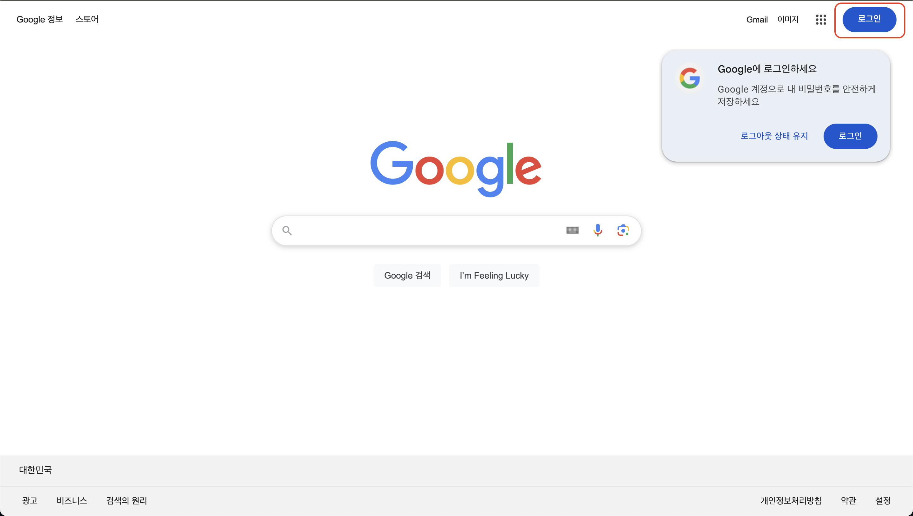
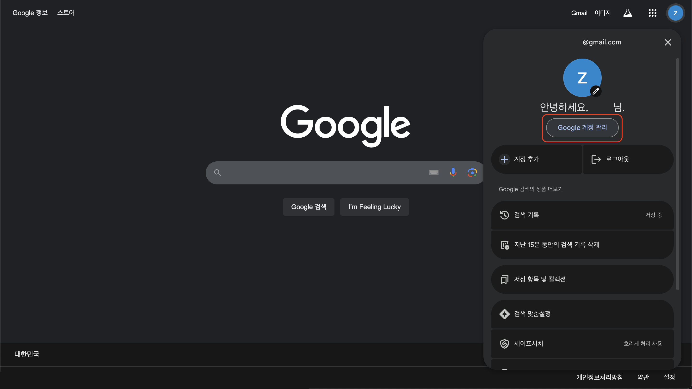
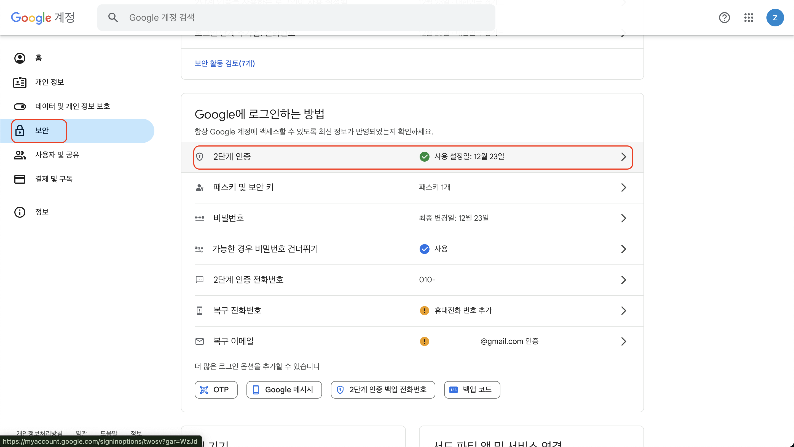
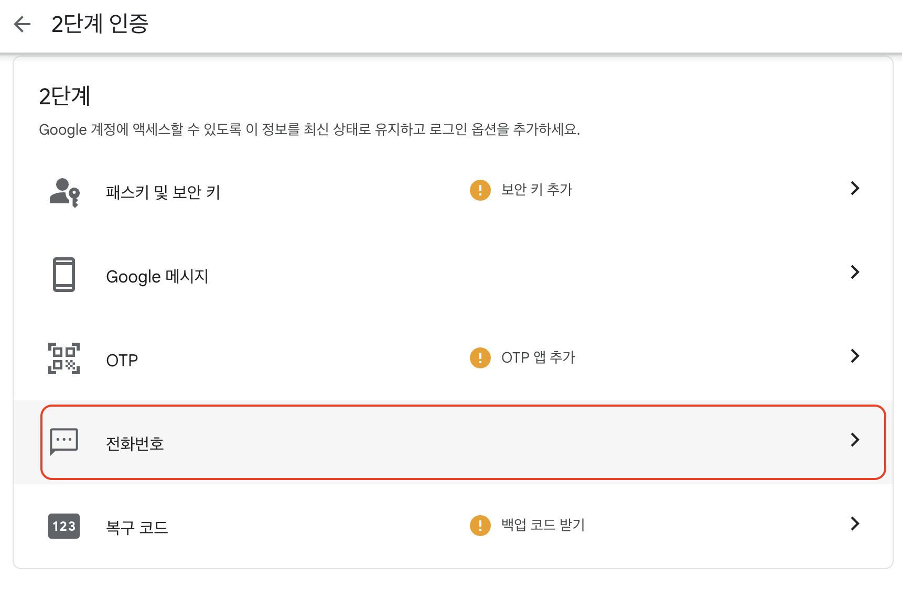
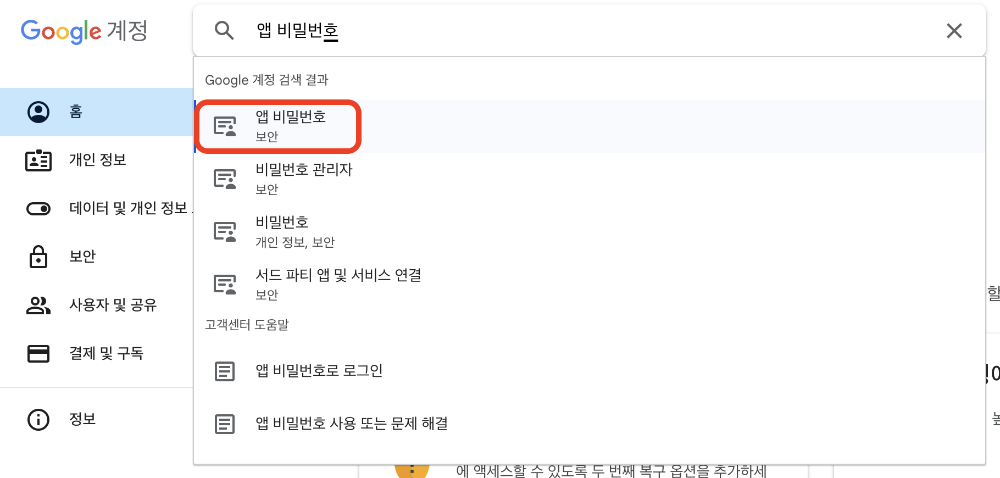
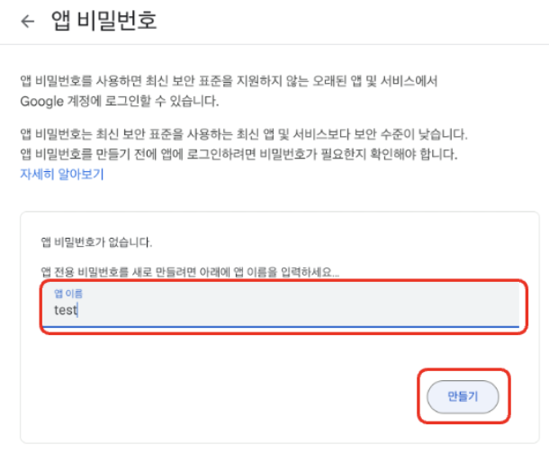
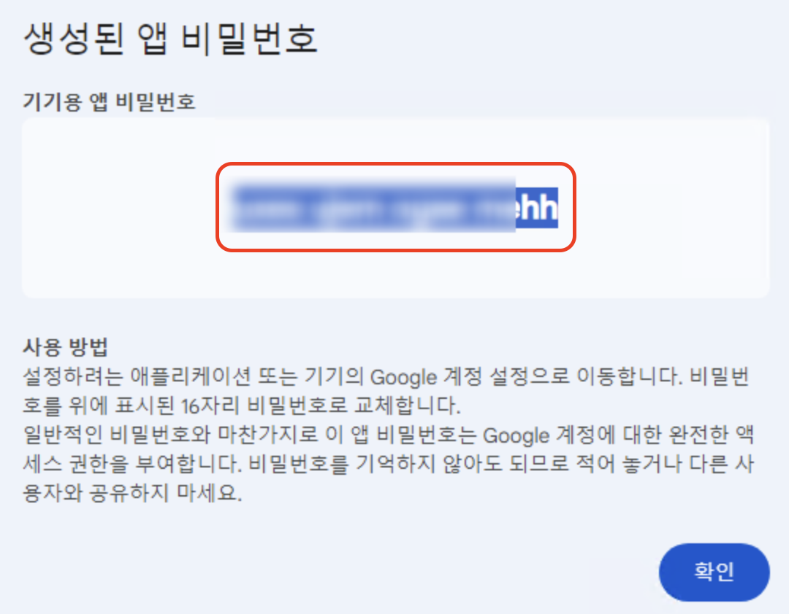
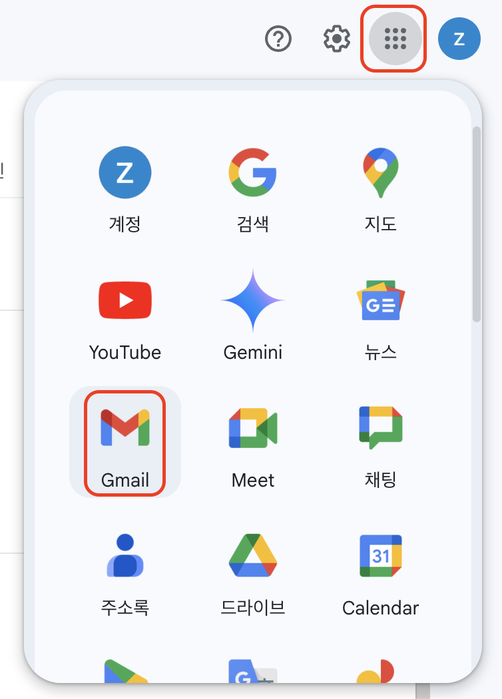
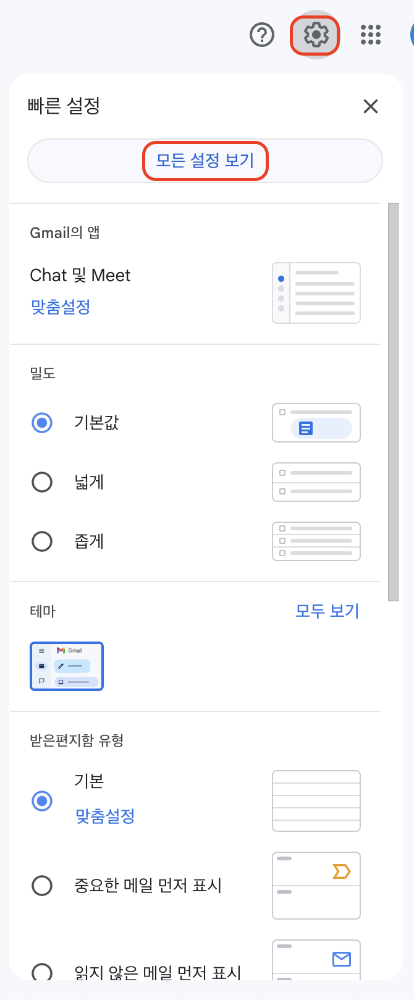
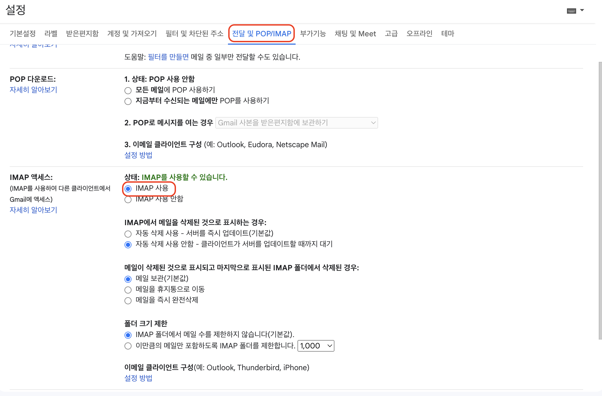

# GMAIL SMTP 설정을 위한 과정

1. 지메일 로그인을 합니다.

   

2. 계정관리를 누릅니다.

   

3. 보안에서 2단계 인증을 누릅니다.

   

4. 보안에서 2단계 인증을 위한 수단을 선택합니다.\
   (저는 패스키 및 보안 키로 했다가 이후 과정이 진행이 안돼서 전화번호로 했습니다.)

   

5. 2단계 인증을 하면 앱 비밀번호가 검색결과로 나타납니다.

   

6. 앱 비밀번호를 위한 앱 이름을 입력하고 만들기 버튼을 누릅니다.

   

7. 생성된 앱 비밀번호를 복사해둡니다.

   

8. 지메일로 이동합니다.

   

9. 설정 아이콘을 누르고 모든 설정 보기 버튼을 누릅니다.

   

10. 전달 및 POP/IMAP에서 IMAP 사용 라디오 버튼을 누르고 변경사항 저장 버튼을 누릅니다.

    
