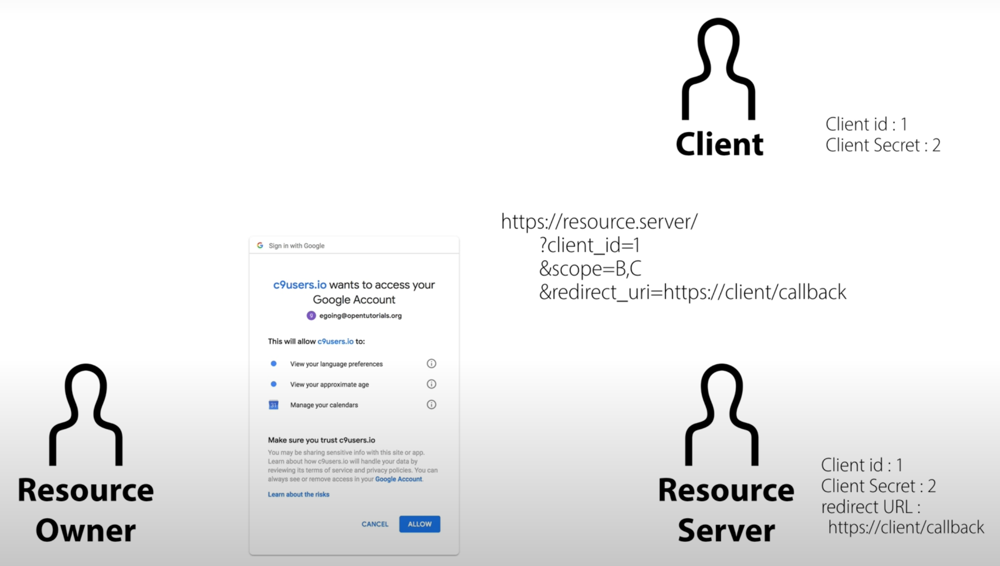

# OAuth 2.0

## 인증 코드 플로우

인증 코드 승인 유형(authorization code grant type)은 액세스 토큰과 리프레시 토큰을 모두 얻는 데 사용되며, 기밀 클라이언트(confidential clients)에 최적화되어 있습니다.\
이 흐름은 리디렉션을 기반으로 하기 때문에 클라이언트는 리소스 소유자의 사용자 에이전트(일반적으로 웹 브라우저)와 상호작용할 수 있어야 하며, 인증 서버로부터 리디렉션을 통해 들어오는 요청을 수신할 수 있어야 합니다.

- (A): 클라이언트는 리소스 소유자의 사용자 에이전트를 인증 엔드포인트로 이동시켜 흐름을 시작합니다.\
  이 요청에는 클라이언트 식별자(`client id`entifier), 요청된 스코프(scope), 로컬 상태(state), 그리고 인증 서버가 액세스를 승인하거나 거부한 후 사용자 에이전트를 다시 보낼 리디렉션 URI를 포함합니다.

- (B): 인증 서버는 사용자 에이전트를 통해 리소스 소유자를 인증하고, 리소스 소유자가 클라이언트의 액세스 요청을 승인할지 거부할지를 판단합니다.

- (C): 리소스 소유자가 액세스를 승인했다고 가정하면, 인증 서버는 제공된 리디렉션 URI(요청 시 제공되었거나 클라이언트 등록 시 제공됨)를 사용하여 사용자 에이전트를 클라이언트로 리디렉션합니다.\
  리디렉션 URI에는 인증 코드(authorization code)와 클라이언트가 이전에 제공한 로컬 상태 정보가 포함됩니다.

- (D): 클라이언트는 이전 단계에서 받은 인증 코드를 포함하여 인증 서버의 토큰 엔드포인트에 `access token`을 요청합니다.\
  요청 시, 클라이언트는 인증 서버에 자신을 인증하고, 인증 코드를 얻기 위해 사용했던 리디렉션 URI를 검증 목적으로 포함합니다.

- (E): 인증 서버는 클라이언트를 인증하고, 인증 코드를 검증하며, 리디렉션 URI가 (C) 단계에서 클라이언트를 리디렉션할 때 사용된 URI와 일치하는지 확인합니다.\
  검증이 완료되면, 인증 서버는 `access token`과 선택적으로 `refresh token`을 응답으로 반환합니다.

### 상세 과정

#### 역할

OAuth는 네 가지 역할을 정의합니다.

- 리소스 소유자 (resource owner)

  - 보호된 리소스에 대한 액세스를 승인할 수 있는 주체를 의미합니다.
  - 리소스 소유자가 사람이면 "엔드유저(end-user)"라고도 합니다.

- 리소스 서버 (resource server)

  - 보호된 리소스를 호스팅하는 서버로, 액세스 토큰을 사용하여 보호된 리소스 요청을 수락하고 응답할 수 있습니다.

- 클라이언트 (client)

  - 리소스 소유자를 대신하여 보호된 리소스를 요청하고, 리소스 소유자의 승인 하에 작동하는 애플리케이션을 의미합니다.
  - "클라이언트"라는 용어는 특정한 구현 특성을 나타내지 않으며(예: 애플리케이션이 서버, 데스크톱, 또는 다른 장치에서 실행되는지 여부에 관계 없음), 다양한 형태로 구현될 수 있습니다.

- 인증 서버 (authorization server)
  - 리소스 소유자를 성공적으로 인증하고 권한을 획득한 후 클라이언트에게 액세스 토큰을 발급하는 서버입니다.

#### 등록

Client는 Resource Server의 승인을 사전에 받아야 합니다.

Resource Server는 Client에게 `Authorized redirect URIs`를 입력받습니다.\
Client는 Resource Server에게 `Client ID`, `Client Secret`를 제공합니다.

- `Client ID`는 서비스 제공자를 식별하는 키입니다.

- `Client Secret`은 외부에 노출되면 안되는 비밀번호입니다.

- `Authorized redirect URIs`는 Resource Server에서 Authorized Code를 Client에게 전달할 때 사용하는 주소입니다.

#### Resource Owner의 승인

Client가 Resource Owner의 B, C에 대한 정보를 알고 싶을 때의 예시입니다.

1. response_type

   - 필수. 값은 반드시 "code"로 설정해야 합니다.

2. client_id

   - 필수. 클라이언트 식별자입니다.

3. redirect_uri

   - 선택적. Section 3.1.2에서 설명된 대로.

4. scope

   - 선택적. Section 3.3에서 설명된 대로 액세스 요청의 범위입니다.

5. state
   - 권장. 클라이언트가 요청과 콜백 간 상태를 유지하기 위해 사용하는 불투명한 값입니다.\
     인증 서버는 사용자 에이전트를 클라이언트로 리디렉션할 때 이 값을 포함합니다.\
     이 매개변수는 Section 10.12에서 설명된 대로 교차 사이트 요청 위조를 방지하기 위해 사용해야 합니다.

Client는 Resource Owner가 인증을 할 수 있도록 특정 주소로 이동할 수 있는 버튼을 제공합니다.\
특정 주소는 Resource Server의 OAuth URL에 `Client ID`, 알고 싶은 정보, `Authorized redirect URIs`를 포함하게 됩니다.

Resource Owner가 해당 주소로 접속하게 되면 Resource Server는 Resource Owner가 로그인이 되어 있는지, 아닌지를 확인합니다.
로그인이 되어 있지 않다면 Resource Server는 Resource Owner에게 로그인 화면을 보여줍니다.

Resource Owner가 로그인에 성공하게 되면 Resource Server는 주소에 포함되어 있는 `Client ID`가 실제로 있는지, `Client ID`와 `Authorized redirect URIs`가 올바르게 매칭이 되어 있는지를 확인합니다.

확인이 문제없이 완료되면 Resource Server는 Resource Owner에게 제공 정보 범위를 확인 받습니다.

Resource Owner가 승인을 완료하면 Resource Server는 해당 유저가 허용하는 정보의 범위를 저장합니다.

#### Resource Server의 승인

- code

  - 필수. 인증 서버에서 생성된 인증 코드입니다.
  - 인증 코드는 누출 위험을 줄이기 위해 발급 후 짧은 시간 안에 만료되어야 합니다.
  - 인증 코드의 최대 유효 기간으로 10분을 권장합니다.
  - 클라이언트는 인증 코드를 한 번만 사용해야 합니다.
  - 인증 코드가 여러 번 사용된 경우, 인증 서버는 요청을 거부해야 하며, 가능하다면 해당 인증 코드를 기반으로 이전에 발급된 모든 토큰을 취소해야 합니다.
  - 인증 코드는 클라이언트 식별자와 리디렉션 URI에 묶여 있습니다.

- state

  - 클라이언트 인증 요청에 "state" 매개변수가 포함되어 있었다면 필수입니다.
  - 클라이언트로부터 받은 값과 정확히 동일한 값을 사용해야 합니다.

Resource Server는 임시 비밀번호(code)포함한 `Authorized redirect URIs`로 Resource Owner를 이동시킵니다.

임시 비밀번호(code)를 받은 Client는 Resource Server에게 토큰을 요청할 때 사용하는 주소로 요청을 보냅니다.

#### 토큰 발급

요청을 받은 Resource Server는 임시 비밀번호(code)와 `Client ID`, `Client Secret`을 확인합니다.\
인증이 완료되면 Resource Server는 토큰을 발급하여 Client에게 응답을 보냅니다.\

## 토큰 관리

- (A): 클라이언트는 인증 서버에 인증을 수행하고 권한 부여(authorization grant)를 제출하여 `access token`을 요청합니다.

- (B): 인증 서버는 클라이언트를 인증하고 권한 부여를 검증합니다.\
  승인 부여가 유효하다면, 인증 서버는 `access token`과 `refresh token`(refresh token)을 발급합니다.

- (C): 클라이언트는 `access token`을 제시하여 리소스 서버에 보호된 리소스를 요청합니다.

- (D): 리소스 서버는 `access token`을 검증하고, 유효하다면 요청을 처리합니다.

- (E): 단계 (C)와 (D)는 `access token`이 만료될 때까지 반복됩니다.\
  클라이언트가 `access token`이 만료된 것을 인지했다면, (G) 단계로 바로 이동합니다.\
  그렇지 않으면, 다시 보호된 리소스를 요청합니다.

- (F): `access token`이 유효하지 않을 경우, 리소스 서버는 토큰이 유효하지 않음 오류를 반환합니다.

- (G): 클라이언트는 인증 서버에 인증을 수행하고 `refresh token`을 제시하여 새 `access token`을 요청합니다.

  클라이언트 인증 요구 사항은 클라이언트 유형과 인증 서버 정책에 따라 달라집니다.

- (H): 인증 서버는 클라이언트를 인증하고 `refresh token`을 검증합니다.\
  `refresh token`이 유효하다면, 새 `access token`(선택적으로 새 `refresh token` 포함)을 발급합니다.

### 토큰 재발급

#### 액세스 토큰 갱신

인증 서버가 클라이언트에게 리프레시 토큰을 발급한 경우, 클라이언트는 HTTP 요청 본문에 아래의 매개변수를 포함하여 "application/x-www-form-urlencoded" 형식으로 토큰 엔드포인트에 리프레시 요청을 보냅니다:

1. grant_type

   - 필수: 값은 반드시 "refresh_token"으로 설정해야 합니다.

2. refresh_token

   - 필수: 클라이언트에게 발급된 리프레시 토큰입니다.

3. scope
   - 선택: Section 3.3에서 설명된 대로 액세스 요청의 범위입니다.\
     요청된 범위는 리소스 소유자가 처음 승인한 범위를 초과할 수 없으며, 생략된 경우 기본적으로 리소스 소유자가 원래 승인한 범위와 동일하게 간주됩니다.

리프레시 토큰은 일반적으로 추가 액세스 토큰을 요청할 때 사용되는 장기적인 자격 증명이므로, 리프레시 토큰은 발급된 클라이언트에 고정됩니다.

- 클라이언트 유형이 기밀(confidential)이거나 클라이언트 자격 증명(client credentials) 또는 기타 인증 요구사항이 부여된 경우, 클라이언트는 인증 서버에 인증해야 합니다.

#### HTTP 요청 예시

클라이언트는 다음과 같은 HTTP 요청을 전송 계층 보안(TLS)을 사용하여 보냅니다(보기 편하게 줄바꿈 추가):

## 자료

- [RFC 6749](https://datatracker.ietf.org/doc/html/rfc6749)
- [WEB2-OAuth](https://youtu.be/hm2r6LtUbk8?feature=shared)
