# Google OAuth

## 구글 OAuth를 사용하기 위한 준비

클라이언트에서 구글의 OAuth 인가 서버에 접속하려면 OAuth 클라이언트 ID와 비밀번호가 필요합니다.

이를 위해서는
❶ 구글 클라우드에서 프로젝트를 생성하고,
❷ OAuth 동의 화면을 생성하고,
❸ 클라이언트 ID를 생성해야 됩니다.

### 구글 클라우드에서 프로젝트 생성

1. 브라우저로 구글 클라우드(console.cloud.google.com/)에 접속해 로그인합니다. 가입하지 않은 분들은 안내에 따라 가입을 진행하고 나서 로그인해주세요.

2. ❶ [프로젝트 선택] → ❷ [새 프로젝트]를 클릭합니다.

   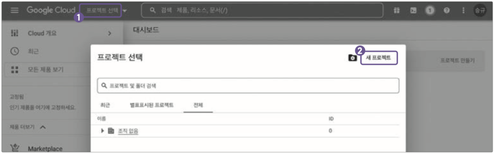

3. 프로젝트명을 ❶ 에 입력하고 ❷ [만들기]를 클릭합니다. 그러면 프로젝트가 생성됩니다.

   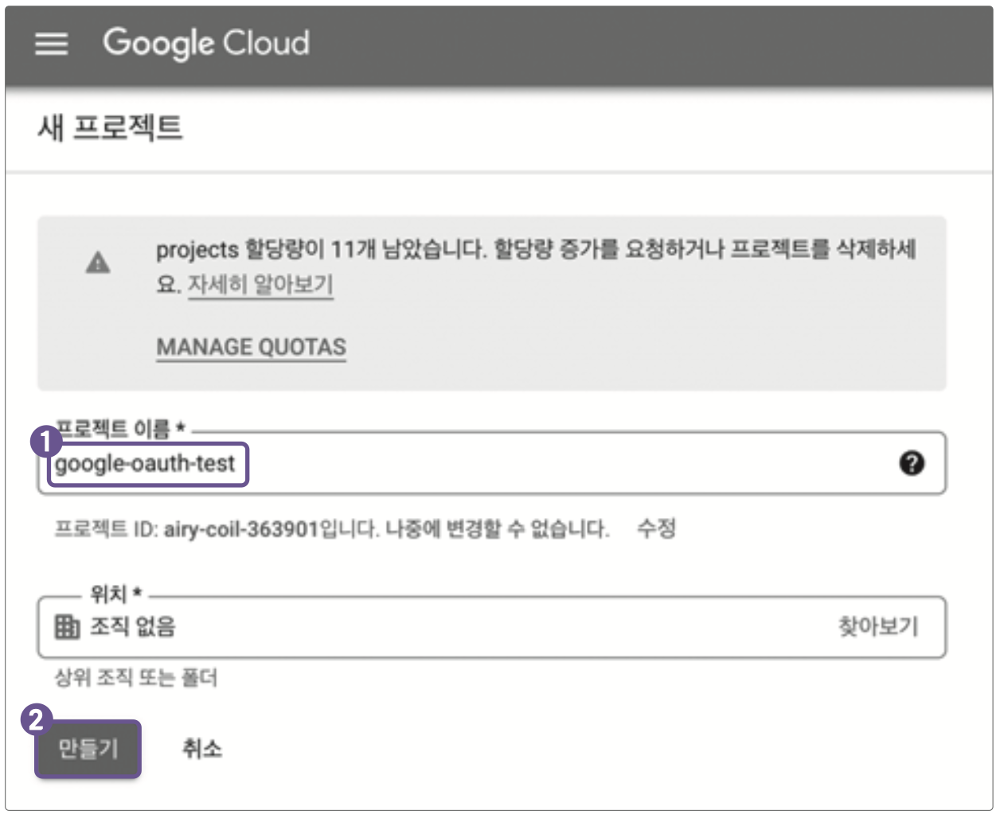

### OAuth 동의 화면을 만들기

1. 프로젝트명을 ❶ 에 입력하고 ❷ [만들기]를 클릭합니다. 그러면 프로젝트가 생성됩니다.

   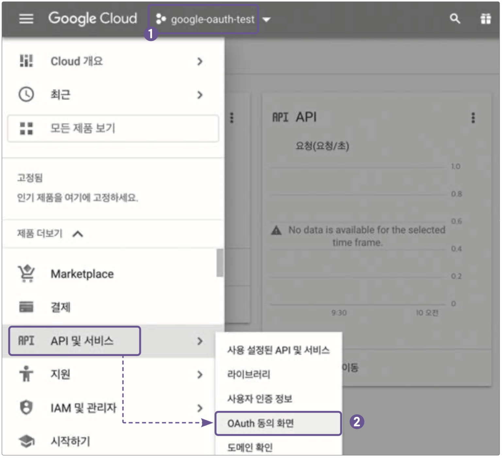

2. OAuth 동의 화면에서 1 ‘외부’를 선택하고 2 [만들기]를 클릭합시다.

   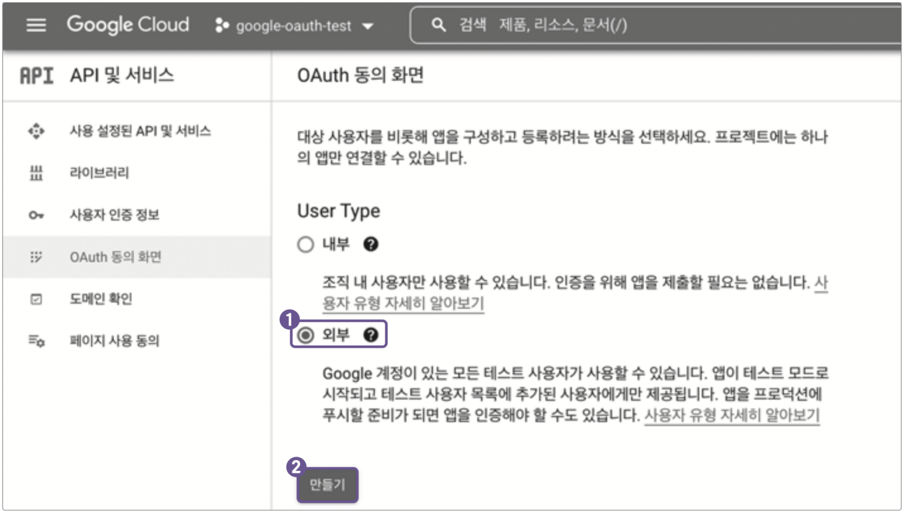

3. 필수값(`*`)인 ❶ 앱 이름, ❷ 사용자 지원 이메일, ❸ 개발자 연락처 정보만 입력하고 ➍[저장후계속]버튼을 클릭합시다.

   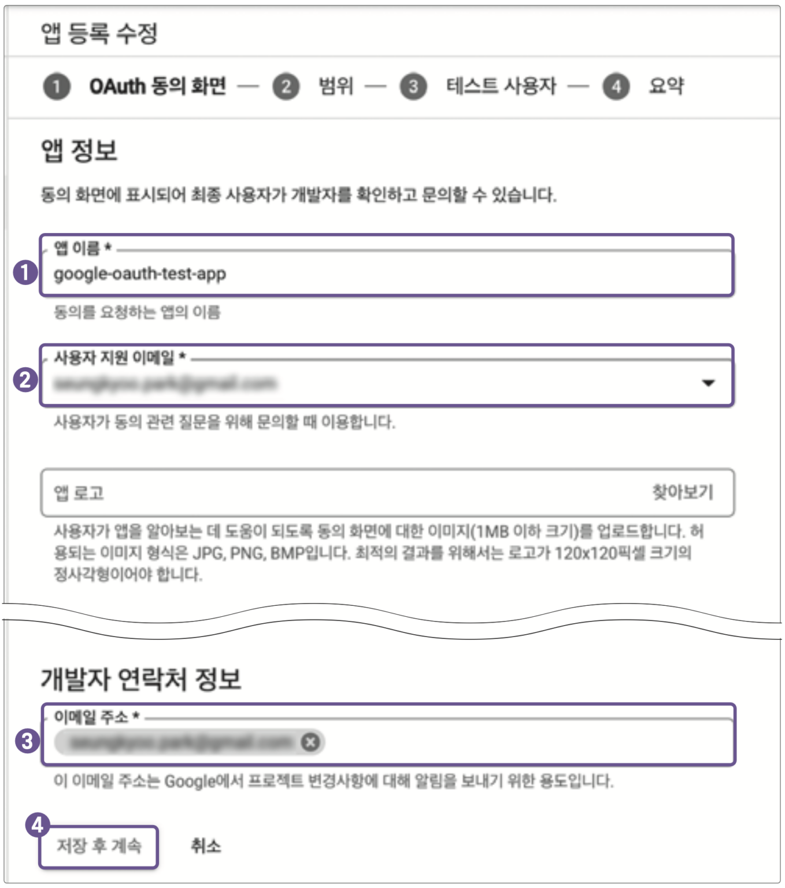

4. ‘범위’에서는 설정 없이 [저장 후 계속] 버튼을 눌러주세요.

   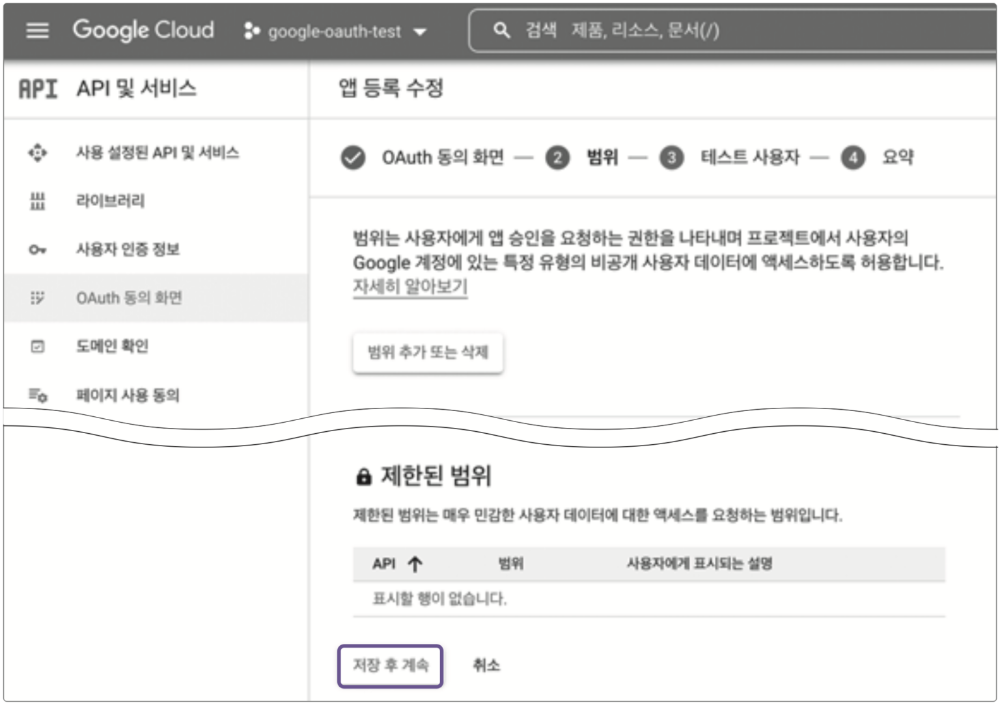

5. ‘테스트 사용자’에서도 설정 없이 [저장 후 계속]을 눌러서 진행해줍니다.

   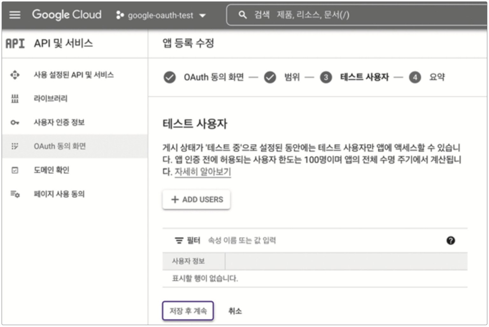

6. OAuth 동의 화면 설정에 대한 ‘요약’ 화면이 보이면 완성입니다. [대시보드로 돌아가기] 버튼을 눌러주세요.

   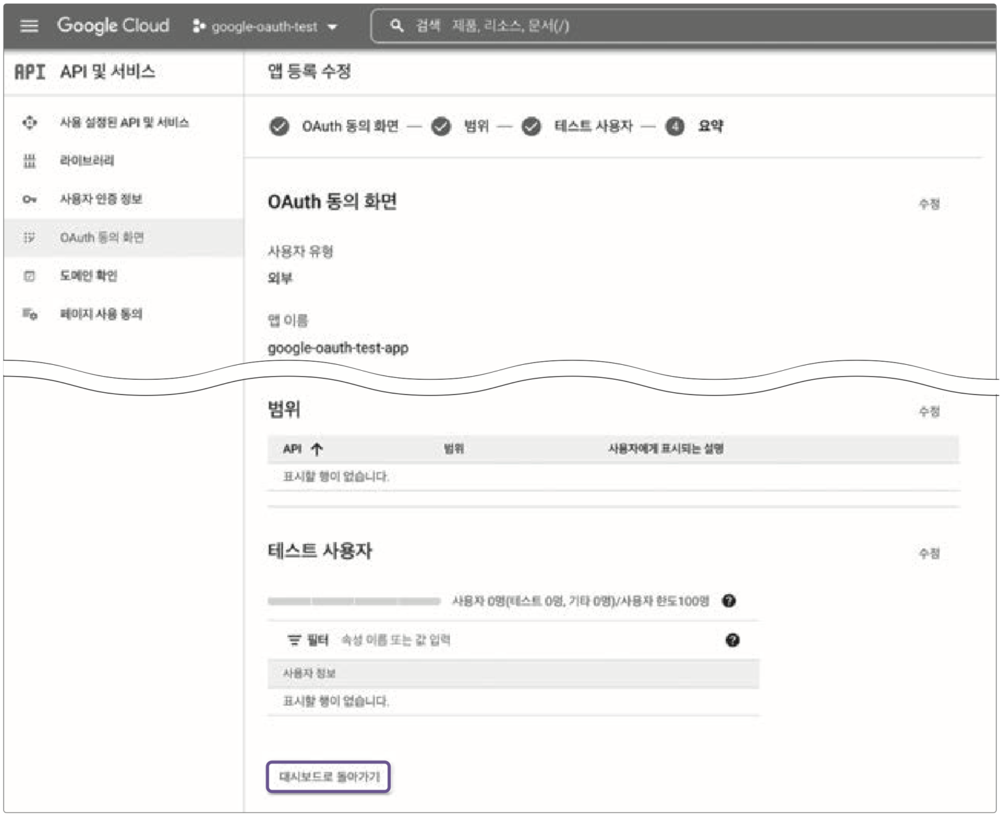

### OAuth 클라이언트의 ID와 비밀번호 만들기

1. 왼쪽 메뉴에서 ❶ [사용자 인증 정보] → ❷ [사용자 인증정보 만들기] → [OAuth 클라이언트 ID]를 눌러서 인증 정보 설정 화면으로 이동합니다.

   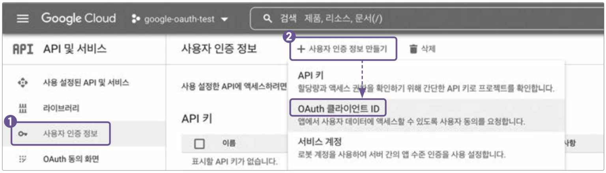

2. OAuth 클라이언트 ID 만들기입니다.\
   ❶ ‘애플리케이션 유형’을 ‘웹 애플리케이션’으로 선택해주세요.\
   ❷ ‘승인된 자바스크립트 원본’에는 서버 주소를 입력합니다(여기서는 `https://localhost:3000`으로 했습니다).\
   ❸ ‘승인된 리디렉션 URI’에는 구글 인증 후 리디렉션할 URL을 입력해줍니다(여기서는 `http://localhost:3000/auth/google`로 했습니다).\
   ❹ [만들기] 버튼을 클릭해서 OAuth 클라이언트를 생성합니다.

   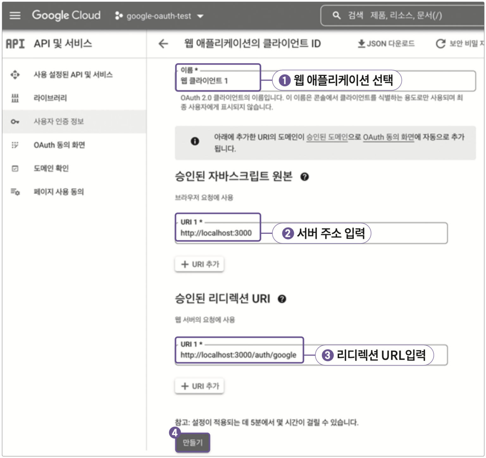

   OAuth 클라언트가 생성됐다는 팝업이 뜹니다.\
   클라이언트 보안 비밀번호는 절대로 유출되면 안 되니 주의해야 합니다.

   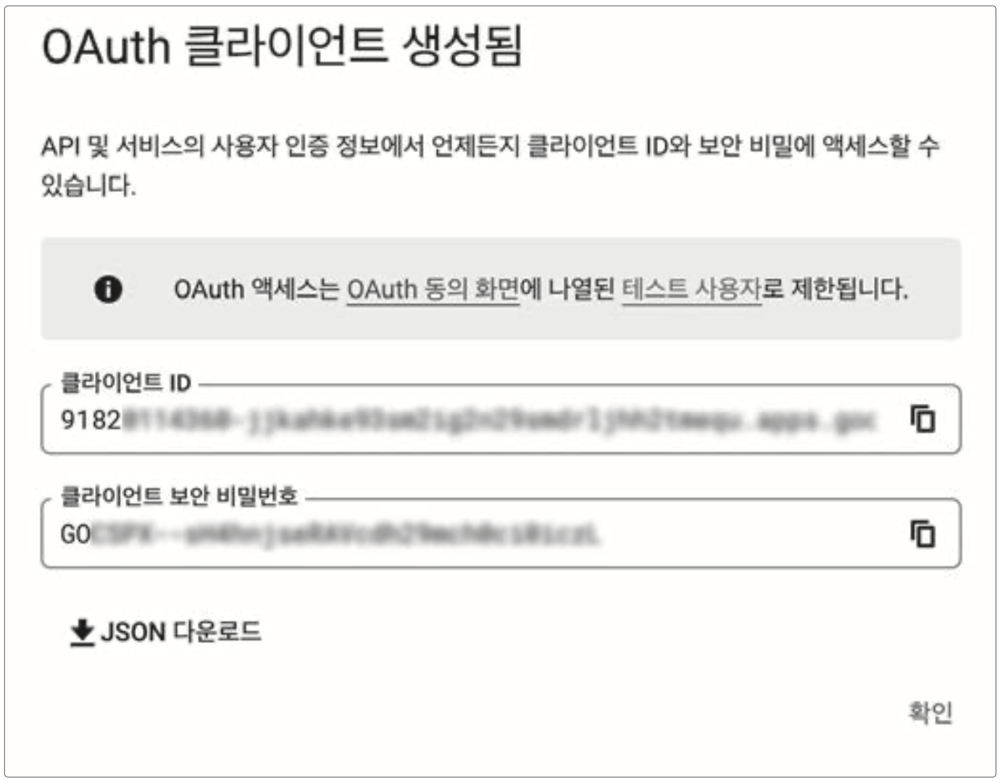

   이제 구글 OAuth를 사용할 수 있는 준비가 되었습니다.

## 구글 웹 서버 애플리케이션용 OAuth 2.0 사용

### 1단계: 승인 매개변수 설정

첫 번째 단계는 승인 요청을 만드는 것입니다. 이 요청은 애플리케이션을 식별하고 사용자가 애플리케이션에 부여하도록 요청할 권한을 정의하는 매개변수를 설정합니다.

Google의 OAuth 2.0 엔드포인트는 `https://accounts.google.com/o/oauth2/v2/auth`에 있습니다.\
이 엔드포인트는 HTTPS를 통해서만 액세스할 수 있습니다.\
일반 HTTP 연결은 거부됩니다.

#### Google 승인 서버 지원 쿼리 문자열 매개변수

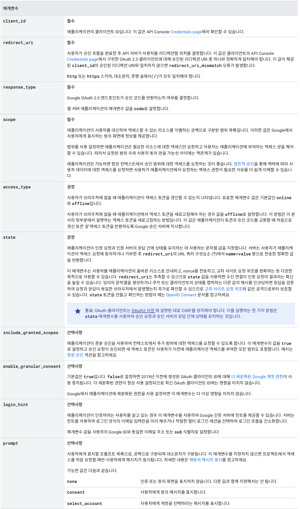

### 2단계: Google OAuth 2.0 서버로 리디렉션

Google 승인 서버로 리디렉션하는 샘플
아래 예시 URL에는 가독성을 위해 줄바꿈과 공백이 포함되어 있습니다.

```http
https://accounts.google.com/o/oauth2/v2/auth?
scope=https%3A//www.googleapis.com/auth/drive.metadata.readonly%20https%3A//www.googleapis.com/auth/calendar.readonly&
access_type=offline&
include_granted_scopes=true&
response_type=code&
state=state_parameter_passthrough_value&
redirect_uri=https%3A//oauth2.example.com/code&
client_id=client_id
```

#### 승인 매개변수 설정 후 리디렉션 예시 코드

```tsx
"use client";

import { Button } from "@/_components/shadcn";

// 구글 OAuth 2.0 엔드포인트
const Google_OAUTH_URL = "https://accounts.google.com/o/oauth2/v2/auth";

export default function GoogleLoginButton() {
  /** 사용자를 Google의 로그인 페이지로 리디렉트하여 인증과 권한 승인을 받음 */
  const handleLogin = () => {
    const clientId = process.env.NEXT_PUBLIC_GOOGLE_CLIENT_ID; // Google Cloud Console에서 생성된 클라이언트 ID
    const redirectUri = process.env.NEXT_PUBLIC_REDIRECT_URI; // 인증이 완료된 후 Google이 사용자를 리디렉션할 URI
    const scope = "openid email profile"; // 애플리케이션이 요청하는 권한 범위
    const responseType = "code"; // 응답 유형

    // access_type 은 offline을 설정하면 리프레시 토큰을 받을 수 있음
    const authUrl = `${Google_OAUTH_URL}?response_type=${responseType}&client_id=${clientId}&redirect_uri=${redirectUri}&scope=${scope}&access_type=offline&prompt=consent`;

    window.location.href = authUrl;
  };

  // 구글 로그인 버튼
  return <Button onClick={handleLogin}>Google로 로그인</Button>;
}
```

### 3단계: Google에서 사용자에게 동의 메시지 표시

리디렉션 후 resource owner가 로그인을 성공하면 동의 메시지가 나타납니다.

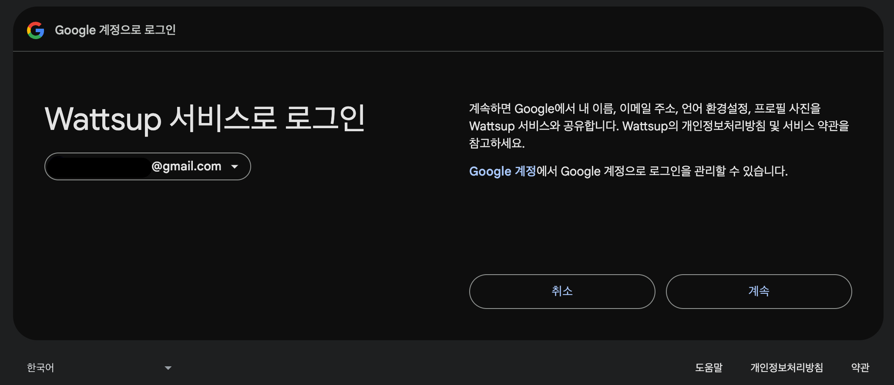

### 4단계: OAuth 2.0 서버 응답 처리

resource owner가 동의하면 resource server는 승인된 리디렉션 URI로 resource owner를 이동시킵니다.

#### 오류 응답 예시

```http
https://oauth2.example.com/auth?error=access_denied
```

#### 승인 코드 응답 예시

```http
https://oauth2.example.com/auth?code=4/P7q7W91a-oMsCeLvIaQm6bTrgtp7
```

#### 응답 처리 예시 코드

```tsx
// Authorized redirect URIs 경로의 페이지

"use client";

import { useRouter, useSearchParams } from "next/navigation";
import { useEffect } from "react";

/**
 * API 라우트에 POST 요청으로 서버에  승인(인증) 코드 전달
 */
const handleCodeExchange = async (
  code: string,
  router: ReturnType<typeof useRouter>
) => {
  try {
    const response = await fetch("/api/auth/exchange", {
      method: "POST",
      headers: {
        "Content-Type": "application/json",
      },
      body: JSON.stringify({ code }),
    });

    const data = await response.json();
    console.log("User Info:", data);

    // 성공 시 리다이렉트 처리
    if (data.user) {
      router.push("/");
    }
  } catch (error) {
    console.error("Error exchanging code:", error);
  }
};

/**
 * Authorized redirect URIs로 code를 성공적으로 받아왔다면 토큰 요청
 */
export default function AuthCallbackPage() {
  const searchParams = useSearchParams();
  const router = useRouter();

  useEffect(() => {
    const code = searchParams.get("code"); //  승인(인증) 코드 추출
    if (code) handleCodeExchange(code, router);
  }, [router, searchParams]);

  return <div>로그인 처리 중...</div>;
}
```

### 5단계: 승인 코드를 갱신(리프레쉬) 토큰 및 액세스 토큰으로 교환

승인 코드를 액세스 토큰으로 교환하려면 `https://oauth2.googleapis.com/token` 엔드포인트를 호출하고 다음 매개변수를 설정합니다.

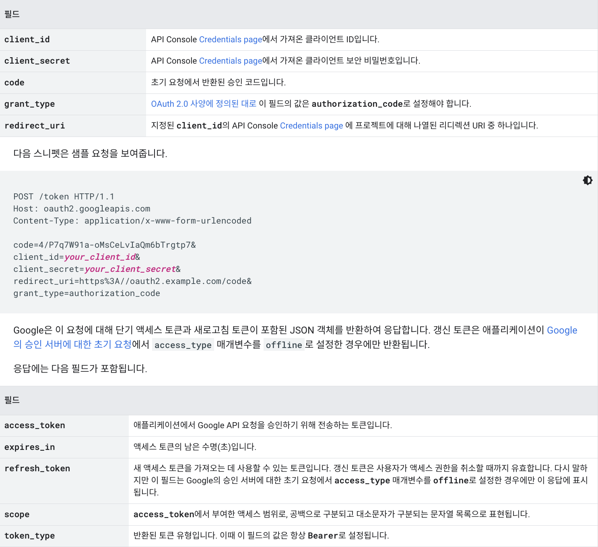

토큰을 재발급 받을 때는 `grant_type: "refresh_token"`을 사용합니다.

### 액세스 토큰 갱신 (오프라인 액세스)

클라이언트 라이브러리를 사용하지 않는 경우 사용자를 Google의 OAuth 2.0 서버로 리디렉션할 때 access_type HTTP 쿼리 매개변수를 offline로 설정해야 합니다.\
이 경우 액세스 토큰으로 승인 코드를 교환하면 Google의 승인 서버에서 갱신 토큰을 반환합니다.\
그런 다음 액세스 토큰이 만료되거나 다른 시점에 갱신 토큰을 사용하여 새 액세스 토큰을 가져올 수 있습니다.

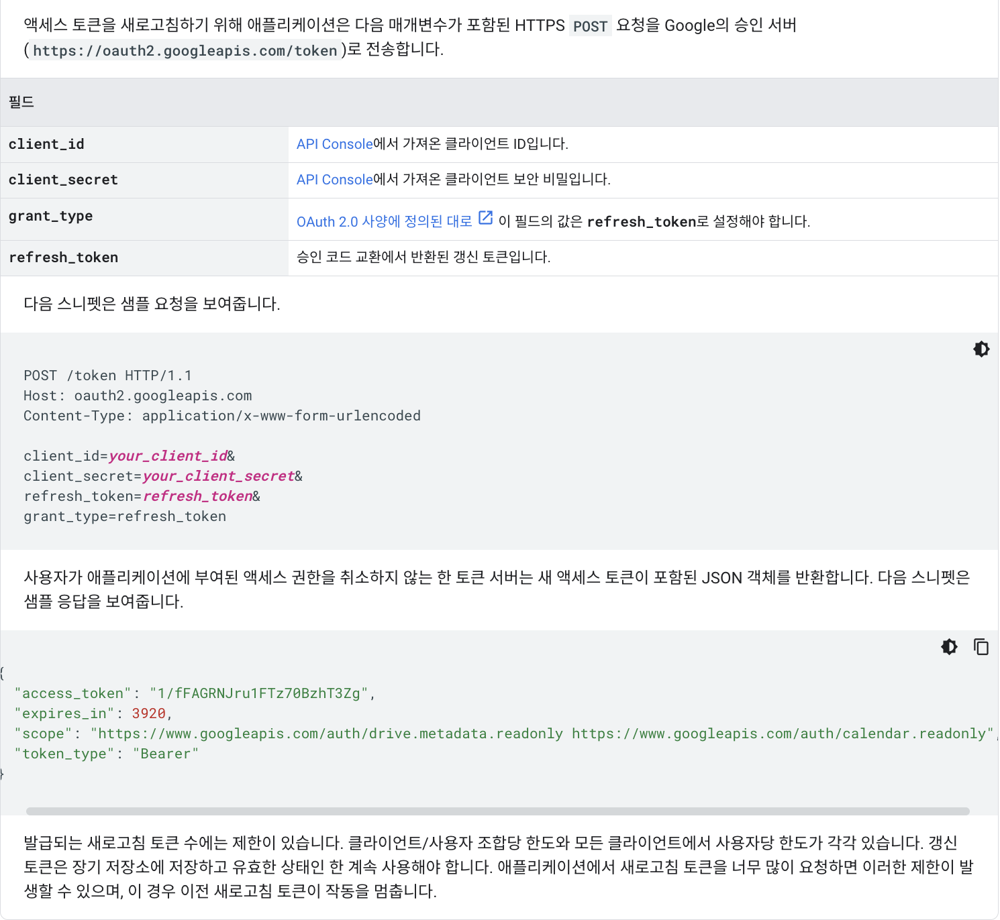

### 탐색 문서

[검색 문서 URI](https://accounts.google.com/.well-known/openid-configuration)

```json
{
  "issuer": "https://accounts.google.com",
  "authorization_endpoint": "https://accounts.google.com/o/oauth2/v2/auth",
  "device_authorization_endpoint": "https://oauth2.googleapis.com/device/code",
  "token_endpoint": "https://oauth2.googleapis.com/token",
  "userinfo_endpoint": "https://openidconnect.googleapis.com/v1/userinfo",
  "revocation_endpoint": "https://oauth2.googleapis.com/revoke",
  "jwks_uri": "https://www.googleapis.com/oauth2/v3/certs",
  "response_types_supported": [
    "code",
    "token",
    "id_token",
    "code token",
    "code id_token",
    "token id_token",
    "code token id_token",
    "none"
  ],
  "subject_types_supported": ["public"],
  "id_token_signing_alg_values_supported": ["RS256"],
  "scopes_supported": ["openid", "email", "profile"],
  "token_endpoint_auth_methods_supported": [
    "client_secret_post",
    "client_secret_basic"
  ],
  "claims_supported": [
    "aud",
    "email",
    "email_verified",
    "exp",
    "family_name",
    "given_name",
    "iat",
    "iss",
    "locale",
    "name",
    "picture",
    "sub"
  ],
  "code_challenge_methods_supported": ["plain", "S256"]
}
```

- 유저 정보 받을 때는 `userinfo_endpoint`인 `"https://openidconnect.googleapis.com/v1/userinfo"`으로 요청합니다.

- 토큰 재발급 받을 때는 `token_endpoint`인 `"https://oauth2.googleapis.com/token"`으로 요청합니다.

#### 토큰 교환 예시 코드

```tsx
import { NextRequest } from "next/server";

import axios from "axios";

export async function POST(request: NextRequest) {
  const { authorizationCode } = await request.json();

  if (!authorizationCode) {
    return new Response(
      JSON.stringify({ error: "Authorization code is missing" }),
      { status: 400 }
    );
  }

  try {
    // Google API에 Token 요청
    const tokenResponse = await axios.post(
      "https://oauth2.googleapis.com/token",
      {
        code: authorizationCode,
        client_id: process.env.NEXT_PUBLIC_GOOGLE_CLIENT_ID,
        client_secret: process.env.GOOGLE_CLIENT_SECRET,
        redirect_uri: process.env.NEXT_PUBLIC_REDIRECT_URI,
        grant_type: "authorization_code",
      }
    );

    const { access_token, refresh_token } = tokenResponse.data;

    // Access Token으로 사용자 정보 요청
    const userInfoResponse = await axios.get(
      "https://openidconnect.googleapis.com/v1/userinfo?alt=json",
      {
        headers: { Authorization: `Bearer ${access_token}` },
      }
    );

    const userInfo = userInfoResponse.data;

    return new Response(
      JSON.stringify({
        user: userInfo,
        access_token: access_token,
        refresh_token: refresh_token,
      }),
      { status: 200 }
    );
  } catch (error) {
    return new Response(JSON.stringify({ error }), { status: 500 });
  }
}
```

## 자료

- [OAuth를 사용한 구글 로그인 인증하기 1편 – OAuth 소개와 준비하기](https://goldenrabbit.co.kr/2023/08/07/oauth%EB%A5%BC-%EC%82%AC%EC%9A%A9%ED%95%9C-%EA%B5%AC%EA%B8%80-%EB%A1%9C%EA%B7%B8%EC%9D%B8-%EC%9D%B8%EC%A6%9D%ED%95%98%EA%B8%B0-1%ED%8E%B8/)
- [웹 서버 애플리케이션용 OAuth 2.0 사용](https://developers.google.com/identity/protocols/oauth2/web-server?hl=ko#httprest)
- [OpenID Connect](https://developers.google.com/identity/openid-connect/openid-connect?hl=ko#discovery)
